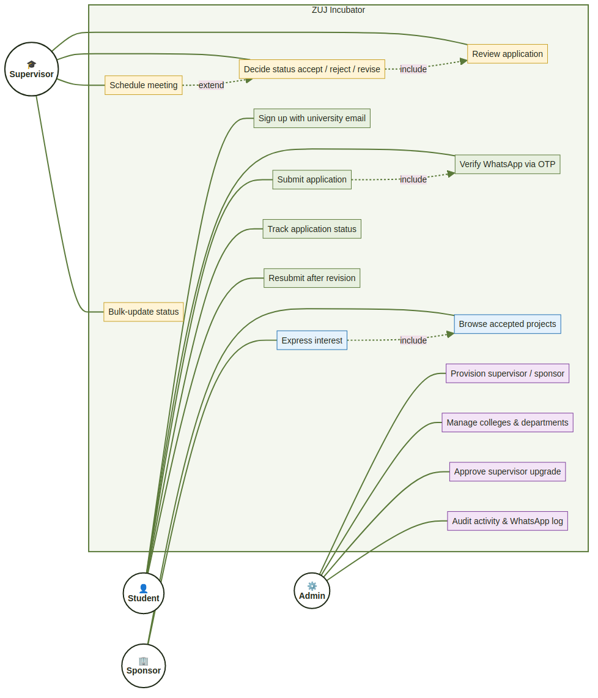
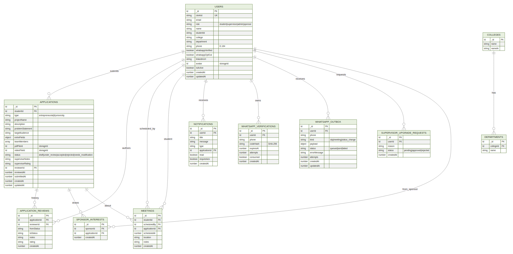
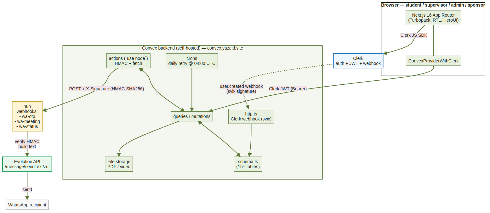
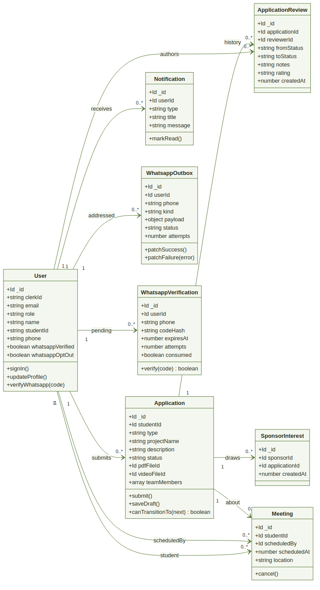
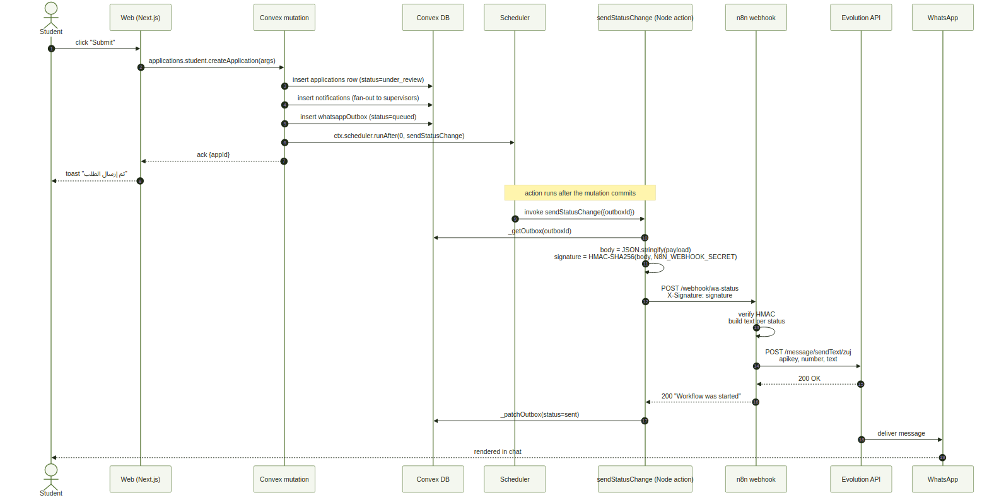
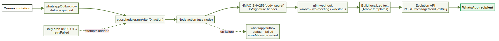

# Al-Zaytoonah University of Jordan
### Faculty of Science and Information Technology
### Department of Software Engineering

---

## ZUJ Incubator — حاضنة الزيتونة

**A Web Platform for Incubating Student Entrepreneurial, IT, and University-Serving Projects**

---

**Prepared by:**
1. Name (Number)
2. Name (Number)

**Supervisor:** Dr. XXXX

**Semester:** Second Semester 2025/2026

---

# ABSTRACT

**ZUJ Incubator (حاضنة الزيتونة)** is a full-stack web platform that digitises the project-incubation workflow for students of Al-Zaytoonah University of Jordan. The platform handles three project tracks (entrepreneurial idea, IT graduation, university-serving applied project) end-to-end: students submit a structured proposal with attachments, an academic supervisor reviews and routes the proposal through status transitions (`under_review` → `accepted` / `rejected` / `needs_modification`), and sponsors can express interest in approved projects. Notifications travel both through an in-app bell and through verified WhatsApp messages so students don't miss meeting invitations or status decisions.

The system is built on **Next.js 16 (App Router)** for the frontend and **Convex** (self-hosted) for the backend — schema, transactional mutations, scheduled actions, file storage, and HTTP webhooks all live in one TypeScript codebase. Authentication and identity are delegated to **Clerk**, whose JWTs are forwarded to Convex via `ConvexProviderWithClerk`. WhatsApp delivery is orchestrated through an **n8n** webhook workflow that signs requests with HMAC and forwards them to the **Evolution API**.

Key results: the system supports four distinct user roles (Student, Supervisor, Sponsor, Admin) with role-scoped routes and guards; nine database tables enforced by a single Convex schema; an HMAC-signed durable outbox for WhatsApp delivery with automatic retries; bilingual Arabic-first RTL UI with light/dark theming; and CI/CD via Coolify with auto-deploy on `main`.

**Keywords:** University Incubator, Student Projects, Next.js, Convex, Real-time Web, WhatsApp Notifications, Software Engineering Capstone.

---

# Table of Contents

1. [Introduction](#1-introduction)
   - 1.1 Project Description
   - 1.2 Project Overview
   - 1.3 Tasks
   - 1.4 Project Planning
   - 1.5 Planning of the Development Phases
   - 1.6 The Scope of the Work
   - 1.7 Stakeholders
   - 1.8 Scope
   - 1.9 Definitions, Acronyms, and Abbreviations
   - 1.10 References
   - 1.11 Overview
2. [Requirements](#2-requirements)
   - 2.1 Product Use Cases
   - 2.2 Functional Requirements
   - 2.3 Data Requirements
3. [Design](#3-design)
   - 3.1 System Design
   - 3.2 Proposed Software Architecture
   - 3.3 User Interface
   - 3.4 Object Design
4. [Test Plans](#4-test-plans)
   - 4.1 Approach
   - 4.2 Test Cases
5. [Positioning](#5-positioning)
6. [Stakeholder and User Descriptions](#6-stakeholder-and-user-descriptions)
7. [Product Overview](#7-product-overview)
8. [Product Features](#8-product-features)
9. [Constraints](#9-constraints)
10. [Quality Ranges](#10-quality-ranges)
11. [Precedence and Priority](#11-precedence-and-priority)
12. [Other Product Requirements](#12-other-product-requirements)
13. [Documentation Requirements](#13-documentation-requirements)
- Appendix A — [Feature Attributes](#appendix-a--feature-attributes)

---

# Table of Figures

| #  | Title                                                                | Page |
|----|----------------------------------------------------------------------|------|
| 1  | Use Case Diagram — actors and primary interactions                   | §3.1 |
| 2  | Database Schema — Convex tables and relationships                    | §3.1 |
| 3  | Component Diagram — frontend ↔ Convex ↔ n8n ↔ Evolution              | §3.2 |
| 4  | Class Diagram — domain model of Applications & Reviews               | §3.2 |
| 5  | Sequence Diagram — "Submit application" + "Schedule meeting" flows   | §3.2 |
| 6  | WhatsApp Pipeline — Convex outbox → n8n → Evolution                  | §3.2 |

---

# Chapter 1

## 1. Introduction

### 1.1 Project Description

ZUJ Incubator addresses a concrete operational gap at Al-Zaytoonah University of Jordan: the incubation programme currently runs on paper forms, ad-hoc Excel sheets, and personal WhatsApp threads between students and supervisors. Information is lost in transit, status updates are inconsistent, and there is no shared system of record for the academic committee to track project progress or generate reports.

The proposed platform replaces this manual workflow with a structured web application where every project lifecycle event — from initial submission to supervisor decision and sponsor engagement — is captured in a single database. Students can author their proposals digitally, attach supporting documents, and receive instant push notifications (both in-app and on WhatsApp) when their status changes. Supervisors gain a dashboard to triage their queue, schedule meetings, and leave structured feedback. Administrators control the academic catalogue (colleges, departments, social links, banners) and audit every privileged action.

**Purpose:**
1. Reduce the time-from-submission-to-supervisor-feedback by eliminating paper handoffs.
2. Provide an authoritative system of record for the incubator's project portfolio.
3. Improve student engagement by closing the feedback loop with real-time notifications.
4. Surface qualified projects to potential sponsors through a discovery surface.

**Target users:** undergraduate students at ZUJ, academic supervisors (lecturers), industry sponsors, and the incubator's administrative staff.

**Success metrics:**
- 100% of new projects submitted through the platform (versus paper) by end of the first semester after launch.
- Supervisor decision latency reduced to < 5 working days for ≥ 80% of applications.
- Student satisfaction (post-flow CSAT) ≥ 4 / 5.
- WhatsApp notification delivery success rate ≥ 95% (measured through `whatsappOutbox.status = "sent"`).

### 1.2 Project Overview

The product is delivered as a **web application** accessible at `https://app.yazeid.site`. It is mobile-responsive (works on any modern browser, Arabic-RTL primary) and progressively enhances on desktop with a sidebar shell for administrators and supervisors. Behind the web app sits a self-hosted Convex backend, a self-hosted n8n + Evolution stack for WhatsApp delivery, and a Clerk tenant for authentication. The platform deploys through Coolify on a single Hetzner-class VPS.

### 1.3 Tasks

The work was decomposed into five sequential tasks, executed over the course of one academic semester:

**Table 1.** Project Timeline

| WBS | Task                              | Start       | Finish      | Progress |
|-----|-----------------------------------|-------------|-------------|----------|
| 1   | Research & Analysis               | 03 / 03 / 2026 | 17 / 03 / 2026 | 100% ✅    |
| 2   | Requirements Gathering            | 18 / 03 / 2026 | 30 / 03 / 2026 | 100% ✅    |
| 3   | Design & Planning                 | 01 / 04 / 2026 | 21 / 04 / 2026 | 100% ✅    |
| 4   | Implementation & Coding           | 23 / 04 / 2026 | 23 / 05 / 2026 | 100% ✅    |
| 5   | Testing & Quality Assurance       | 24 / 05 / 2026 | 31 / 05 / 2026 | 100% ✅    |

**Task 1 — Research & Analysis.** Interviewed five current Software Engineering supervisors and twelve students to map the current paper workflow. Surveyed comparable platforms (Slate, AlmaConnect, custom JotForm builds at peer universities) to identify must-have features and visual conventions.

**Task 2 — Requirements Gathering.** Translated interview notes into a functional requirements catalogue (see §2.2). Held two validation sessions with the academic supervisor of the capstone, captured edge cases (resubmission of rejected applications, parallel supervision, supervisor upgrade requests).

**Task 3 — Design & Planning.** Authored the Convex schema (15+ tables), use-case diagrams, and high-fidelity Figma mockups for all four role surfaces. Picked the tech stack and finalised the monorepo split (`@smart-zuj/web` + `@smart-zuj/convex` + `@smart-zuj/core`).

**Task 4 — Implementation & Coding.** Built the frontend (Next.js 16 App Router with Turbopack), backend (Convex queries / mutations / actions / crons), authentication bridge (Clerk → Convex via JWT), WhatsApp pipeline (n8n + Evolution), and Coolify-driven CD. Iterative deployments throughout via PRs into `main`.

**Task 5 — Testing & QA.** Vitest unit tests for Convex helpers, convex-test integration tests for the mutations, manual end-to-end testing across all four roles, accessibility audit (RTL, keyboard nav, screen reader), and a security review (HMAC signing, role-based access control, Clerk webhook signature verification).

### 1.4 Project Planning

The project followed an **incremental delivery model**. After the design phase, each user role was delivered in a dedicated milestone: student surface → supervisor surface → admin surface → sponsor surface → notifications & polish. Each milestone shipped through a pull request merged into `main`, which auto-deployed to production via Coolify.

Risk management:
- **Data loss risk.** Convex's native transactional mutations + scheduled retries mitigate the risk of partial writes. The `whatsappOutbox` table provides a durable record of every send attempt.
- **Vendor lock-in.** Self-hosted Convex (open-source backend) means we are not bound to Convex Cloud pricing. Clerk has a free tier large enough for the university's expected user base.
- **WhatsApp delivery reliability.** Outbox + daily retry cron + admin observability log (`/admin/whatsapp-log`).

### 1.5 Planning of the Development Phases

Phase planning is summarised in Table 1 above. Each phase had an explicit exit criterion:

- **Research →** approved problem statement and interview synthesis document
- **Requirements →** signed-off requirements catalogue + use-case diagrams
- **Design →** working Convex schema (deployed to dev), Figma covering all four roles
- **Implementation →** functional production build, every PR review-approved
- **Testing →** all Vitest tests passing, manual e2e checklist completed, accessibility ≥ AA on each primary surface.

### 1.6 The Scope of the Work

In-scope:
- Web application covering all four user roles end-to-end.
- WhatsApp OTP-based phone verification and event-driven notifications (meeting scheduled, meeting cancelled, status changed).
- Admin control plane: user provisioning, college/department catalogue, supervisor upgrade approval, activity & WhatsApp send logs, social links, banners.
- File uploads (PDF + video) per application with size and type validation.
- Sponsor matchmaking — sponsors can browse accepted projects and register interest.
- Real-time presence indicators (who is viewing the same application).

Explicitly out-of-scope (deferred to future versions):
- Native mobile applications (iOS / Android). Web is mobile-responsive but no native shell.
- Payment processing for sponsor commitments.
- Multi-tenant deployment for other universities.
- Plagiarism detection on submitted documents.
- Automated sentiment / quality analysis of project proposals.

### 1.7 Stakeholders

See §6 for full stakeholder profiles.

| Stakeholder                 | Primary interest                                              |
|-----------------------------|---------------------------------------------------------------|
| **Student**                 | Submit and track their incubator application end-to-end.      |
| **Academic Supervisor**     | Review, decide on, and schedule meetings around applications. |
| **Sponsor**                 | Discover and express interest in accepted projects.           |
| **Incubator Administrator** | Oversee the system, provision accounts, configure the catalogue, audit activity. |
| **Faculty Dean / Department Head** | Receive periodic reports on the incubator's activity. (Read-only consumers via admin reports.) |

### 1.8 Scope

The platform's scope is bounded to **academic-year incubator operations within ZUJ**. It does not aspire to be a general-purpose project management tool, an LMS, or a CRM. Functionality outside the incubator pipeline (course grading, library management, attendance, etc.) is deliberately rejected to keep the surface area small and maintainable by a student team.

### 1.9 Definitions, Acronyms, and Abbreviations

| Term | Meaning |
|------|---------|
| **ZUJ** | Al-Zaytoonah University of Jordan |
| **Incubator** | The university programme that supports student projects from idea to graduation. |
| **Application** | A project submission record in the platform (synonymous with "proposal"). |
| **OTP** | One-Time Password — six-digit numeric code delivered via WhatsApp for phone verification. |
| **HMAC** | Hash-based Message Authentication Code — used to sign outbound webhooks to n8n. |
| **JWT** | JSON Web Token — Clerk issues these, Convex validates them. |
| **RTL** | Right-to-Left text direction (Arabic). |
| **RBAC** | Role-Based Access Control. |
| **Cron** | A scheduled background job (the retry job for failed WhatsApp sends runs daily at 04:00 UTC). |
| **Outbox pattern** | Architectural pattern where outgoing messages are persisted before sending so they can be retried. |
| **Coolify** | An open-source Heroku/Vercel-style self-hosting platform (used for CD). |

### 1.10 References

- Convex documentation — https://docs.convex.dev/
- Next.js 16 App Router — https://nextjs.org/docs
- Clerk authentication — https://clerk.com/docs
- n8n workflow automation — https://docs.n8n.io/
- Evolution API for WhatsApp — https://doc.evolution-api.com/
- HeroUI primitives — https://www.heroui.com/
- Internal: `CLAUDE.md` (architecture walkthrough), `DEPLOYMENT.md` (self-hosted setup), `docs/n8n/*.json` (workflow exports).

### 1.11 Overview

The remainder of the report is organised in conventional Software Engineering chapters: Chapter 2 details the functional, data, and use-case requirements; Chapter 3 covers the system, component, and class designs; Chapter 4 outlines the test plan and case design. Sections 5–13 follow the IEEE Vision document template (positioning, stakeholders, product overview, features, constraints, quality ranges, priority, additional requirements, documentation), and Appendix A lists feature attributes.

---

# Chapter 2

## 2. Requirements

### 2.1 Product Use Cases

#### Figure 1 — Use Case Diagram

*The four primary actors (Student, Supervisor, Admin, Sponsor) and the use cases they trigger inside the ZUJ Incubator boundary. Dashed arrows show `include` / `extend` relationships between use cases (e.g. "Submit application" `includes` "Verify WhatsApp"; "Schedule meeting" `extends` "Decide status").*

Use cases reuse three high-leverage flows:

**Use Case 1 — Submit Application**

| Field | Value |
|---|---|
| **Use Case** | Submit Application |
| **Actor** | Student |
| **Preconditions** | Student is signed in. Profile is complete (college + department set). |
| **Postconditions** | Application row inserted with status `under_review` *(or `draft` if saved as draft)*. Notifications fanned out to all supervisors. |
| **Main flow** | 1. Student opens `/student/new` and picks a project type. 2. Form renders the type-specific fields (`entrepreneurial_idea` / `it_graduation` / `university_entrepreneurial`). 3. Student fills out fields, attaches PDF + optional video, optionally adds team members. 4. Submit triggers `applications.student.createApplication` (Convex mutation) and `notifyAllSupervisors`. |
| **Alternative flow** | 3a. Student saves as draft → application stored with `status="draft"` and visible only to them. |

**Use Case 2 — Review & Decide on Application**

| Field | Value |
|---|---|
| **Use Case** | Review Application |
| **Actor** | Supervisor |
| **Preconditions** | Supervisor signed in. Application exists in a non-terminal status. |
| **Postconditions** | New status persisted. `applicationReviews` row created. Student notified in-app + WhatsApp (if verified). |
| **Main flow** | 1. Supervisor opens an application from `/supervisor/applications`. 2. Reviews PDF + video + form fields. 3. Optionally rates the project and writes notes. 4. Picks a new status (`accepted` / `rejected` / `needs_modification` / `under_review`). 5. `applications.supervisor.updateStatus` mutation transitions the status, fans out the notification, and triggers `maybeSendWhatsapp` for the student. |

**Use Case 3 — Verify WhatsApp Number**

| Field | Value |
|---|---|
| **Use Case** | Verify WhatsApp |
| **Actor** | Student |
| **Preconditions** | Student signed in. |
| **Postconditions** | `users.whatsappVerified = true` and `users.phone` set in E.164. |
| **Main flow** | 1. Student opens profile → enters phone number. 2. `whatsapp.requestWhatsappOtp` generates a 6-digit code, hashes it, stores `whatsappVerifications` row, enqueues a `whatsappOutbox` row, schedules `internal.whatsapp.actions.sendOtp`. 3. Action POSTs HMAC-signed payload to n8n `wa-otp` webhook → Evolution → WhatsApp. 4. Student receives code, submits it. 5. `whatsapp.verifyWhatsappOtp` validates the hash, marks the row consumed, patches the user. |
| **Alternative flow** | 2a. Rate limit (60 s) → user sees Arabic error. 4a. Wrong code → mutation returns `{ok:false, attemptsLeft}` (no throw, so attempt counter commits across the transaction). |

### 2.2 Functional Requirements

Each requirement is tagged `FR-<id>` and is independently testable.

| ID | Requirement | Acceptance Criteria |
|---|---|---|
| **FR-01 User Authentication** | Users sign up with a university email and log in securely. | Sign-up restricted to `*@std-zuj.edu.jo` / `*@std.zuj.edu.jo` / `@zuj.edu.jo`. Passwords hashed by Clerk. Sessions backed by Clerk JWTs forwarded to Convex. |
| **FR-02 Role-Based Access** | Users only see surfaces appropriate to their role. | `RoleGuard` component blocks unauthorised routes; backend functions re-check via `requireUser(ctx)` / `requireSupervisor(ctx)` / `requireAdmin(ctx)`. |
| **FR-03 Student ID from Email** | `studentId` is derived from the email, never re-typed. | Email `202010001@std-zuj.edu.jo` → `studentId = "202010001"`. Implemented in `handleClerkWebhook`. |
| **FR-04 Application Submission** | Students submit an application with type-specific fields, attachments, and optional team members. | Three types each render different `extraFields`; submission persists to `applications` table and notifies supervisors. |
| **FR-05 Application Draft** | A student may save a partially-completed application as a draft. | Draft persists to the DB with `status="draft"`; visible only to the owner; auto-saved on form mutation. |
| **FR-06 Status Transitions** | Supervisors transition application status with valid transitions only. | `canTransition(fromStatus, toStatus)` enforces a state machine; invalid transitions rejected at the mutation. |
| **FR-07 Bulk Status Update** | Supervisors update many applications at once. | `applications.supervisor.bulkUpdateStatus` accepts ≤ 100 ids, skips invalid transitions, reports `{succeeded, skipped}`. |
| **FR-08 Meetings** | Supervisors schedule meetings; students see them on their dashboard. | `meetings` table + `myUpcomingMeetings` query; WhatsApp `wa-meeting` notification for verified students. |
| **FR-09 In-App Notifications** | Bell icon shows unread notifications with type, message, link. | `notifications` table; unread badge in `NotificationBell` component; mark-read mutation. |
| **FR-10 WhatsApp Notifications** | Verified students receive WhatsApp messages for OTP, meetings, status changes. | Durable `whatsappOutbox` with status (`queued/sent/failed`); HMAC-signed POST to n8n; daily retry cron for failed messages (excluding OTPs). |
| **FR-11 Opt-Out of WhatsApp** | A student may turn off WhatsApp notifications. | `users.whatsappOptOut` honoured by `maybeSendWhatsapp`; UI toggle on profile. |
| **FR-12 Profile Management** | Users edit name, LinkedIn, college, department, avatar. | `users.shared.updateProfile`; college / department from the `colleges` catalogue. |
| **FR-13 Password Change** | Authenticated users change their password from the profile. | `user.updatePassword({ currentPassword, newPassword })` via Clerk; signs out other sessions on success. |
| **FR-14 Admin Account Provisioning** | Admins create supervisor / sponsor accounts. | `users.adminActions.createSupervisor` / `createSponsor` creates the Clerk user via the backend SDK and inserts a matching `users` row in Convex. |
| **FR-15 College Catalogue** | Admins manage colleges and departments. | `colleges` / `departments` tables; admin UI under `/admin/colleges`. |
| **FR-16 Supervisor Upgrade Request** | A student may request promotion to supervisor; an admin approves / rejects. | `supervisorUpgradeRequests` table; admin queue under `/admin/upgrade-requests`. |
| **FR-17 Activity Log** | The system records privileged actions for audit. | `activityLogs` table; admin view at `/admin/logs`. |
| **FR-18 WhatsApp Outbox Log** | Admins can audit every WhatsApp send. | Paginated query `whatsapp.admin.listOutbox` rendered at `/admin/whatsapp-log` with masked phone numbers. |
| **FR-19 Sponsor Interest** | Sponsors express interest in accepted projects. | `sponsorInterests` table; sponsor-facing card UI; supervisor view of incoming interest. |
| **FR-20 Articles & Guide** | Supervisors publish articles + maintain the entrepreneurial guide. | `articles` and `entrepreneurialGuide` tables; CRUD UI for supervisors; read-only for students. |
| **FR-21 Banners** | Supervisors publish dashboard banners. | `banners` table; scrolling banner on landing + dashboards. |
| **FR-22 Theme Toggle** | Users pick a light or dark theme; the preference persists. | `ThemeProvider` (CSS variables); `localStorage` per-user. |
| **FR-23 Bilingual UI** | The UI is Arabic-first with RTL layout. | `dir="rtl"` on `<html>`; Tailwind logical properties; all strings in Arabic. |
| **FR-24 Mobile-Responsive** | The platform works on mobile-screen widths. | Tailwind responsive utilities; layouts collapse to a single column < 1024 px. |
| **FR-25 Real-Time Presence** | Users see who else is viewing the same application. | `presence` table; live subscription via Convex reactivity. |

### 2.3 Data Requirements

The Convex schema is the single source of truth. The major entities are listed below.

#### 2.3.1 Domain Entities

**Types of data**
- **User data:** identity (Clerk-linked), role, contact info (phone, email, LinkedIn), avatar, verification flags.
- **Application data:** project name, description, problem statement, target audience, type-specific fields, attachments, team members, status, supervisor notes/rating, timestamps.
- **Supporting data:** uploaded PDFs and videos (Convex File Storage).
- **Notification data:** in-app messages + WhatsApp outbox.
- **Audit data:** activity logs + WhatsApp send log.

**Data entities (Convex tables)**

| Table | Purpose |
|---|---|
| `users` | Every authenticated person (Clerk-linked). |
| `applications` | Project submissions across all types. |
| `applicationReviews` | History of status transitions, ratings, notes. |
| `meetings` | Supervisor-scheduled meetings with students. |
| `notifications` | In-app bell notifications. |
| `whatsappVerifications` | Pending OTP rows (SHA-256 of plaintext code only). |
| `whatsappOutbox` | Durable record of every WhatsApp send attempt. |
| `colleges` / `departments` | Academic catalogue. |
| `articles` | Knowledge-base articles authored by supervisors. |
| `entrepreneurialGuide` | The structured "how to incubate" guide. |
| `banners` | Dashboard banners. |
| `socialLinks` | Footer social links. |
| `activityLogs` | Privileged-action audit log. |
| `studentNotes` | Supervisor's private notes on a student. |
| `supervisorUpgradeRequests` | Student-initiated requests to become a supervisor. |
| `presence` | Who is currently viewing which surface. |
| `sponsorInterests` | Sponsor → accepted-project interest. |

**Attributes (excerpt)**

- **`users`**: `clerkId`, `email`, `name`, `phone`, `role` (`student|supervisor|admin|sponsor`), `studentId`, `college`, `department`, `avatar` (storageId), `linkedinUrl`, `whatsappVerified`, `whatsappOptOut`, `phoneVerificationTime`, `isActive`, `createdAt`, `updatedAt`.
- **`applications`**: `studentId` (FK), `type`, `projectName`, `description`, `problemStatement`, `targetAudience`, `extraFields` (JSON map), `teamMembers` (array of `{name, phone}`), `pdfFileId` / `videoFileId` (storageId), `phone`, `status`, `supervisorNotes`, `supervisorRating`, `reviewerId`, `reviewedAt`, `submittedAt`, `createdAt`, `updatedAt`.
- **`whatsappOutbox`**: `userId`, `phone`, `kind` (`otp|meeting|status_change`), `payload`, `status`, `errorMessage`, `attempts`, `createdAt`, `updatedAt`.

**Constraints**

1. **Unique Clerk ID** — each user has at most one Convex row (`by_clerkId` index, unique).
2. **Mandatory application fields** — `projectName`, `description`, `problemStatement`, `targetAudience` are required on submit. Drafts may omit them.
3. **Status state machine** — `canTransition` allows: `under_review → accepted`, `under_review → rejected`, `under_review → needs_modification`, `needs_modification → under_review` (resubmission). Other transitions are rejected.
4. **File size limits** — PDF ≤ 10 MB, video ≤ 200 MB (enforced client-side and server-side).
5. **OTP rate limit** — one OTP request per user per 60 s; max five wrong attempts per OTP row.
6. **WhatsApp opt-in** — `maybeSendWhatsapp` short-circuits for users who are not verified students, who opted out, or who lack a phone number.

#### Figure 2 — Database Schema (ER diagram)

*ER diagram of the core tables. Convex enforces these through `schema.ts`; every cardinality shown above is also indexed for query performance (e.g. `by_student` on applications, `by_user_active` on whatsappVerifications, `by_status_created` on whatsappOutbox).*

---

# Chapter 3

## 3. Design

### 3.1 System Design

The platform is decomposed into four cooperating subsystems, each with a single owner:

1. **Frontend (Next.js)** — renders the UI, holds no business state, subscribes to Convex queries for reactivity.
2. **Convex backend** — the only system that owns data. Exposes queries (read), mutations (write), actions (Node.js side-effects), and crons.
3. **Clerk** — authentication, session management, email & password security.
4. **n8n + Evolution** — WhatsApp delivery pipeline.

Cross-cutting:
- **HMAC** between Convex actions and n8n.
- **Clerk JWT** between the browser and Convex (handled by `ConvexProviderWithClerk`).
- **Clerk webhook → Convex HTTP route** for user sync (`http.ts`).

### 3.2 Proposed Software Architecture

#### Figure 3 — Component Diagram

*The four cooperating subsystems and the channels between them. The Convex backend is the single owner of mutable data. The browser communicates with Convex through `ConvexProviderWithClerk` which attaches the Clerk JWT to every request. Outbound WhatsApp delivery flows through an HMAC-signed POST to a self-hosted n8n instance, which forwards the message to Evolution.*

#### Figure 4 — Class / Domain Model

*UML class diagram of the application's domain model. Methods on each class are the public operations exposed via the Convex API (e.g. `submit()` → `applications.student.createApplication`, `verify(code)` → `whatsapp.verifyWhatsappOtp`).*

#### Figure 5 — Sequence Diagram (Submit Application + WhatsApp side effect)

*Sequence of calls when a student submits an application that triggers a WhatsApp side-effect. The Convex mutation completes synchronously; the scheduler then invokes the Node action once the transaction is committed (which is why an in-mutation throw rolls back the schedule — see §2.3.6 design note on Convex transactions).*

#### Figure 6 — WhatsApp Pipeline (high-level)

*Linear pipeline from a Convex mutation to a WhatsApp message. Failed sends never crash the originating mutation; the outbox row is patched to `failed` and the daily 04:00-UTC `retryFailed` cron picks it up again as long as `attempts < 3` and the row is younger than 24 h.*

### 3.3 User Interface

The UI is built with **HeroUI** primitives on top of Tailwind, RTL-first, Arabic copy across the platform. Key principles ("DESIGN.md"):
- **Trust over flash.** No decorative motion at rest; entrance reveals only.
- **Status colours via tokens** — `bg-status-pending`, `text-status-accepted`, etc.
- **Light & Dark theming** via CSS variables (`--primary`, `--card`, `--foreground`, …).
- **Logical properties** (e.g. `ps-*`, `pe-*`) so the same components work in RTL and LTR.

Selected screens:
- `/` — landing page with hero, four feature showcases (Submit, WhatsApp, Track, Theme, Learn), and stats.
- `/student` — student dashboard (stats cards, upcoming meetings, recent applications, attention section).
- `/student/new/[type]` — application form per type, draft auto-save.
- `/student/applications/[id]` — read-only application detail, supervisor notes timeline, PDF viewer.
- `/student/profile` — hero header (avatar + chips), profile card, WhatsApp link, security card, account info card.
- `/supervisor/applications` — kanban-ish list with status filters, bulk actions.
- `/admin/*` — sidebar with students / supervisors / sponsors / colleges / upgrade-requests / logs / whatsapp-log / social.

Wireframes for each surface live under `docs/superpowers/specs/` and were reviewed with the academic supervisor.

### 3.4 Object Design

The TypeScript type graph is exported from `@smart-zuj/convex/src/index.ts`. Key types:

- `Doc<"applications">` — the application record as stored in Convex (auto-generated by `convex codegen`).
- `Id<"users">`, `Id<"applications">` — strongly-typed primary key references.
- `api.applications.student.createApplication` — fully-typed reference the frontend uses with `useMutation`.
- `ApplicationFormData` — domain shape consumed by `useApplicationForm`.
- `ApplicationStatus = "draft" | "under_review" | "accepted" | "rejected" | "needs_modification"`.

The frontend never imports raw schema types; it always goes through the `@smart-zuj/convex` package re-exports, which keeps the type boundary stable across packages.

---

# Chapter 4

## 4. Test Plans

### 4.1 Approach

Two tiers of automated testing plus a manual checklist.

**Tier 1 — unit tests (Vitest).** Pure helpers: phone normalisation, OTP generation, status state machine, formatters. Located next to the code under test (`*.test.ts`).

**Tier 2 — integration tests (`convex-test`).** Spin up an in-memory Convex environment per test, seed the schema, run the actual mutation under test against it. Covers:
- `requestWhatsappOtp` / `verifyWhatsappOtp` happy path + rate limit + max attempts + expired code.
- `createApplication` / `updateStatus` happy path + invalid status transition + non-owner cannot edit.
- `notifyAllSupervisors` / `maybeSendWhatsapp` — confirms outbox rows and notification fanout.

77 tests across nine `*.test.ts` files; run with `pnpm --filter @smart-zuj/convex test`.

**Tier 3 — manual end-to-end checklist** (recorded in `docs/superpowers/plans/`). Walks through every primary user journey on a real browser, against a real Convex deployment, with a real WhatsApp number.

**Suspension and resumption criteria.** Automated tests block PR merges via the verification script: `pnpm --filter @smart-zuj/convex test && pnpm --filter @smart-zuj/web exec tsc --noEmit`. Any red test or type error suspends merge; a green run resumes the pipeline.

### 4.2 Test Cases

Selected representative test cases:

| ID | Title | Input | Expected | Pass / fail criteria |
|---|---|---|---|---|
| **TC-01** | Phone normalisation — local input | `"0795551234"` | `"+962795551234"` | Exact string match. |
| **TC-02** | Phone normalisation — invalid | `"abc"` | throws | Vitest `expect(…).toThrow()`. |
| **TC-03** | OTP — request, valid | Authenticated student, fresh state | `outbox` row created, `whatsappVerifications` row created, action scheduled. | Convex test asserts row counts. |
| **TC-04** | OTP — verify wrong code | Code `999999` against hash of `123456` | Returns `{ ok: false, attemptsLeft: 4 }`; `attempts++` persisted. | The returned object & DB state. |
| **TC-05** | OTP — rate limit | Two requests within 60 s | Second request throws Arabic error containing `انتظر`. | `expect(...).rejects.toThrow(/انتظر/)`. |
| **TC-06** | createApplication — happy | Valid student, valid form | New `applications` row with status `under_review`; supervisors notified. | Row + notifications fanout. |
| **TC-07** | updateStatus — invalid transition | `draft → accepted` | Throws "transition not allowed". | Test asserts throw. |
| **TC-08** | maybeSendWhatsapp — opt-out | Student with `whatsappOptOut=true` | No outbox row created. | DB query returns 0 rows. |
| **TC-09** | maybeSendWhatsapp — non-student | Supervisor with `whatsappVerified=true` | No outbox row created. | Same as above. |
| **TC-10** | sendOtp action — n8n returns 200 | Mocked fetch | Outbox patched to `status="sent"`. | DB assertion. |
| **TC-11** | sendOtp action — n8n returns 401 | Mocked fetch | Outbox patched to `status="failed"`, `errorMessage` set, action does **not** throw. | DB assertion. |
| **TC-12** | Daily retry cron | One `failed` row < 24h old, `attempts < 3` | Status flipped back to `queued`, action scheduled. | DB assertion. |
| **TC-13** | RBAC — student calls supervisor mutation | Authenticated student calls `updateStatus` | `ConvexError("غير مصرح")`. | Throws expected error. |
| **TC-14** | Webhook — derive studentId | Email `202010001@std-zuj.edu.jo` | `users.studentId = "202010001"`. | Test asserts row. |
| **TC-15** | College state machine | Pick college → department resets | After `setField("college", "X")`, `form.department === ""`. | UI hook test. |

---

# 5. Positioning

### 5.1 Business Opportunity

ZUJ already operates an incubator programme manually. Digitising it removes hours of administrative overhead per project (paper handling, email coordination, status spreadsheets) and lets the university scale its incubator capacity without proportionally scaling its administrative staff. It also creates the data foundation for future analytics — average decision time, supervisor workload, sponsor engagement, etc.

### 5.2 Problem Statement

| | |
|---|---|
| **The problem of** | a paper- and email-driven incubator workflow |
| **affects** | students, academic supervisors, and the incubator administration |
| **the impact of which is** | slow feedback loops, lost paperwork, no shared status visibility, no audit trail, no path to sponsor matchmaking |
| **a successful solution would be** | a single web platform that owns the full lifecycle (submission → decision → meeting → sponsor interest) with real-time WhatsApp notifications and admin observability |

### 5.3 Product Position Statement

| | |
|---|---|
| **For** | ZUJ students with an entrepreneurial / IT / university-serving idea |
| **Who** | need a guided, transparent submission and review workflow |
| **The (product name) ZUJ Incubator** | is a role-based web platform |
| **That** | digitises the entire incubator lifecycle and pushes status updates to students in real time over WhatsApp |
| **Unlike** | the current paper-based process and ad-hoc WhatsApp threads |
| **Our product** | provides a system of record, automated supervisor notification fan-out, and a sponsor discovery surface |

---

# 6. Stakeholder and User Descriptions

### 6.1 Market Demographics

ZUJ has ~1,200 IT-track students enrolled across BSc programmes in Software Engineering, CS, and IS. Each cohort produces ~150 graduation projects per year, plus an estimated 50 entrepreneurial submissions. Initial target market: 100% of these projects, ramping over a single academic year.

Industry trends:
- Universities adopting open-source self-hosted platforms (Convex, Supabase, Clerk + custom).
- Rise of WhatsApp as the dominant student communication channel in the MENA region — making it the obvious choice for push notifications.
- Bilingual Arabic-first design becoming a baseline expectation for student-facing tools in Jordan.

### 6.2 Stakeholder Summary

| Name | Description | Responsibilities |
|---|---|---|
| **Incubator Director** | Faculty member running the incubator | Approves feature scope, ensures the system serves the academic mission. |
| **Department Heads** | Heads of Software Engineering, CS, IS | Allocate supervisors; consume reports on activity within their department. |
| **IT Department of ZUJ** | University IT operations | Hosts the platform, manages DNS, monitors uptime. |
| **Capstone Supervisor** | Faculty supervisor of the capstone team | Reviews progress; signs off on the deliverable. |

### 6.3 User Summary

| Name | Description | Responsibilities | Represented by |
|---|---|---|---|
| **Student** | Undergraduate with a project to submit | Author and resubmit applications; respond to supervisor decisions; verify WhatsApp. | Self-representing |
| **Supervisor** | Academic supervisor | Review applications, schedule meetings, publish articles. | Department Heads |
| **Sponsor** | Industry partner | Browse accepted projects and express interest. | Industry liaison office |
| **Administrator** | Incubator admin staff | Provision accounts, manage the catalogue, audit activity. | Incubator Director |

### 6.4 User Environment

- **Devices:** mixed — desktops in the IT lab, personal laptops, and Android / iOS phones. Mobile is the dominant access channel for students.
- **Network:** university Wi-Fi + 4G; the platform must remain usable on flaky 3 Mbps connections.
- **Concurrency:** small (≤ 200 simultaneous users at peak — submission deadlines).
- **Locale:** Arabic-RTL default; the OS keyboard switches between Arabic and English are common (Arabic text + Latin email addresses + ASCII digits).

### 6.5 Stakeholder Profiles

#### 6.5.1 Incubator Director

| | |
|---|---|
| **Representative** | (omitted) |
| **Description** | Senior faculty member responsible for the incubator programme. |
| **Type** | Academic administrator, low day-to-day technical involvement, high-level decision maker. |
| **Responsibilities** | Approves system scope, ensures alignment with academic policies, sign-off on launch. |
| **Success Criteria** | Demonstrable reduction in administrative load; positive student feedback; usable analytics. |
| **Involvement** | Reviewed requirements; participates in launch sign-off. |
| **Deliverables** | Periodic status reports from the system. |

#### 6.5.2 Department Head

| | |
|---|---|
| **Description** | Manages a department's faculty members (potential supervisors). |
| **Type** | Academic manager. |
| **Responsibilities** | Allocates supervisors to applications; consumes department-level reports. |
| **Success Criteria** | Even distribution of supervisor workload; timely decisions. |

### 6.6 User Profiles

#### 6.6.1 Student

| | |
|---|---|
| **Representative** | Self (Stakeholder: Student) |
| **Description** | Undergraduate with a project to incubate. |
| **Type** | Casual user; high familiarity with WhatsApp, social apps; moderate familiarity with formal forms. |
| **Responsibilities** | Submit a complete application; respond to supervisor decisions; verify WhatsApp. |
| **Success Criteria** | Receives a decision in ≤ 5 working days; never has to chase a paper trail. |
| **Involvement** | Day-to-day primary user. |
| **Deliverables** | The submitted application + final report (paper deliverable, outside system scope). |

#### 6.6.2 Supervisor

| | |
|---|---|
| **Type** | Power user. Reviews many applications per week. |
| **Responsibilities** | Triage queue, decide, leave structured notes. |
| **Success Criteria** | Bulk-update saves time; clear in-app status of each application. |

### 6.7 Key Stakeholder or User Needs

| Need | Priority | Current Solution | Proposed Solution |
|---|---|---|---|
| **Push status updates to students** | High | Email + sporadic WhatsApp DMs from supervisors | WhatsApp-OTP-verified push notifications via the outbox + n8n pipeline |
| **Single system of record** | High | Spreadsheets + paper folders | Convex schema with auditable transitions |
| **Bulk supervisor decisions** | Medium | One-by-one in person | `bulkUpdateStatus` mutation; supervisor list with selection |
| **Sponsor discovery** | Medium | Manual introductions by faculty | Sponsor-only browse + interest registration |
| **Audit trail** | Medium | None | `activityLogs` + `whatsappOutbox` admin views |
| **Bilingual UI** | High | English-only when digital tools are used at all | Arabic-first RTL UI |

### 6.8 Alternatives and Competition

**6.8.1 Generic LMS / Moodle plugins.** Moodle can technically host this workflow but is heavy, doesn't model the supervisor decision state machine natively, and has no first-class WhatsApp integration.

**6.8.2 JotForm / Google Forms + Sheets.** What ZUJ uses today informally. No status state machine, no notifications, no sponsor surface, no auditability.

**6.8.3 Custom build at peer universities.** Some universities have built bespoke portals but none of the ones surveyed include WhatsApp delivery or sponsor matchmaking.

---

# 7. Product Overview

### 7.1 Product Perspective

ZUJ Incubator is a stand-alone web application. It integrates with Clerk for identity and with the n8n + Evolution stack for WhatsApp delivery, but it does not depend on any university SIS today — student records live entirely inside Convex (`users` table), populated through Clerk webhook on first sign-up.

### 7.2 Summary of Capabilities

| User Benefit | Supporting Features |
|---|---|
| Students submit and track projects digitally | FR-04, FR-05, FR-06, FR-25 |
| Supervisors review and decide efficiently | FR-06, FR-07, FR-08, FR-20 |
| Sponsors discover accepted projects | FR-19 |
| Admins control the catalogue and audit activity | FR-14, FR-15, FR-17, FR-18 |
| Push notifications in the channel students actually use | FR-10, FR-11, OTP rate limit (TC-05) |
| Trust signals (verified WhatsApp, account age, role) | FR-12, FR-22 (Profile redesign) |

### 7.3 Assumptions and Dependencies

- Reliable WhatsApp delivery is contingent on the Evolution instance staying connected (QR scan must survive container restarts).
- Convex self-hosted backend requires a long-lived `INSTANCE_SECRET` and an `ADMIN_KEY` for deploys.
- Clerk's free tier is sufficient for the expected MAU; if exceeded, billed Clerk plan or self-host Clerk fork.
- Coolify is the deployment platform; switching off it would require a new CD pipeline.

### 7.4 Cost and Pricing

The platform is an internal product for the university. No per-seat cost to students. Operating cost is the VPS (~$15 / month), the domain (~$15 / year), and a free-tier Clerk account. Total opex < $200 / year.

### 7.5 Licensing and Installation

Internal university project. Source code lives at `https://github.com/gproject333/zfproject`. Deployment instructions live in `DEPLOYMENT.md`. No installer for end users — it is a web application.

---

# 8. Product Features

### 8.1 Application Submission & Status Tracking

Students submit a project proposal in a guided three-step form, save drafts, and track the decision in real time.

### 8.2 WhatsApp OTP & Notifications

Students verify their WhatsApp number through a six-digit OTP and receive status updates and meeting reminders in WhatsApp. Outbox + retry pattern guarantees delivery.

### 8.3 Supervisor Review Workspace

Filterable application queue, structured note-taking, ratings, bulk decisions, and meeting scheduling — all in one screen.

### 8.4 Sponsor Discovery

Sponsors browse accepted projects in an immersive feed and register interest, surfacing leads to supervisors.

### 8.5 Admin Control Plane

Account provisioning, college / department catalogue management, upgrade-request approvals, activity log, WhatsApp send log, social-link and banner configuration.

### 8.6 Knowledge Base

Supervisors author articles + maintain the entrepreneurial guide, surfaced to students from the dashboard.

### 8.7 Real-Time Presence

Live indicator of who is co-viewing the same application — useful for synchronous supervisor / student meetings.

### 8.8 Light / Dark Theme

Per-user theme toggle persisted in `localStorage`; the entire system honours the choice through CSS variables.

---

# 9. Constraints

- **Language.** UI strings are Arabic-first; English appears only in technical contexts (developer-facing logs).
- **Direction.** Default `dir="rtl"`; layouts use Tailwind logical properties.
- **Browser support.** Modern evergreen browsers (last 2 versions of Chrome, Firefox, Safari, Edge). No IE11.
- **Self-hosted.** All third-party services (Convex, n8n, Evolution) run on a single VPS via Coolify; no external paid SaaS in the critical path beyond Clerk.
- **Security.** HMAC on every outbound webhook; Clerk webhook signatures verified via svix; Convex mutations always re-check identity from JWT.
- **Privacy.** Plaintext OTP never persisted (SHA-256 only); phone numbers masked in admin views; `users.email` never displayed to peer users outside of admin role.

---

# 10. Quality Ranges

| Quality | Target | Measured by |
|---|---|---|
| **Availability** | ≥ 99.5% / month | Coolify uptime monitor + Convex health endpoint |
| **Response time (median)** | < 200 ms for queries; < 800 ms for mutations | Convex Insights |
| **WhatsApp send success** | ≥ 95% | `whatsappOutbox` status aggregation |
| **Accessibility** | WCAG AA on every primary surface | Manual axe-core audit |
| **Test coverage** | ≥ 80% lines on Convex helpers | Vitest --coverage |
| **Build time** | < 3 minutes (Coolify) | CI build logs |

---

# 11. Precedence and Priority

| Tier | Features |
|---|---|
| **Critical (must)** | Authentication (FR-01), RBAC (FR-02), Application submission (FR-04), Status transitions (FR-06), In-app notifications (FR-09). |
| **Important (should)** | WhatsApp OTP + notifications (FR-10, FR-11), Meetings (FR-08), Profile management (FR-12, FR-13), Admin provisioning (FR-14), College catalogue (FR-15). |
| **Useful (could)** | Bulk status update (FR-07), Sponsor interest (FR-19), Articles & guide (FR-20), Banners (FR-21), Theme toggle (FR-22), Real-time presence (FR-25). |

---

# 12. Other Product Requirements

### 12.1 Applicable Standards

- **WCAG 2.1 Level AA** — accessibility baseline.
- **OWASP Top 10** — security checklist applied during code review (auth, injection, broken access control, sensitive data exposure).
- **HMAC-SHA256** — webhook signing.
- **E.164** — phone-number storage format.
- **UTF-8** everywhere, both in DB and over the wire.

### 12.2 System Requirements

- **Server-side:** Linux VPS with Docker (Coolify-managed). At least 4 GB RAM, 60 GB SSD, 2 vCPU.
- **Client-side:** Any modern browser with JavaScript enabled and ≥ 720 px viewport width recommended for desktop surfaces; mobile-responsive down to 360 px.
- **Network:** outbound HTTPS for the browser; outbound HTTPS from Convex to n8n; outbound HTTPS from n8n to Evolution; WhatsApp's own infrastructure for the final delivery hop.

### 12.3 Performance Requirements

- p50 page load < 1.5 s on broadband.
- p95 query latency < 400 ms.
- Supports ≥ 200 concurrent active sessions (peak around submission deadlines).
- WhatsApp send: from mutation to user's phone < 5 s on healthy day; failure → retry within 24 h.

### 12.4 Environmental Requirements

Pure software application — no environmental constraints. Runs in a normal data-centre environment. Operates within a Coolify-managed Docker network.

---

# 13. Documentation Requirements

### 13.1 User Manual

Two short Arabic-language one-pagers, one per role (Student and Supervisor). Covers the happy-path of each surface with annotated screenshots. Stored in `docs/`.

### 13.2 Online Help

Tooltips on icon-only buttons (HeroUI `Tooltip`). Inline help text on every form field. No standalone help system in v1.

### 13.3 Installation & Configuration

See `DEPLOYMENT.md` for the full self-hosted bootstrap (Coolify, Convex, Evolution, n8n, Clerk). The README has the abbreviated developer-onboarding quick-start.

### 13.4 Labelling and Packaging

- Brand: **ZUJ Incubator — حاضنة الزيتونة**.
- Logo: an "OliveLogo" SVG monogram (a bold Z with a smaller inverted Z nested inside it). Used on the landing page, the auth screens, both dashboards' sidebars, and the email signatures sent through Clerk.
- Colour identity: olive primary (`#5B7A3A`), warm accent (`#C9A227`).

---

# Appendix A — Feature Attributes

### A.1 Status

| Status | Meaning |
|---|---|
| **Proposed** | Discussed but not approved for implementation. |
| **Approved** | Useful & feasible — green-lit for the next milestone. |
| **Incorporated** | Implemented and merged into `main`. |

All FR-01 through FR-25 are **Incorporated** for v1.

### A.2 Benefit

| Benefit | Meaning |
|---|---|
| **Critical** | Failure to deliver this means the system fails its purpose. |
| **Important** | Without this, the system is usable but less effective. |
| **Useful** | Quality-of-life — wins on student / supervisor satisfaction. |

See §11 for the per-feature benefit ranking.

### A.3 Effort

Recorded as person-week estimates during planning. The complete plan (per-task days) is recorded in `docs/superpowers/plans/*.md` for each feature batch.

### A.4 Risk

| Risk | Mitigation |
|---|---|
| WhatsApp delivery failure | Outbox + retry cron |
| Clerk webhook missed | `user.created` retried by Clerk; on-demand reconciliation possible from admin |
| Convex backup loss | Self-hosted Convex container's volume snapshotted nightly via Coolify |
| RBAC bypass | Every mutation re-checks identity from JWT |

### A.5 Stability

Schema changes go through versioned migrations (see Convex's migration guidelines). The schema is considered stable after the v1 launch; only additive changes are expected during the first semester of operation.

### A.6 Target Release

All features in this document target **v1.0 (academic year 2026 launch)**. Future work — payment processing, multi-tenant support, native mobile apps — is tracked in `docs/superpowers/specs/`.

### A.7 Assigned To

The capstone team. All assignments are recorded as Git commit author + reviewer.

### A.8 Reason

Each requirement traces back to the interview synthesis document or the supervisor's written feedback during the requirements phase. References are inline in the relevant section above.

---

**— End of Document —**

