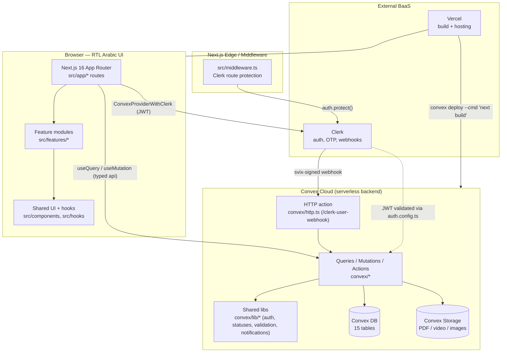
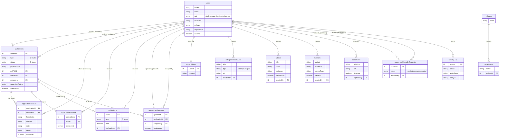
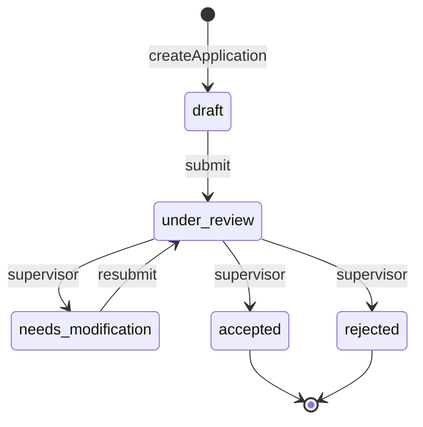
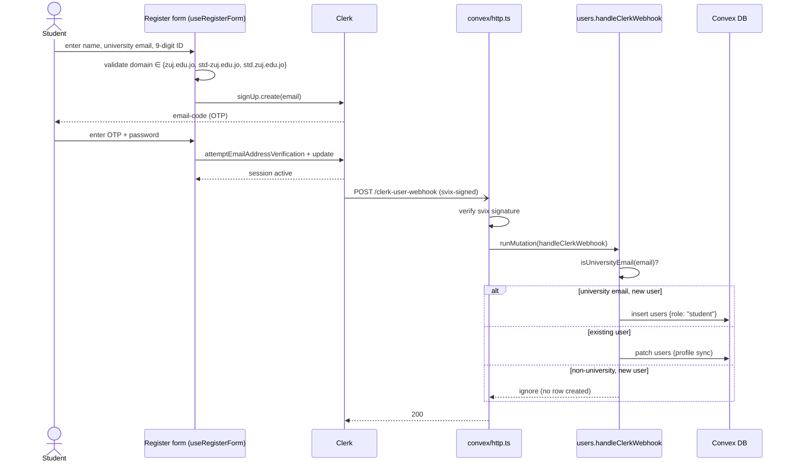
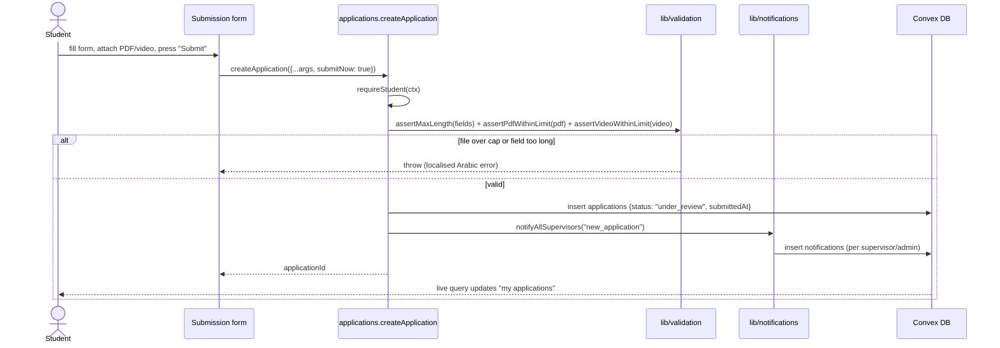
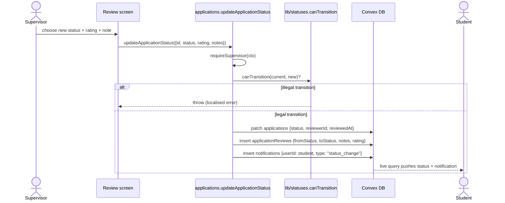
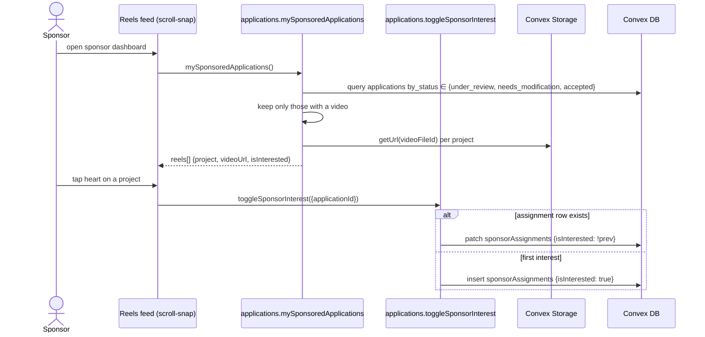
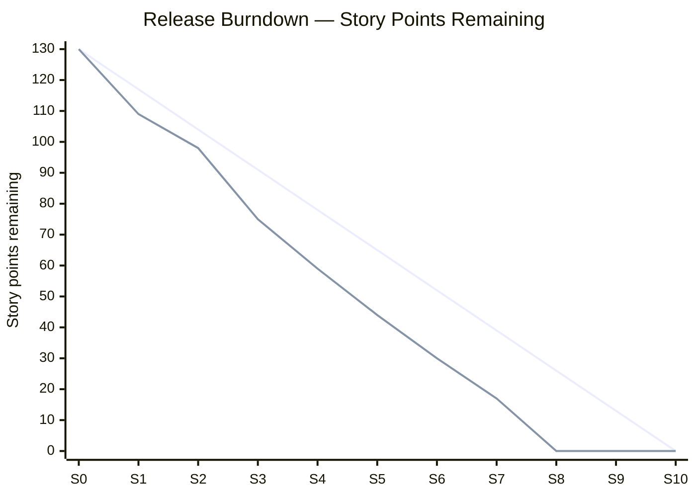

# Al-Zaytoonah University of Jordan
# ZUJ Incubator (حاضنة الزيتونة)
## Consolidated Software Documentation

Vision Document · Software Requirements Specification · Software Design Document · Test Plan & Report · User Manuals · Project Management Plan

**Graduation Project — Software Documentation Handover**
**Date:** 14 May 2026

---

## Table of Contents

1. [Vision Document](#part-1--vision-document)
2. [Software Requirements Specification (SRS)](#part-2--software-requirements-specification-srs)
3. [Software Design Document (SDD)](#part-3--software-design-document-sdd)
4. [Test Plan & Report](#part-4--test-plan--report)
5. [User Manuals](#part-5--user-manuals)
6. [Project Management Plan](#part-6--project-management-plan)

---

## Revision Notes (this consolidated edition)

This single-file edition merges the six original docs (`ZUJIncubatorVisionDocument.md`, `ZUJIncubatorSRS.md`, `ZUJIncubatorSDD.md`, `ZUJIncubatorTestPlan.md`, `ZUJIncubatorUserManuals.md`, `ZUJIncubatorProjectManagementPlan.md`) and applies the following factual corrections so the documentation matches the live code on `main`:

| # | Correction |
|---|---|
| 1 | **Next.js version** updated from 16.2.4 → **16.2.6** (matches `package.json`). |
| 2 | **Upload size caps (10 MB PDF, 100 MB video) are now enforced server-side** in `convex/lib/uploads.ts` (`assertPdfWithinLimit`, `assertVideoWithinLimit`), invoked from `createApplication` and `updateApplication` in `convex/applications/student.ts`. References to a single `assertFileWithinLimit` helper have been replaced with the two real helpers. |
| 3 | **University email-domain guard now runs in the Clerk webhook** at `convex/users.ts` (`handleClerkWebhook`). Self-registration is restricted to `@zuj.edu.jo`, `@std-zuj.edu.jo`, and `@std.zuj.edu.jo`; non-university emails are skipped silently (sponsors/supervisors are still provisioned administratively via `convex/users/admin.ts`). |
| 4 | **`react-player` and `framer-motion`** clarified as living in `dependencies` and currently unused in `src/`. |
| 5 | **Additions to the dependency table:** `@convex-dev/auth` v0.0.91 (auth scaffolding) and `remark-gfm` v4.0.1 (markdown rendering). |

The remainder of the document is faithful to the original six files.

---

# Part 1 — Vision Document


---

# Chapter 1 — Introduction

## 1.1 Project Description

**ZUJ Incubator (حاضنة الزيتونة)** is a centralized, web-based incubation platform developed for Al-Zaytoonah University of Jordan to manage the full lifecycle of student-led entrepreneurial initiatives and graduation projects. The system replaces the previous fragmented, document- and email-based workflow with a single source of truth that unifies submission, review, mentorship, and sponsorship under one digital roof.

The platform accepts three distinct submission tracks: **entrepreneurial ideas**, **IT graduation projects**, and **university-level entrepreneurial projects**. Each submission, referred to internally as an *Application*, advances through a deterministic state machine: `draft → under_review → needs_modification → accepted | rejected`. Every state transition is preserved as an immutable record in a dedicated reviews table, providing a permanent and auditable history of supervisor decisions.

The system is organized around four user roles, each granted a distinct set of permissions through a role-based access control (RBAC) model:

- **Student** — drafts, edits, and submits applications; uploads PDF business plans and video pitches; receives supervisor feedback; can request promotion to a supervisor role.
- **Supervisor** — reviews applications in real time, annotates them with notes and ratings, authors educational articles, publishes banners, and curates the entrepreneurial guide library.
- **Sponsor** — discovers accepted projects through an Instagram-style **reels feed**, expresses funding interest, and is matched to projects via sponsor assignments.
- **Administrator** — manages institutional metadata (colleges, departments), user roles, social-media links, and oversees the system-wide activity log.

Beyond the core submission workflow, the platform provides a suite of real-time and content services: a **presence subsystem** that signals which reviewer is currently viewing a given application, a **typed notification system** that emits events such as status changes, new notes, and sponsor assignments, **markdown-based articles** with audience targeting, **scrolling and hero banners**, and a curated **entrepreneurial guide** of videos, courses, and external resources. The entire interface is fully right-to-left (RTL) Arabic, rendered with the Tajawal typeface, and localized through Clerk's Arabic locale.

## 1.2 Project Overview

ZUJ Incubator is conceived as a strategic enabler for the university's innovation ecosystem. By digitizing what has traditionally been a paper- and email-driven process, the platform delivers measurable value across all stakeholder groups. For **students**, it reduces friction in submission, accelerates feedback cycles, and offers structured learning material curated by faculty. For **supervisors**, it consolidates review work in a single dashboard, automates audit logging, and surfaces real-time collaboration cues. For **the incubator office**, it provides a unified record of every project, every decision, and every transition, enabling data-driven oversight of the incubator's portfolio. For **external sponsors and investors**, it converts the historically opaque pool of accepted projects into a discoverable, media-rich feed that supports informed funding decisions.

The platform's underlying value proposition is therefore three-fold: **process digitization**, **transparency through auditability**, and **ecosystem connectivity** between students, mentors, and capital providers.

## 1.3 Tasks

The technical scope of the project comprises the following engineering tasks, each grounded in concrete artifacts within the codebase:

1. Design and implement the Convex relational schema covering **fifteen** domain tables (`users`, `applications`, `applicationReviews`, `applicationPresence`, `notifications`, `sponsorAssignments`, `banners`, `articles`, `entrepreneurialGuide`, `colleges`, `departments`, `supervisorUpgradeRequests`, `studentNotes`, `socialLinks`, `activityLogs`), including indexed access patterns suitable for real-time subscriptions.
2. Integrate Clerk authentication with Convex by configuring JWT validation in `convex/auth.config.ts` and propagating identity through `ConvexProviderWithClerk`.
3. Enforce a four-role RBAC matrix at the Convex function boundary, with all sensitive operations gated by `ctx.auth.getUserIdentity()`.
4. Implement the application state machine and immutable review log, ensuring optimistic concurrency control (OCC) safety on concurrent supervisor writes.
5. Build the real-time presence and notification subsystems backed by Convex live queries.
6. Implement secure file ingestion for PDF business plans and video pitches via Convex Storage — with server-enforced upload size caps (10 MB for PDFs, 100 MB for videos), client-side PDF previews powered by `react-pdf`, and pitch-video playback through the native HTML5 `<video>` element.
7. Develop the markdown-authoring pipeline for articles (rich text rendering via `react-markdown` with `remark-gfm`) and the audience-targeting model.
8. Construct the Instagram-style sponsor reels feed for accepted projects as a CSS scroll-snap vertical feed.
9. Deliver the administrative dashboards using `recharts` for analytics and `@tanstack/react-table` for tabular management.
10. Produce a fully RTL, accessible Arabic user interface using Tailwind CSS v4, HeroUI 3, and the Tajawal typeface.
11. Execute a system-wide migration from custom legacy components to the HeroUI 3 component library to standardize UI behavior.
12. Configure the production deployment pipeline, including a Vercel build hook that deploys the Convex backend on each release.
13. Enforce end-to-end type safety and code quality through TypeScript strict mode and ESLint (the `@convex-dev/eslint-plugin` Convex ruleset), and author automated backend tests with Vitest and `convex-test` in the `edge-runtime` environment covering the RBAC matrix, the application state machine, and the upload-size and university-email guards.

## 1.4 Project Planning

The project follows an **Agile / Scrum** methodology executed across an academic horizon of **fifteen weeks**, organized into eleven sprints of one or two weeks each. Core feature sprints (Sprints 1–4) follow a two-week cadence, while planning, real-time, content, sponsor, analytics, hardening, and delivery sprints are compressed into single-week iterations to align with the academic calendar.

| Sprint | Duration | Phase | Key Deliverables |
|---|---|---|---|
| Sprint 0 | Week 1 | Analysis | Stakeholder interviews, finalised SRS, product backlog |
| Sprint 1 | Weeks 2–3 | Design / Foundation | Convex schema v1, Clerk integration, base App Router layout, RTL theme |
| Sprint 2 | Weeks 4–5 | Foundation | RBAC matrix, user provisioning, college/department admin |
| Sprint 3 | Weeks 6–7 | Core Workflow | Application draft + submit for the three tracks |
| Sprint 4 | Weeks 8–9 | Core Workflow | Supervisor review screens, ratings, notes, state machine, immutable audit log |
| Sprint 5 | Week 10 | Real-time | Presence heartbeats and typed notifications |
| Sprint 6 | Week 11 | Content | Articles (markdown + audience), banners, entrepreneurial guide |
| Sprint 7 | Week 12 | Sponsor Track | Sponsor reels feed and sponsor assignments |
| Sprint 8 | Week 13 | Analytics | Admin dashboards (`recharts`, `react-table`), activity log viewer |
| Sprint 9 | Week 14 | Hardening | Accessibility, RTL polish, performance, security review |
| Sprint 10 | Week 15 | Delivery | UAT with the incubator office, production deployment on Vercel, documentation handover |

Each sprint terminates with a Sprint Review demonstrating working software to the academic supervisor, followed by a Sprint Retrospective that feeds improvements into the next iteration.

## 1.5 Planning of Development Phases

Within the Scrum cadence above, the work is conceptually organized into the following five engineering phases:

1. **Requirements Analysis.** Elicitation of functional and non-functional requirements through interviews with the university incubator office, faculty supervisors, and a sample of prospective sponsors. Outputs: prioritized product backlog, user-story map, and SRS (IEEE 830–style).
2. **System Design.** Architectural design of the Next.js / Convex / Clerk stack; Convex schema and index design; entity-relationship diagram; high-fidelity UI mockups in HeroUI; definition of the RBAC matrix and the application state machine.
3. **Implementation.** Iterative construction across Sprints 1 through 8, organised as vertical slices that deliver an end-to-end feature per sprint. Continuous integration is enforced through automated Convex deploys on the Vercel build pipeline.
4. **Testing.** Static verification of Convex functions and UI code through TypeScript strict-mode compilation and ESLint (with the `@convex-dev/eslint-plugin` Convex ruleset); automated backend tests of Convex functions using Vitest with `convex-test` under the `edge-runtime` environment, covering the RBAC matrix, the application state machine, and the upload-size and university-email guards; manual functional testing of critical UI flows; manual User Acceptance Testing per role with representatives of the incubator office.
5. **Deployment and Handover.** Provisioning of production Convex and Clerk environments, configuration of live API keys and Clerk JWT issuer, deployment to Vercel, runbook delivery, and stakeholder training.

## 1.6 The Scope of the Work

**Within scope.**

- Three application tracks: entrepreneurial idea, IT graduation, university-level entrepreneurial.
- Four user roles with full RBAC enforcement.
- Application state machine with immutable audit log of every transition.
- Real-time presence and typed in-app notifications.
- Markdown article authoring with audience targeting, scrolling and hero banners, and the entrepreneurial guide library.
- PDF business-plan and video-pitch uploads via Convex Storage with in-browser preview.
- Sponsor matchmaking with an Instagram-style reels feed for accepted projects.
- Administrative management of colleges, departments, social media links, supervisor upgrade requests, and the global activity log.
- Right-to-left Arabic user interface localized via Clerk's Arabic locale.
- Production deployment on Vercel with a Convex backend build hook.

**Out of scope.**

- In-platform financial transactions, escrow, or disbursement to sponsored projects.
- Automated AI-based application review or scoring.
- Native mobile applications for iOS or Android.
- Multi-tenant federation across multiple universities.
- Offline-first or fully Progressive Web App (PWA) capability.
- External notification channels such as SMS, WhatsApp, or push notifications.
- Public-facing API for third-party integrators.

## 1.7 Stakeholders

| Stakeholder | Interest in the System |
|---|---|
| Students of Al-Zaytoonah University | Primary submitters; consume articles and guide content; track application status. |
| Faculty supervisors | Review applications, mentor students, author articles, manage banners and guides. |
| External sponsors and investors | Discover accepted projects via the reels feed; express funding interest. |
| Incubator office / university administration | Manage institutional hierarchy (colleges, departments), roles, social links, and oversight. |
| Development team (graduation project team) | Designs, implements, tests, and maintains the platform. |
| Academic supervisor of the graduation project | Mentors the development team and validates academic deliverables. |
| Platform providers (Convex, Clerk, Vercel) | Provide the underlying Backend-as-a-Service, identity, and hosting infrastructure. |

## 1.8 Scope

ZUJ Incubator delivers a centralized, RTL-Arabic web platform that manages the complete lifecycle of three categories of student projects across four user roles, supported by real-time review, immutable auditing, markdown content modules, and a sponsor-facing discovery feed. The system explicitly excludes payment processing, AI-driven evaluation, native mobile applications, and inter-university federation.

## 1.9 Definitions, Acronyms, and Abbreviations

| Term / Acronym | Definition |
|---|---|
| **ZUJ** | Al-Zaytoonah University of Jordan — the host institution of the incubator. |
| **Application** | A project submission record in the `applications` table belonging to one of three tracks. |
| **Track** | One of `entrepreneurial_idea`, `it_graduation`, or `university_entrepreneurial`. |
| **Review** | An immutable record in `applicationReviews` capturing a single state transition. |
| **Sponsor Assignment** | A record in `sponsorAssignments` linking a sponsor to an accepted application. |
| **Presence** | The real-time heartbeat in `applicationPresence` indicating active reviewers. |
| **Reels Feed** | Instagram-style swipe interface that surfaces accepted projects to sponsors. |
| **Audit Log** | The append-only `activityLogs` table recording system-wide events. |
| **RBAC** | Role-Based Access Control across student, supervisor, sponsor, and admin roles. |
| **BaaS** | Backend-as-a-Service — the architectural pattern delivered by Convex. |
| **JWT** | JSON Web Token — Clerk-issued credential validated by Convex. |
| **OCC** | Optimistic Concurrency Control — Convex's default write-conflict strategy. |
| **CRUD** | Create, Read, Update, Delete. |
| **SRS** | Software Requirements Specification. |
| **UAT** | User Acceptance Testing. |
| **RSC / SSR** | React Server Components / Server-Side Rendering (Next.js App Router). |
| **RTL** | Right-to-Left text directionality used for the Arabic UI. |
| **MVP** | Minimum Viable Product — the deliverable at the end of Sprint 10. |
| **Application States** | `draft`, `under_review`, `needs_modification`, `accepted`, `rejected`. |
| **User Roles** | `student`, `supervisor`, `sponsor`, `admin`. |

## 1.10 References

The following references correspond to the technologies, libraries, and methodologies actually used in the implementation of ZUJ Incubator.

1. Convex — *Convex Documentation*. https://docs.convex.dev
2. Clerk — *Clerk Authentication Documentation*. https://clerk.com/docs
3. Next.js — *Next.js App Router Documentation (v16)*. https://nextjs.org/docs
4. HeroUI — *HeroUI Component Library (v3)*. https://www.heroui.com
5. Tailwind CSS — *Tailwind CSS v4 Documentation*. https://tailwindcss.com
6. TypeScript — *TypeScript Handbook*. https://www.typescriptlang.org/docs
7. Zod — *Zod Schema Validation*. https://zod.dev
8. React Hook Form — *React Hook Form Documentation*. https://react-hook-form.com
9. react-pdf — *react-pdf Library*. https://github.com/wojtekmaj/react-pdf
10. react-markdown and remark-gfm. https://github.com/remarkjs/react-markdown
11. Recharts — *Recharts Charting Library*. https://recharts.org
12. TanStack Table — *@tanstack/react-table v8*. https://tanstack.com/table
13. Vitest and convex-test — *Convex Function Testing*. https://docs.convex.dev/functions/testing
14. Vercel — *Vercel Deployment Documentation*. https://vercel.com/docs
15. Schwaber, K., & Sutherland, J. (2020). *The Scrum Guide*. https://scrumguides.org
16. IEEE Std 830-1998 — *IEEE Recommended Practice for Software Requirements Specifications*.

## 1.11 Overview

This chapter has introduced **ZUJ Incubator**, established its functional intent as a unified incubation platform for Al-Zaytoonah University, enumerated the engineering tasks and stakeholder groups, fixed the Agile / Scrum delivery plan over a fifteen-week horizon, and bounded the system through explicit in-scope and out-of-scope statements. The terminology and references set out in Sections 1.9 and 1.10 will be used consistently throughout the remainder of the document. The next chapter formalises the functional and non-functional requirements that this scope implies.

---

# Chapter 2 — Positioning

## 2.1 Business Opportunity

Al-Zaytoonah University of Jordan, like the majority of higher-education institutions in the region, operates its entrepreneurship and graduation-project programs through a combination of paper forms, email threads, shared drives, and ad-hoc face-to-face meetings. Although this informal workflow has historically been tolerable for small cohorts, the recent national push toward an *innovation economy*, the steady growth in incubator enrolments, and the increasing involvement of external sponsors have transformed what was once a manageable administrative routine into a fragmented, error-prone, and largely opaque process.

This shift has created a clear and quantifiable opportunity for a purpose-built digital incubation platform. From a **technical perspective**, modern Backend-as-a-Service infrastructure (Convex), federated identity (Clerk), and real-time collaboration primitives now make it economically feasible for a single graduation-project team to deliver a production-grade, multi-role system that would have required a dedicated engineering department only a few years ago. From a **business perspective**, an institutional digital incubator unlocks several streams of value simultaneously: it accelerates the time from idea to evaluated submission, expands the university's capacity to admit and supervise more projects without proportionally expanding its administrative staff, generates structured data that can inform strategic decisions in the incubator office, and — most importantly — establishes a discoverable bridge between accepted student projects and the external sponsors and investors who increasingly seek early-stage opportunities within Jordanian universities.

**ZUJ Incubator** therefore positions itself at the intersection of three converging trends: the digital transformation of higher-education administration, the institutionalisation of entrepreneurship as a core university function, and the regional demand for transparent, auditable channels between academic talent and private capital. Capturing this opportunity before competing universities deploy similar systems offers Al-Zaytoonah University a meaningful first-mover advantage in attracting both prospective entrepreneurial students and the sponsorship ecosystem that supports them.

## 2.2 Problem Statement

| Element | Description |
|---|---|
| **The problem of** | the absence of a unified, auditable, and real-time platform for managing the full lifecycle of entrepreneurial ideas and graduation projects at Al-Zaytoonah University of Jordan, |
| **Affects** | undergraduate students submitting entrepreneurial or graduation projects, faculty supervisors who must review them, external sponsors seeking early-stage projects to back, and the incubator office responsible for institutional oversight, |
| **The impact of which is** | excessive administrative overhead and review delays caused by reliance on paper forms and scattered email correspondence; loss of accountability due to the absence of an immutable audit trail of supervisor decisions; missed funding opportunities for high-quality student projects that remain invisible to external sponsors; inability of the incubator office to obtain reliable, real-time analytics on its portfolio; and an overall student experience characterised by uncertainty about application status, slow feedback, and limited access to curated entrepreneurial learning material, |
| **A successful solution would be** | a centralised, role-aware web platform that digitises the three official submission tracks (entrepreneurial idea, IT graduation project, and university-level entrepreneurial project), enforces a deterministic application state machine with a permanent review log, supports real-time collaboration among supervisors, exposes accepted projects to vetted sponsors through a media-rich discovery feed, delivers institutional analytics to administrators, and offers students structured access to articles, banners, and a curated entrepreneurial guide — all in a fully right-to-left Arabic interface. |

## 2.3 Product Position Statement

| Element | Statement |
|---|---|
| **For** | students, faculty supervisors, external sponsors, and the incubator administration of Al-Zaytoonah University of Jordan, |
| **Who** | need a single, transparent, and auditable channel through which entrepreneurial ideas and graduation projects can be submitted, reviewed, mentored, and connected to funding opportunities, |
| **The ZUJ Incubator (حاضنة الزيتونة) is a** | role-based, real-time web incubation platform built on Next.js, Convex, and Clerk, |
| **That** | digitises the three official application tracks, enforces an immutable five-state review workflow with full audit logging, surfaces real-time presence and typed notifications for collaborative supervision, exposes accepted projects to sponsors through an Instagram-style reels feed, and delivers curated articles, banners, and entrepreneurial guides through a fully right-to-left Arabic interface. |
| **Unlike** | generic learning-management systems (e.g., Moodle), free-form collaboration tools (e.g., Microsoft Teams, Google Workspace), and conventional project-management trackers (e.g., Trello, Asana) — none of which model the university incubator domain, enforce role-specific review workflows, provide sponsor-facing discovery, or preserve immutable academic audit trails, |
| **Our product** | is a domain-specific, RTL-Arabic platform purpose-built for the operational reality of an Al-Zaytoonah University incubator: it embeds the three official submission tracks and the four institutional roles directly into its data model, guarantees auditability through an append-only review log, enables real-time multi-supervisor collaboration via Convex live queries, and uniquely bridges the academic and investment ecosystems through its sponsor reels feed — turning a fragmented administrative process into a single, measurable, and scalable institutional asset. |

---

# Chapter 3 — Stakeholder and User Descriptions

## 3.1 Market Demographics

The primary user base of **ZUJ Incubator (حاضنة الزيتونة)** is drawn from the academic and entrepreneurial community surrounding Al-Zaytoonah University of Jordan and the broader Amman-based investor ecosystem. The demographic profile of the platform's intended audience is summarised below.

| Dimension | Profile |
|---|---|
| **Age range** | 18 – 24 (students), 28 – 60 (faculty supervisors), 30 – 65 (sponsors and administration). |
| **Educational level** | Undergraduate (students); Master's or Doctoral degrees in Information Technology, Engineering, Business, or Entrepreneurship (supervisors); diverse, typically Bachelor's degree or higher (sponsors); university administrative qualifications (admin staff). |
| **Geographic location** | Predominantly the Hashemite Kingdom of Jordan, with a primary concentration in Amman and surrounding governorates; sponsors may also operate regionally across the Levant and the Gulf. |
| **Language** | Arabic as primary language of interaction; English as a secondary working language for technical and academic terminology. |
| **Digital literacy** | Students: high; native users of mobile and social-media interfaces. Supervisors and administration: moderate to high; familiar with LMS platforms, email, and Office tooling. Sponsors: high; accustomed to modern SaaS dashboards. |
| **Devices in use** | Mobile phones (Android and iOS) for casual browsing and notifications; desktop and laptop computers (Windows, macOS) for content authoring, review, and administrative work. |
| **Connectivity** | Stable broadband and 4G/5G connectivity on campus and in metropolitan areas; occasional bandwidth limitations require the interface to remain responsive on slower connections. |
| **Cultural context** | Right-to-left Arabic content consumption; familiarity with Islamic-academic terminology; preference for visually-rich, modern interfaces aligned with regional social-media usage patterns. |

## 3.2 Stakeholder Summary

The following stakeholders have a direct interest in the success of ZUJ Incubator and have shaped its functional scope.

| Stakeholder | Role | Responsibilities |
|---|---|---|
| **Al-Zaytoonah Incubator Office** | Product Owner / Institutional Sponsor | Defines policies, owns the project portfolio, validates UAT, approves production release, and is accountable for institutional adoption. |
| **University Administration** | Executive Sponsor | Approves the strategic alignment of the platform with university objectives; authorises integration with university identity and infrastructure. |
| **Faculty Supervisors** | Domain Experts / Power Users | Provide subject-matter knowledge of supervision workflows, define review criteria, author articles and guides, and validate the review-and-rating model. |
| **Students of Al-Zaytoonah University** | End Users (primary) | Submit and iterate on applications; consume articles, banners, and the entrepreneurial guide; serve as the principal subjects of UAT. |
| **External Sponsors and Investors** | End Users / Beneficiaries | Discover accepted projects, express funding interest, and validate the sponsor-facing reels feed and assignment workflow. |
| **Academic Project Supervisor** | Project Mentor | Mentors the development team, evaluates academic deliverables, enforces methodology, and signs off on sprint reviews. |
| **Development Team** | Implementers | Design, build, test, deploy, document, and maintain the platform. |
| **Platform Providers (Convex, Clerk, Vercel)** | Infrastructure Suppliers | Provide the Backend-as-a-Service, identity, and hosting layers that the system depends upon. |

## 3.3 User Summary

The system distinguishes four authenticated user types (encoded in the `users` table and enforced by the RBAC matrix in the Convex layer), plus an unauthenticated visitor category.

| User Type | Code in System | Description | Authenticated |
|---|---|---|---|
| **Administrator** | `admin` | Highest-privileged user; manages colleges, departments, social links, user roles, and reviews the global activity log. | Yes |
| **Supervisor** | `supervisor` | Faculty member who reviews applications, authors articles and banners, curates the entrepreneurial guide, and processes supervisor-upgrade requests. | Yes |
| **Student** | `student` | Default role on registration; drafts and submits applications, uploads PDF and video media, receives feedback, and may request promotion to a supervisor role. | Yes |
| **Sponsor** | `sponsor` | Created by an administrator; browses accepted projects via the reels feed, expresses interest, and is recorded in `sponsorAssignments`. | Yes |
| **Guest / Visitor** | *(unauthenticated)* | Lands on the public marketing pages and the login/registration flow; cannot read or write any business data. | No |

## 3.4 User Environment

ZUJ Incubator is designed as a responsive, web-only platform delivered through modern browsers. Its operating environment differs subtly between user types.

| Environment Aspect | Students | Supervisors | Sponsors | Administrators |
|---|---|---|---|---|
| **Primary device** | Mobile phone (predominantly) and personal laptop | Office desktop or laptop | Mobile phone first, desktop second | Office desktop |
| **Location of use** | Campus, dormitory, home | Faculty office, home office | Office, travel, mobile contexts | University incubator office |
| **Operating systems** | Android, iOS, Windows, macOS | Windows, macOS | iOS, Android, Windows, macOS | Windows, macOS |
| **Browsers** | Chrome, Safari, Edge (latest two versions) | Chrome, Edge | Chrome, Safari | Chrome, Edge |
| **Network conditions** | Variable: campus Wi-Fi, mobile data, residential broadband | Stable campus or office network | Mostly mobile data; intermittent | Stable institutional network |
| **Concurrent usage** | Sporadic, peaks near submission deadlines | Daily during review periods | Browsing-style sessions, weekly | Continuous during working hours |
| **Sensitivity to latency** | Moderate (drafting + uploads) | High (real-time review with presence) | Moderate (reels feed scroll experience) | Moderate (dashboards) |
| **Privacy expectations** | Personal data must be visible only to themselves and their assigned supervisors | Application content scoped to authorised supervisors | Sees only accepted projects intended for sponsor visibility | Full visibility under audit |

The interface is implemented in Right-to-Left Arabic with the Tajawal typeface, localised through Clerk's Arabic locale, and built with Tailwind CSS v4 and HeroUI v3 to ensure consistent responsive behaviour across the breakpoints typical of these environments.

## 3.5 Stakeholder Profiles

### 3.5.1 Al-Zaytoonah Incubator Office (Product Owner)
The incubator office owns the institutional incubation programme. Its representatives define which application tracks are valid, set the policies that govern supervisor assignments and sponsor matching, and bear ultimate responsibility for the academic and reputational outcomes of the platform. They are the most authoritative voice in scope-setting and accept or reject feature proposals during sprint reviews.

### 3.5.2 University Administration (Executive Sponsor)
The university administration provides the formal mandate, budget alignment, and integration authority required to deploy a system that processes student academic records. Its concerns centre on regulatory compliance, brand alignment, and strategic positioning of Al-Zaytoonah within the regional higher-education landscape.

### 3.5.3 Faculty Supervisors (Domain Experts)
Faculty supervisors are the most domain-knowledgeable users of the platform. Their daily interaction with the review workflow, their authorship of articles and banners, and their professional judgement on student work make them the primary source of functional requirements for the review-and-rating model, the audit log, and the educational content modules.

### 3.5.4 External Sponsors (Strategic Beneficiaries)
Sponsors interact with the platform mainly through the reels feed and the sponsor-interest workflow. Their satisfaction depends on the quality of the discovery experience, the credibility signals attached to accepted projects (ratings, supervisor endorsements), and the speed with which they can be matched to projects of interest.

### 3.5.5 Academic Project Supervisor (Mentor)
The academic project supervisor monitors the development team's progress, enforces the Agile / Scrum methodology, evaluates academic deliverables (SRS, design documents, code), and signs off on each sprint.

### 3.5.6 Development Team
The development team is responsible for delivering the working system on time, on scope, and according to the engineering standards established in the project (Convex guidelines, TypeScript strictness, HeroUI design system, accessibility, and RTL correctness).

### 3.5.7 Platform Providers
Convex, Clerk, and Vercel are non-human stakeholders whose service-level guarantees, pricing models, and technical roadmaps directly influence the platform's operating cost and reliability.

## 3.6 User Profiles

### 3.6.1 Student
- **Background.** Undergraduate enrolled at Al-Zaytoonah University, typically in years three or four; mother tongue Arabic; high mobile-application fluency.
- **Technical experience.** Comfortable with social-media interfaces and mobile-first web applications; limited prior exposure to formal project-management tools.
- **Needs.** A frictionless way to draft and submit applications, upload media (PDF business plans, video pitches), track status in real time, receive supervisor feedback, and consume curated entrepreneurial learning material.
- **Frequency of use.** Bursty: intense activity during drafting and just before deadlines; lighter check-ins to follow status changes and notifications.

### 3.6.2 Supervisor
- **Background.** Faculty member with a Master's or Doctoral degree; subject-matter expertise in the relevant academic department; bilingual Arabic/English.
- **Technical experience.** Familiar with LMS platforms, email-based workflows, Microsoft Office; moderate experience with modern web dashboards.
- **Needs.** A consolidated review queue, real-time presence to coordinate with peer supervisors, structured rating and note-taking, immutable audit history, and tools to publish articles, banners, and entrepreneurial guides for students.
- **Frequency of use.** Daily during active review periods; weekly outside peak windows.

### 3.6.3 Sponsor
- **Background.** Entrepreneur, investor, or representative of a corporate CSR programme; based primarily in Amman with regional outreach.
- **Technical experience.** High familiarity with modern SaaS, social media, and short-form video platforms (Instagram Reels, TikTok, LinkedIn).
- **Needs.** A rapid, visually-engaging discovery experience for accepted projects; trustworthy credibility signals (supervisor ratings, university endorsement); a low-friction way to express interest in a project.
- **Frequency of use.** Weekly browsing sessions; spikes around incubator demo days and end-of-semester showcases.

### 3.6.4 Administrator
- **Background.** University staff member working within the incubator office or central administration; high digital literacy in administrative tooling.
- **Technical experience.** Strong: comfortable with content-management systems, spreadsheets, and analytics dashboards.
- **Needs.** Comprehensive control over institutional metadata (colleges, departments), user roles, social links, supervisor-upgrade requests, and the global activity log; analytics dashboards for incubator portfolio oversight.
- **Frequency of use.** Daily during working hours.

### 3.6.5 Guest / Visitor
- **Background.** Prospective student, parent, sponsor, or general visitor.
- **Needs.** Public-facing information about the incubator and a clear path to register or sign in.
- **Frequency of use.** One-off or occasional, typically a single session.

## 3.7 Key Stakeholder or User Needs

Each identified need is linked to a concrete feature of ZUJ Incubator. Priority follows the MoSCoW convention (M = Must, S = Should, C = Could).

| # | Stakeholder / User Need | Priority | Current Solution | Proposed Solution in ZUJ Incubator |
|---|---|---|---|---|
| 1 | A single, official channel for submitting entrepreneurial and graduation projects. | **M** | Paper forms, email threads, ad-hoc folders. | The `applications` module with three explicit tracks (`entrepreneurial_idea`, `it_graduation`, `university_entrepreneurial`). |
| 2 | Deterministic, transparent review workflow with a permanent audit trail. | **M** | Verbal decisions and unstructured email replies. | A five-state machine (`draft → under_review → needs_modification → accepted | rejected`) coupled to the append-only `applicationReviews` log. |
| 3 | Real-time awareness of which supervisor is currently reviewing an application. | **S** | None. | The `applicationPresence` heartbeat surfaced as live indicators in the supervisor UI. |
| 4 | Timely, structured feedback to students. | **M** | Delayed email replies. | Typed `notifications` (status change, new note, assignment) and structured supervisor notes attached to each review. |
| 5 | Upload and preview of PDF business plans and video pitches. | **M** | External shared drives. | Convex Storage integration with in-browser PDF preview via `react-pdf` and native HTML5 `<video>` playback for pitch videos. |
| 6 | Curated, audience-targeted entrepreneurial learning content. | **S** | Scattered websites and Telegram channels. | The `articles`, `banners`, and `entrepreneurialGuide` modules authored by supervisors and administrators. |
| 7 | A discoverable surface that exposes accepted projects to external sponsors. | **M** | None. | The Instagram-style **sponsor reels feed** for accepted projects, backed by the `sponsorAssignments` table. |
| 8 | Role-based access control across four user types. | **M** | None (implicit trust). | RBAC enforced at the Convex function boundary via `ctx.auth.getUserIdentity()` plus a role field in the `users` table. |
| 9 | Institutional analytics over the project portfolio. | **S** | Manual spreadsheets. | Administrator dashboards built with `recharts` and `@tanstack/react-table` on top of the system tables. |
| 10 | A fully Arabic, right-to-left user experience. | **M** | Mixed RTL/LTR experience in generic tools. | Native RTL implementation with the Tajawal typeface and Clerk Arabic localisation. |
| 11 | Self-service career progression for students who become teaching assistants. | **C** | Manual letters and approvals. | The `supervisorUpgradeRequests` workflow with administrator approval. |
| 12 | A complete record of system actions for accountability. | **M** | None. | The append-only `activityLogs` table visible to administrators. |

## 3.8 Alternatives and Competition

ZUJ Incubator is not entering an empty market; several adjacent classes of tooling are already used — informally — to perform parts of its workflow. The table below positions the most relevant alternatives.

| Alternative | Category | Strengths | Weaknesses | Why It Falls Short of ZUJ Incubator |
|---|---|---|---|---|
| **Moodle / Microsoft Teams for Education / Google Classroom** | Learning Management Systems (LMS) | Already deployed at most universities; mature; integrated with student accounts. | Centred on courses, assignments, and grades; no concept of an *incubation application* or a *sponsor*; no immutable review log; no reels feed. | Cannot model the three submission tracks, the supervisor-review state machine, or sponsor matchmaking. |
| **Microsoft 365 / Google Workspace (Forms, Drive, Email)** | Generic collaboration suites | Universally available; familiar to staff. | Workflow lives across disconnected tools; no audit trail; no role enforcement; no analytics; no Arabic-first UX. | Reproduces today's fragmented, paper-replacing-paper experience that the project is designed to eliminate. |
| **Trello / Asana / Jira** | Project-management trackers | Strong task boards; well-known. | Generic kanban; no domain model for academic incubation; no sponsor view; no media uploads with previews; no Arabic-academic content modules. | Treats projects as tasks, not as audited academic applications belonging to institutional tracks. |
| **AngelList / Wamda / regional investor portals** | Sponsor-facing deal-flow platforms | Real investor audiences. | External, not affiliated with the university; no academic supervision layer; no Arabic-academic content; no institutional accountability. | They lack the academic submission and review pipeline; they only solve the sponsor-discovery slice. |
| **Custom in-house spreadsheets and shared drives** | Bespoke informal tooling | Zero direct cost; flexible. | Error-prone; no concurrency control; no audit; no notifications; no role enforcement; not scalable. | Represents the *status quo* this project explicitly replaces. |

The competitive analysis shows that, while individual capabilities of ZUJ Incubator can be partially approximated by existing tools, **no single alternative delivers an integrated, role-aware, audited, RTL-Arabic incubation pipeline that connects students, supervisors, sponsors, and administrators within one institutional product.** This integration — not any single isolated feature — constitutes the defensible position of the platform.

---

# Chapter 4 — Product Overview

## 4.1 Product Perspective

**ZUJ Incubator (حاضنة الزيتونة)** is delivered as a **self-contained, web-based product** that operates as a single logical system in production rather than as a sub-component of a larger institutional information system. The platform owns its data, its identity-to-role mapping, its content modules, and its user-facing experience, and it does **not** currently embed itself inside Al-Zaytoonah University's wider academic management or student information systems.

Notwithstanding this autonomy, the product is intentionally built on top of three external **Backend-as-a-Service** providers, each of which it integrates with through well-defined, asynchronous boundaries:

| Integration | Direction | Purpose | Interface |
|---|---|---|---|
| **Convex Cloud** | Outbound (always-on) | Hosts the relational schema, executes queries / mutations / actions, and provides real-time subscriptions and file storage. | Convex client SDK (`convex/react`), `_generated/api` typed bindings. |
| **Clerk** | Bidirectional | Issues JWTs for authentication, hosts the sign-in / sign-up UI, and emits user-lifecycle webhooks. | `@clerk/nextjs` middleware, `ConvexProviderWithClerk`, `svix`-signed webhooks consumed at `convex/http.ts`. |
| **Vercel** | Hosting | Builds and serves the Next.js front end and triggers the Convex deploy step on each release. | Standard `next build` pipeline plus the `convex deploy --cmd 'next build'` hook. |
| **Browser environment** | Inbound | Loads the RTL Arabic UI on Chrome, Edge, Safari, and Firefox (latest two major versions). | Standard HTML / ES2022 / CSS3 over HTTPS. |

The product is architected so that the front end (Next.js App Router under `src/app/`) and the back end (Convex functions under `convex/`) share a single TypeScript type system through Convex's `_generated/api`, eliminating an entire class of contract-drift defects that would otherwise be possible at the integration boundary. Future integration with university SSO, financial systems, or alumni databases is anticipated but explicitly out of scope for the current release.

## 4.2 Summary of Capabilities

| # | Feature | Description | Benefit |
|---|---|---|---|
| 1 | **Multi-Track Application Submission** | A unified submission form supporting the three official tracks (`entrepreneurial_idea`, `it_graduation`, `university_entrepreneurial`) with track-aware validation and required fields. | One canonical channel for every type of incubated project; eliminates fragmented intake processes. |
| 2 | **Deterministic Review State Machine** | Five enforced states (`draft → under_review → needs_modification → accepted | rejected`) governing the lifecycle of every application. | Predictable progression; no orphaned or inconsistent submissions. |
| 3 | **Immutable Audit Log** | Append-only `applicationReviews` and `activityLogs` tables capturing every state change, supervisor action, and administrative event. | Full institutional accountability and academic integrity. |
| 4 | **Real-Time Presence** | Heartbeat-based `applicationPresence` indicating which supervisor is currently viewing an application. | Prevents duplicate review effort and supports coordinated supervision. |
| 5 | **Typed Notification System** | Domain-typed notifications (`status_change`, `new_note`, `new_application`, `assignment`, etc.) surfaced in real time. | Timely user awareness without dependence on external email channels. |
| 6 | **Role-Based Access Control (RBAC)** | Four roles (`student`, `supervisor`, `sponsor`, `admin`) enforced at the Convex function boundary via `ctx.auth.getUserIdentity()`. | Robust security and least-privilege by design. |
| 7 | **Media Uploads and Previews** | PDF business plans and pitch videos uploaded to Convex Storage, with in-browser PDF previews powered by `react-pdf` and pitch-video playback through the native HTML5 `<video>` element. | Rich, self-contained applications with no external file-sharing detours. |
| 8 | **Sponsor Reels Feed** | Instagram-style vertical feed exposing accepted projects to authenticated sponsors, backed by `sponsorAssignments`. | Bridges the academic and investment ecosystems through a familiar discovery pattern. |
| 9 | **Markdown Articles with Audience Targeting** | Supervisor- and admin-authored articles rendered via `react-markdown` + `remark-gfm`, scoped to specific audiences. | Centralised, high-quality entrepreneurial learning content. |
| 10 | **Banners and Entrepreneurial Guide** | Scrolling and hero banners plus a curated library of videos, courses, and external resources. | Structured engagement and educational support for students. |
| 11 | **Supervisor Upgrade Requests** | Self-service workflow allowing students who become teaching assistants to request promotion to a supervisor role, subject to admin approval. | Reduces administrative overhead for routine role changes. |
| 12 | **Administrative Dashboards** | Analytics and tabular management built with `recharts` and `@tanstack/react-table` over the institutional data. | Data-driven oversight of the incubator portfolio. |
| 13 | **Institutional Metadata Management** | CRUD interfaces for colleges, departments, social links, and user roles. | Single source of truth for institutional structure. |
| 14 | **RTL Arabic UI** | Fully right-to-left interface using the Tajawal typeface, HeroUI v3 components, Tailwind CSS v4, and Clerk Arabic localisation. | Native-quality experience for the Arabic-speaking primary audience. |
| 15 | **Continuous Deployment Pipeline** | Vercel build hook (`convex deploy --cmd 'next build'`) deploying both front end and Convex backend on each release. | Predictable, repeatable, low-risk releases. |

## 4.3 Assumptions and Dependencies

### 4.3.1 Assumptions

The product is engineered under the following explicit assumptions:

| # | Assumption | Justification |
|---|---|---|
| A1 | End users have continuous access to the public internet over HTTPS. | The system has no offline mode and relies on Convex live queries for real-time behaviour. |
| A2 | Users access the platform from an evergreen browser (Chrome, Edge, Safari, or Firefox — latest two major versions). | Next.js 16, Tailwind v4, and HeroUI v3 target modern browsers; legacy browsers are not supported. |
| A3 | Each self-registering user possesses a unique Al-Zaytoonah email address (`@zuj.edu.jo`, `@std-zuj.edu.jo`, or `@std.zuj.edu.jo`), verified by Clerk's email-code (OTP) flow. | Both the registration form and the Convex Clerk-webhook restrict self-service `student` accounts to university domains; non-university identities (e.g. external sponsors) are provisioned administratively. |
| A4 | Al-Zaytoonah University formally endorses the platform and provides at least one administrator account during onboarding. | An empty `users` table with `role = "admin"` cannot bootstrap itself; the first admin is seeded manually. |
| A5 | Sponsors are vetted and onboarded by an administrator rather than self-registering as sponsors. | Sponsor role is created administratively (see `convex/users/`) to preserve trust in the reels feed. |
| A6 | Application content stays within the platform's upload caps — 10 MB per PDF business plan and 100 MB per pitch video — enforced both client-side and server-side in the application mutations. | The platform delegates file persistence to Convex Storage; the caps keep storage growth and reviewer download times predictable. |
| A7 | Arabic is the primary content language and Latin scripts may occur within technical terms. | The Tajawal font and RTL layout are tuned for Arabic with mixed-direction tolerance. |

### 4.3.2 Dependencies

The product depends on the following external services, frameworks, and libraries. The versions listed are those pinned in `package.json` at the time of writing.

**Cloud platforms.**

| Service | Role |
|---|---|
| Convex (`convex` v1.36.1) | Database, server-side functions, real-time subscriptions, file storage. |
| Clerk (`@clerk/nextjs` v6.39.2, `@clerk/clerk-react` v5.61.3, `@clerk/backend` v3.4.2, `@clerk/localizations` v4.5.5) | Authentication, identity, JWT issuance, RTL localisation. |
| Vercel | Hosting, CI/CD for both the Next.js front end and the Convex backend deploy step. |

**Application frameworks.**

| Framework / Library | Role |
|---|---|
| Next.js v16.2.6 | App Router, server components, routing, build pipeline. |
| React v19 + React DOM | UI runtime. |
| TypeScript v5.9.3 | Static typing across front end and Convex functions. |

**UI and interaction.**

| Library | Role |
|---|---|
| HeroUI v3.0.3 (`@heroui/react`) | Component library and design system. |
| Tailwind CSS v4.2.2 | Utility-first styling; also provides the sponsor reels feed scroll-snap behaviour. |
| Framer Motion v11.18.2 | Listed in `dependencies` for future animation work — currently not imported anywhere in `src/` (the reels feed uses CSS `scroll-snap-y mandatory` instead). |
| lucide-react v1.11.0 | Icon set. |
| next-themes v0.4.6 | Dark mode and theme persistence. |

**Forms, validation, and data presentation.**

| Library | Role |
|---|---|
| React Hook Form v7.74.0 | Form state management. |
| Zod v4.3.6 | Schema validation on the client. |
| Recharts v3.8.1 | Administrative analytics charts. |
| `@tanstack/react-table` v8.21.3 | Tabular data presentation. |

**Media and content.**

| Library | Role |
|---|---|
| react-pdf v10.4.1 | In-browser preview of PDF business plans. |
| react-player v3.4.0 | Listed in `dependencies` for future use — pitch videos currently play through the native HTML5 `<video>` element and the library is not imported anywhere in `src/`. |
| react-markdown v10.1.0 + remark-gfm v4.0.1 | Rendering of supervisor and admin articles. |
| react-dropzone v15.0.0 | File-upload drag-and-drop. |

**Integration utilities.**

| Library | Role |
|---|---|
| svix v1.92.2 | Verification of incoming Clerk webhooks at `convex/http.ts`. |
| `@convex-dev/auth` v0.0.91 | Installed for Convex auth integration scaffolding; the live auth flow uses Clerk JWTs validated via `convex/auth.config.ts`. |

**Testing.**

| Library | Role |
|---|---|
| Vitest v4.1.6 | Test runner for the Convex backend test suite (`pnpm test`). |
| convex-test v0.0.52 | In-memory Convex backend mock for exercising queries, mutations, and actions. |
| `@edge-runtime/vm` v5.0.0 | Edge-runtime environment that mirrors the Convex function runtime under test. |

A breaking change in any of these dependencies — particularly Convex, Clerk, or Next.js — would constitute a material risk and would require a corresponding update sprint.

## 4.4 Cost and Pricing

### 4.4.1 Development Cost

Because ZUJ Incubator is delivered as a graduation project by the student development team, the direct labour cost is **not invoiced** to Al-Zaytoonah University; it is absorbed as part of the academic deliverable. The notional cost is summarised below for academic completeness.

| Cost Item | Quantity | Notional Rate | Notional Cost |
|---|---|---|---|
| Development effort (4 developers × 15 weeks × 20 h) | 1,200 person-hours | 10 JOD / h | 12,000 JOD |
| Academic supervision | 15 weeks × 2 h | — | In-kind |
| Design and testing | Included above | — | — |
| **Notional development total** | — | — | **≈ 12,000 JOD** |

### 4.4.2 Operating (Hosting) Cost

The platform's operating cost is driven by the pricing tiers of the three external services it depends upon. The figures below reflect the publicly listed plans of those providers at the time of writing and should be revalidated before contracting.

| Service | Tier Suitable for Pilot | Tier Suitable for Production | Notes |
|---|---|---|---|
| **Convex** | Free (starter) | Pro (~25 USD / month per project + usage) | Database, functions, file storage; usage charges apply above the included quota. |
| **Clerk** | Free (≤ 10,000 monthly active users) | Pro (from ~25 USD / month + per-MAU charges) | Authentication, RTL localisation, webhooks. |
| **Vercel** | Hobby (free) | Pro (~20 USD / month per seat) | Required for a commercial / institutional deployment. |
| **Domain and TLS** | — | ~15 USD / year | A `*.zuj.edu.jo` subdomain is recommended. |
| **Estimated monthly production total** | — | **≈ 70 – 120 USD / month at moderate load** | Scales with active users and storage volume. |

### 4.4.3 Pricing Model

ZUJ Incubator is intended to be deployed and owned by Al-Zaytoonah University of Jordan as **institutional internal software**. It is therefore **free of charge to end users** (students, supervisors, sponsors, and administrators). No subscription, transactional, or freemium pricing model is applied at the user-facing layer. Any future monetisation — for example, sponsorship transaction fees or premium sponsor-tier features — is explicitly out of scope for the current release and would require an institutional policy decision.

## 4.5 Licensing and Installation

### 4.5.1 Licensing

| Aspect | Position |
|---|---|
| **Ownership** | The source code, design assets, and database schema are the intellectual property of the student development team and Al-Zaytoonah University of Jordan, jointly, as the academic supervising institution. |
| **End-User License** | The platform is licensed for **internal institutional use** by Al-Zaytoonah University. End users do not require a separate licence; access is governed by the RBAC matrix and the university's acceptable-use policy. |
| **Third-Party Licences** | All third-party dependencies are consumed under their published open-source licences (predominantly MIT and Apache 2.0); their notices must be preserved in any redistribution. |
| **Trademarks** | "Al-Zaytoonah University" and "حاضنة الزيتونة" are institutional marks of the university and are used in the product under the university's authority. |

### 4.5.2 Prerequisites

Before installation, the operator must provision the following:

1. A **Convex** project (free tier acceptable for development).
2. A **Clerk** application configured for both development and production, with the Convex JWT template enabled and the issuer domain recorded.
3. A **Vercel** project linked to the Git repository.
4. Node.js LTS and `pnpm` installed on the developer workstation.

### 4.5.3 Environment Variables

The following variables must be provided (see `.env.example`):

- `CONVEX_DEPLOYMENT`
- `NEXT_PUBLIC_CONVEX_URL`
- `NEXT_PUBLIC_CONVEX_SITE_URL`
- `NEXT_PUBLIC_CLERK_PUBLISHABLE_KEY`
- `CLERK_SECRET_KEY`
- `CLERK_WEBHOOK_SECRET`
- `CLERK_JWT_ISSUER_DOMAIN`
- `NEXT_PUBLIC_CLERK_SIGN_IN_URL`
- `NEXT_PUBLIC_CLERK_SIGN_UP_URL`

### 4.5.4 Installation Steps (Development)

1. Clone the repository.
2. Install dependencies: `pnpm install`.
3. Create a `.env.local` file by copying `.env.example` and populating each variable as documented.
4. In the Convex dashboard, paste the Clerk issuer URL into the `CLERK_JWT_ISSUER_DOMAIN` environment variable of the dev deployment.
5. Start the development environment: `pnpm dev` — this command runs the Convex dev server and the Next.js dev server concurrently.
6. Seed the first administrator account by inserting a record into the `users` table with `role = "admin"` and the appropriate Clerk `tokenIdentifier`.
7. Open `http://localhost:3000` in a supported browser to verify the deployment.

### 4.5.5 Installation Steps (Production)

1. Connect the repository to Vercel and configure the build command as `pnpm build` (which internally invokes `convex deploy --cmd 'next build'`).
2. Populate all environment variables (Section 4.5.3) in Vercel for the production environment.
3. In Clerk, switch from test keys to live keys and update the JWT issuer for the production Convex deployment.
4. Configure the production Convex deployment with the production `CLERK_JWT_ISSUER_DOMAIN`.
5. Bind the production domain (recommended: a `*.zuj.edu.jo` subdomain) and provision TLS via Vercel's managed certificates.
6. Trigger the first production deployment; the build pipeline will deploy both the Next.js front end and the Convex backend atomically.
7. Promote the first administrator account in the production database and conduct UAT with representatives of the incubator office before announcing general availability.

---

# Chapter 5 — Product Features

## 5.1 Feature List

The features below collectively cover every capability implemented within **ZUJ Incubator (حاضنة الزيتونة)**. Each feature is described with the same four attributes — *Feature Name*, *Description*, *Priority*, and *Users Affected* — to facilitate later traceability into the SRS and the test plan. Priority follows the convention **High = critical for the MVP**, **Medium = important but deferrable**, **Low = nice-to-have / quality-of-life enhancement**.

### F-01. User Authentication and Identity Management

- **Description.** Issues and validates user identity through Clerk, with sign-in, sign-up, email-code verification, password recovery, and session management. Self-service sign-up is restricted to Al-Zaytoonah email domains (`@zuj.edu.jo`, `@std-zuj.edu.jo`, `@std.zuj.edu.jo`) and confirmed through Clerk's email-code (OTP) flow. JWTs issued by Clerk are validated by Convex against the issuer domain configured in `convex/auth.config.ts`, and incoming Clerk webhooks are verified with `svix` at `convex/http.ts` to synchronise user lifecycle events into the `users` table — auto-provisioning a `student` record only for verified university emails.
- **Priority.** High.
- **Users Affected.** All authenticated user types (Student, Supervisor, Sponsor, Administrator).

### F-02. Role-Based Access Control (RBAC)

- **Description.** Enforces a four-role authorisation matrix (`student`, `supervisor`, `sponsor`, `admin`) at the Convex function boundary. Every sensitive query, mutation, and action derives the calling user from `ctx.auth.getUserIdentity()`, looks up the corresponding `users` record, and rejects the call when the role does not satisfy the operation's policy.
- **Priority.** High.
- **Users Affected.** All authenticated user types.

### F-03. User Profile Management

- **Description.** Allows authenticated users to view and update their personal data (name, contact details, college, department, avatar) and exposes administrator-only controls for editing the `role` field of any user. Profile data is persisted in the `users` table and kept in sync with Clerk via webhooks.
- **Priority.** High.
- **Users Affected.** All authenticated user types; Administrator additionally for role assignment.

### F-04. Multi-Track Application Submission

- **Description.** Provides students with a unified, track-aware submission form supporting the three official tracks (`entrepreneurial_idea`, `it_graduation`, `university_entrepreneurial`). The form adapts its required fields and validators based on the selected track and writes the resulting record into the `applications` table.
- **Priority.** High.
- **Users Affected.** Student (primary), Supervisor and Administrator (read-only consumption).

### F-05. Application Drafting and Iterative Editing

- **Description.** Permits students to save an application in the `draft` state, return to it across sessions, edit it freely while it remains in `draft` or `needs_modification`, and submit it for review when ready. Drafts are isolated to their owning student.
- **Priority.** High.
- **Users Affected.** Student.

### F-06. Application Lifecycle State Machine

- **Description.** Enforces the deterministic transitions `draft → under_review → needs_modification → accepted | rejected` at the mutation layer. Illegal transitions (for example, `accepted → draft`) are rejected, and every legal transition emits a corresponding entry in the `applicationReviews` table and a typed `notification`.
- **Priority.** High.
- **Users Affected.** Student, Supervisor, Administrator.

### F-07. PDF Business-Plan Upload and Preview

- **Description.** Accepts PDF business-plan documents up to 10 MB — a cap enforced both client-side and in the Convex application mutation — through a `react-dropzone` interface, persists them in Convex Storage, and renders an in-browser preview through `react-pdf` for reviewers and authorised viewers.
- **Priority.** High.
- **Users Affected.** Student (upload), Supervisor, Sponsor, Administrator (view).

### F-08. Video Pitch Upload and Preview

- **Description.** Accepts pitch videos uploaded by students up to 100 MB — a cap enforced both client-side and in the Convex application mutation — stores them in Convex Storage, and plays them back through the native HTML5 `<video>` element both in the supervisor review screen and in the sponsor reels feed.
- **Priority.** High.
- **Users Affected.** Student (upload), Supervisor, Sponsor, Administrator (view).

### F-09. Supervisor Review, Rating, and Notes

- **Description.** Allows supervisors to advance an application's state, assign a structured rating (`excellent`, `good`, `average`, `poor`), attach a textual note, and record the decision in the immutable review log. Multiple supervisors may review concurrently.
- **Priority.** High.
- **Users Affected.** Supervisor, Student (consumer of the resulting feedback).

### F-10. Immutable Review Audit Log

- **Description.** Persists every state transition and every supervisor note as an append-only record in `applicationReviews`, preserving authorship, timestamp, prior state, new state, and any attached note or rating. Records are never deleted or mutated, guaranteeing academic accountability.
- **Priority.** High.
- **Users Affected.** Supervisor (writer), Administrator (auditor), Student (reader of own history).

### F-11. Real-Time Reviewer Presence

- **Description.** Maintains a heartbeat in `applicationPresence` for every supervisor currently viewing an application and surfaces this presence in the supervisor UI in real time, preventing duplicate reviews and supporting coordinated supervision.
- **Priority.** Medium.
- **Users Affected.** Supervisor.

### F-12. Typed Notification System

- **Description.** Emits domain-typed notifications (`status_change`, `new_note`, `new_application`, `assignment`, and related types) into the `notifications` table; these are delivered to the recipient through Convex live queries and rendered as a dropdown inbox in the UI.
- **Priority.** High.
- **Users Affected.** All authenticated user types.

### F-13. Student Personal Notes Workspace

- **Description.** Provides each student with a private notebook (`studentNotes`) for capturing ideas, reminders, and draft content. Notes are visible only to their owning student and are not part of any submission.
- **Priority.** Low.
- **Users Affected.** Student.

### F-14. Markdown Article Authoring and Publication

- **Description.** Empowers supervisors and administrators to author long-form articles in Markdown, target them at specific audiences (for example, students of a particular college or department), and publish them through a feed rendered by `react-markdown` with `remark-gfm` support.
- **Priority.** Medium.
- **Users Affected.** Supervisor and Administrator (authors), Student (reader).

### F-15. Banner Management

- **Description.** Allows supervisors and administrators to publish three banner variants — *text*, *scrolling*, and *hero* — that appear on student-facing pages, with scheduling and audience controls stored in the `banners` table.
- **Priority.** Medium.
- **Users Affected.** Supervisor and Administrator (authors), Student (reader).

### F-16. Entrepreneurial Guide Library

- **Description.** Maintains a curated catalogue of external entrepreneurial resources (videos, courses, articles, links) in the `entrepreneurialGuide` table, surfaced to students through a categorised browsing interface.
- **Priority.** Medium.
- **Users Affected.** Supervisor and Administrator (curators), Student (consumer).

### F-17. Sponsor Reels Discovery Feed

- **Description.** Presents accepted applications to authenticated sponsors through an Instagram-style vertical video feed built with CSS scroll-snap (`snap-y snap-mandatory`). The feed exposes only projects in the `accepted` state and surfaces credibility signals such as supervisor ratings.
- **Priority.** High.
- **Users Affected.** Sponsor (primary consumer), Student (project owner whose work is exposed).

### F-18. Sponsor Assignment and Matchmaking

- **Description.** Enables sponsors to express funding interest in an accepted application; the resulting record in `sponsorAssignments` triggers a typed assignment notification to the relevant student and supervisor and is visible to administrators for portfolio oversight.
- **Priority.** High.
- **Users Affected.** Sponsor, Student, Supervisor, Administrator.

### F-19. Supervisor Upgrade Request Workflow

- **Description.** Provides a self-service flow allowing students who function as teaching assistants to submit a `supervisorUpgradeRequests` record; administrators review the request and, upon approval, the user's `role` is promoted from `student` to `supervisor`.
- **Priority.** Low.
- **Users Affected.** Student (requester), Administrator (approver).

### F-20. Colleges and Departments Management

- **Description.** Offers administrators full CRUD over the institutional hierarchy stored in the `colleges` and `departments` tables. These entities are referenced by user profiles, articles, and banners for audience targeting.
- **Priority.** High.
- **Users Affected.** Administrator (writer), all other roles (indirect consumers).

### F-21. Social Links Management

- **Description.** Allows administrators to maintain the list of institutional social-media links in the `socialLinks` table, surfaced in the global footer of the application.
- **Priority.** Low.
- **Users Affected.** Administrator (writer), all visitors (reader).

### F-22. Administrative Dashboards and Analytics

- **Description.** Provides administrators with portfolio-level dashboards built using `recharts` (charts and KPIs) and `@tanstack/react-table` (tabular drill-down) over aggregates of applications, reviews, sponsor assignments, and user activity.
- **Priority.** Medium.
- **Users Affected.** Administrator.

### F-23. System-Wide Activity Log

- **Description.** Records every consequential action in the append-only `activityLogs` table — including authentication events, role changes, application transitions, sponsor assignments, and content publication — and exposes the log to administrators through a searchable and filterable interface.
- **Priority.** High.
- **Users Affected.** Administrator (auditor); all other roles generate entries implicitly.

### F-24. Clerk Webhook Synchronisation

- **Description.** Receives signed Clerk lifecycle webhooks (`user.created`, `user.updated`, `user.deleted`, etc.) at the Convex HTTP endpoint defined in `convex/http.ts`, verifies them with `svix`, and reconciles the `users` table accordingly, ensuring that Clerk and Convex never diverge. New `student` accounts are auto-provisioned only for verified Al-Zaytoonah email domains; a stray Clerk sign-up with a non-university email is ignored, so application accounts cannot be created outside the registration flow.
- **Priority.** High.
- **Users Affected.** All authenticated user types (indirectly); operated by the system.

### F-25. Right-to-Left Arabic Interface and Theming

- **Description.** Delivers a fully right-to-left Arabic experience using the Tajawal typeface, Clerk's `arSA` localisation, HeroUI v3 components configured for RTL, and a light/dark theme switcher powered by `next-themes`. Layout, typography, and navigation are consistent with Arabic reading conventions across all breakpoints.
- **Priority.** High.
- **Users Affected.** All user types (including Guests).

### F-26. Responsive Multi-Device Layout

- **Description.** Adapts every screen of the platform to mobile, tablet, and desktop breakpoints through Tailwind CSS v4 and HeroUI v3 responsive primitives, ensuring usability on the devices typical of each user type (mobile-first for students and sponsors, desktop-first for supervisors and administrators).
- **Priority.** High.
- **Users Affected.** All user types.

### F-27. Public Marketing and Onboarding Pages

- **Description.** Exposes unauthenticated visitors to public pages that introduce the incubator, present recent announcements, and route users to the Clerk-hosted sign-in and sign-up flows configured by `NEXT_PUBLIC_CLERK_SIGN_IN_URL` and `NEXT_PUBLIC_CLERK_SIGN_UP_URL`.
- **Priority.** Medium.
- **Users Affected.** Guest / Visitor.

### F-28. Continuous Deployment Pipeline

- **Description.** Implements an integrated build-and-deploy workflow whereby every push to the production branch triggers `convex deploy --cmd 'next build'` on Vercel, atomically updating both the front end and the Convex backend.
- **Priority.** Medium.
- **Users Affected.** Development Team (operators); transparently affects all users.

The above twenty-eight features collectively cover the full operational surface of ZUJ Incubator. Every feature traces to one or more tables, Convex functions, or front-end routes already implemented in the repository, and each will be refined into individual functional requirements in the Software Requirements Specification (SRS) that succeeds this Vision Document.

---

# Chapter 6 — Constraints

The following constraints define the boundary conditions under which **ZUJ Incubator (حاضنة الزيتونة)** must be designed, implemented, and delivered. They are non-negotiable inputs to the architecture and to the project plan.

## 6.1 Technical Constraints

| # | Constraint | Rationale / Implication |
|---|---|---|
| TC-1 | The back end **must** be implemented on Convex (`convex` ≥ 1.36) and consumed through the auto-generated typed API in `convex/_generated/`. | Selected as the project's Backend-as-a-Service; introduces a serverless execution model with built-in real-time subscriptions and disallows arbitrary long-running Node.js code in standard query/mutation contexts. |
| TC-2 | Authentication **must** be delegated to Clerk via `@clerk/nextjs` and `ConvexProviderWithClerk`; the system **shall not** implement a parallel identity layer. | Avoids the cost and risk of a bespoke authentication stack; mandates compliance with Clerk's session, token, and webhook contracts. |
| TC-3 | The front end **must** be built with Next.js 16 (App Router) and React 19. | Determined by the chosen rendering model (RSC + SSR) and by the existing repository foundation. |
| TC-4 | All UI components **must** be implemented with HeroUI v3 and Tailwind CSS v4; bespoke components are permitted only where HeroUI does not provide an equivalent. | Standardises the visual language and reduces accessibility risk; results from the ongoing HeroUI 3 migration. |
| TC-5 | Convex queries **must** use `.withIndex()` rather than `.filter()`, **must not** call `.collect()` on unbounded tables, and **must** include argument validators for every function. | Enforced by the project's Convex guidelines (`convex/_generated/ai/guidelines.md`); violations cause performance, correctness, or validation defects. |
| TC-6 | Node.js-only code (for example, code that uses `node:fs` or third-party SDKs requiring the Node runtime) **must** reside in separate files marked `"use node";` and be exposed only as Convex actions. | Reflects the dual-runtime model of Convex; mixing causes deploy-time failures. |
| TC-7 | The user-facing language **must** be Arabic with full right-to-left support; Latin scripts are permitted only within technical identifiers. | Driven by the primary audience and the institutional context of Al-Zaytoonah University. |
| TC-8 | The system **must** be operable from evergreen browsers (latest two major versions of Chrome, Edge, Safari, and Firefox) on Windows, macOS, Android, and iOS. | Restricted by the modern web features used by Next.js 16, Tailwind v4, and HeroUI v3. |
| TC-9 | Source code **must** be written in TypeScript (strict mode) and **shall not** disable strictness selectively. | Preserves end-to-end type safety between the Convex back end and the Next.js front end. |
| TC-10 | Deployment **must** use the integrated Vercel + Convex pipeline (`convex deploy --cmd 'next build'`); manual server provisioning is not permitted. | Operational simplicity; matches the institutional skill set; reproducibility. |

## 6.2 Time Constraints

| # | Constraint | Detail |
|---|---|---|
| TM-1 | The project **must** be completed within a single academic horizon of fifteen weeks, divided into eleven Scrum sprints (Sprint 0 – Sprint 10). | Imposed by the graduation-project calendar; no extension is available. |
| TM-2 | Sprint Reviews **must** be held at the end of every sprint and attended by the academic project supervisor. | Required by the methodology and by the academic supervision contract. |
| TM-3 | The final deliverable (UAT-validated production deployment, documentation, and source code) **must** be submitted by the end of Sprint 10 (Week 15). | Bound by the official defence date. |
| TM-4 | No feature classified as **Must** in Chapter 8 may slip beyond Sprint 9 without explicit supervisor approval. | Ensures buffer for Sprint 10 testing and stabilisation. |

## 6.3 Budget Constraints

| # | Constraint | Detail |
|---|---|---|
| BC-1 | The development effort **is** delivered as a student academic contribution and is **not invoiced** to the university. | The platform's nominal labour cost is therefore zero on the institutional budget. |
| BC-2 | Recurring operating cost during development **must** remain within the free tiers of Convex, Clerk, and Vercel. | Eliminates out-of-pocket expenditure for the team during the academic semester. |
| BC-3 | Production operating cost **shall not** exceed an estimated 70 – 120 USD / month under moderate institutional load (paid Convex, Clerk, and Vercel tiers plus domain). | The university must be willing to absorb this recurring cost as a precondition of go-live. |
| BC-4 | The project **shall not** rely on paid third-party SDKs, paid component libraries, or paid AI APIs. | Preserves a sustainable cost profile and avoids vendor lock-in beyond the three core BaaS providers. |
| BC-5 | All third-party dependencies **must** be available under permissive open-source licences (predominantly MIT or Apache 2.0). | Avoids licensing fees and complies with institutional IP policy. |

## 6.4 Legal and Organisational Constraints

| # | Constraint | Detail |
|---|---|---|
| LC-1 | The platform **must** comply with the Hashemite Kingdom of Jordan's **Personal Data Protection Law No. 24 of 2023**, including lawful basis for processing, purpose limitation, and the data-subject rights it establishes. | Mandatory for any system processing personal data of Jordanian residents. |
| LC-2 | The platform **must** comply with Al-Zaytoonah University's internal policies on student records, academic integrity, intellectual-property ownership of student projects, and acceptable use of institutional information systems. | Required for institutional endorsement. |
| LC-3 | Authentication and personal data flows **must** rely on Clerk's compliance posture (SOC 2 Type II) rather than on a bespoke alternative. | Reduces compliance burden on the project team. |
| LC-4 | Application content (PDFs, videos, textual ideas) **belongs** to the submitting student; the platform acquires only a non-exclusive licence to display and distribute the work to authorised reviewers and, for accepted projects, to vetted sponsors. | Required to respect student IP rights. |
| LC-5 | Administrative and audit data (`activityLogs`, `applicationReviews`) **must** be retained for the period mandated by university record-keeping policy and **must not** be modified or deleted by any user. | Required for academic accountability. |
| LC-6 | The platform **shall not** transfer personal data outside the regions in which Convex and Clerk operate without an explicit institutional decision documented in writing. | Aligns with PDPL cross-border-transfer provisions. |
| LC-7 | The platform **must not** introduce features that violate the Jordanian Electronic Transactions Law, the Cybercrime Law, or any sectoral regulation relevant to higher education. | General regulatory baseline. |
| LC-8 | All branding, including the official trademark "حاضنة الزيتونة \| ZUJ Incubator", **must** be used only with the authority of the university's public-relations department. | Institutional brand protection. |

---

# Chapter 7 — Quality Ranges

This chapter defines the non-functional quality targets that **ZUJ Incubator (حاضنة الزيتونة)** must satisfy in production. The thresholds below are measurable and will be verified during Sprint 9 (Hardening) and Sprint 10 (UAT).

## 7.1 Usability

| Quality Attribute | Target | Verification Method |
|---|---|---|
| Task discoverability for first-time students | A first-time student shall be able to locate and begin a new application within **≤ 90 seconds** of authenticated landing. | Moderated usability testing with 5 students. |
| Submission completion rate | A motivated student shall be able to complete a full submission (including PDF and video upload) in **≤ 15 minutes**. | Stopwatch measurement during UAT. |
| RTL layout correctness | **100 %** of screens shall render without LTR layout regressions; mixed-direction text (Arabic + Latin identifiers) shall remain readable. | Visual regression review across 1280, 1024, 768, and 375 px breakpoints. |
| Accessibility | The platform shall conform to **WCAG 2.1 Level AA** for colour contrast, keyboard navigation, and screen-reader labelling on all critical paths. | Automated axe-core scan + manual keyboard traversal. |
| Error feedback | Every user-visible error shall provide a localised Arabic message and a recovery action within **≤ 1 screen**. | UI inspection per UAT scenario. |

## 7.2 Performance

| Quality Attribute | Target | Verification Method |
|---|---|---|
| Initial page load (Time to Interactive) | **≤ 3.0 s** on a desktop broadband connection; **≤ 5.0 s** on simulated 4G. | Lighthouse audit on production build. |
| Convex query latency (P50) | **≤ 150 ms** for indexed reads under normal load. | Convex dashboard insights. |
| Convex query latency (P95) | **≤ 500 ms** for indexed reads under normal load. | Convex dashboard insights. |
| Mutation round-trip (P95) | **≤ 800 ms** for state-machine transitions and review writes. | Application logs. |
| Real-time notification delivery | **≤ 1.0 s** between event emission and recipient UI update. | Stopwatch during multi-tab UAT. |
| PDF preview render | **≤ 2.0 s** for a 5 MB PDF. | Manual measurement. |
| Reels-feed scroll | Smooth **60 fps** swipe animation on a mid-range mobile device. | Chrome DevTools performance profile. |

## 7.3 Reliability

| Quality Attribute | Target | Verification Method |
|---|---|---|
| System availability | **≥ 99.5 %** monthly uptime, inheriting the SLAs of Convex, Clerk, and Vercel. | Provider status pages and uptime monitoring. |
| Mean Time Between Failures (MTBF) | **≥ 30 days** for incidents requiring developer intervention. | Incident log during pilot. |
| Mean Time To Recovery (MTTR) | **≤ 4 hours** for production-affecting defects. | Incident log during pilot. |
| Data durability | **No** loss of any record in `applications`, `applicationReviews`, or `activityLogs` under normal operation; recovery via Convex point-in-time snapshots. | Convex platform guarantees + tabletop drill. |
| Defect escape rate | **≤ 5 %** of defects shall escape from staging into production. | Defect-tracking audit at the end of Sprint 10. |
| Audit-log completeness | **100 %** of state transitions shall produce a corresponding `applicationReviews` entry. | Automated `convex-test` assertion that a legal transition writes an `applicationReviews` record (`convex/incubator.test.ts`), plus manual verification during UAT. |

## 7.4 Scalability

| Quality Attribute | Target | Verification Method |
|---|---|---|
| Concurrent authenticated users | The system shall sustain **≥ 500** concurrent authenticated users without measurable degradation of P95 latency. | Synthetic load test prior to go-live. |
| Total registered users | The data model shall accommodate **≥ 20,000** users without schema changes. | Schema review and indexed-read benchmark. |
| Submitted applications per academic year | The system shall handle **≥ 5,000** applications per year with stable performance. | Capacity projection based on Convex insights. |
| Storage growth | Convex Storage shall accommodate the projected **≥ 50 GB** of cumulative PDF and video assets per year. | Tier sizing exercise. |
| Horizontal scaling | All scaling is **delegated** to Convex, Clerk, and Vercel; the application layer is stateless and requires no operator intervention to scale. | Architectural review. |

## 7.5 Security

| Quality Attribute | Target | Verification Method |
|---|---|---|
| Authentication | **100 %** of non-public endpoints shall reject anonymous or invalid Clerk JWTs. | Automated test calling each Convex function without a token. |
| Authorisation (RBAC) | **0 %** of cross-role privilege escalations shall succeed in a structured penetration test. | Automated `convex-test` RBAC suite (`convex/incubator.test.ts`) plus a manual RBAC matrix test. |
| Transport security | **100 %** of HTTP traffic shall be served over HTTPS with TLS 1.2+ enforced by Vercel. | TLS scan. |
| Webhook integrity | **100 %** of Clerk webhooks shall be verified via `svix` signatures before any database mutation. | Code review of `convex/http.ts`. |
| Input validation | **100 %** of Convex functions shall declare argument validators (`v.*`). | Static check in CI. |
| OWASP coverage | The system shall not be vulnerable to any item in the **OWASP Top 10 (2021)** at the time of go-live. | Internal security review. |
| Audit log immutability | **0** authorised paths shall allow deletion or mutation of `activityLogs` records. | Code review and runtime test. |
| Sensitive-data handling | Personal data shall be processed strictly in accordance with the Jordanian **PDPL No. 24 of 2023** (see §6.4). | Compliance checklist signed off by the academic supervisor. |

---

# Chapter 8 — Precedence and Priority

This chapter defines how the features described in Chapter 5 are ranked, sequenced, and made dependent upon one another. Prioritisation follows the **MoSCoW** convention; dependencies are captured at feature granularity; and implementation order is mapped onto the Scrum plan introduced in Chapter 1.

## 8.1 Prioritisation Method — MoSCoW

| Tier | Meaning in the Context of ZUJ Incubator |
|---|---|
| **Must (M)** | Required for the MVP; absence makes the platform unable to fulfil its core mission. |
| **Should (S)** | Strongly desired; absence noticeably weakens the value proposition but does not block go-live. |
| **Could (C)** | Beneficial enhancement; included if capacity allows during the academic horizon. |
| **Won't (W)** | Explicitly out of scope for the current release; recorded to bound stakeholder expectations. |

## 8.2 Feature Priority Matrix

| # | Feature | MoSCoW |
|---|---|---|
| F-01 | User Authentication and Identity Management | **M** |
| F-02 | Role-Based Access Control (RBAC) | **M** |
| F-03 | User Profile Management | **M** |
| F-04 | Multi-Track Application Submission | **M** |
| F-05 | Application Drafting and Iterative Editing | **M** |
| F-06 | Application Lifecycle State Machine | **M** |
| F-07 | PDF Business-Plan Upload and Preview | **M** |
| F-08 | Video Pitch Upload and Preview | **M** |
| F-09 | Supervisor Review, Rating, and Notes | **M** |
| F-10 | Immutable Review Audit Log | **M** |
| F-11 | Real-Time Reviewer Presence | **S** |
| F-12 | Typed Notification System | **M** |
| F-13 | Student Personal Notes Workspace | **C** |
| F-14 | Markdown Article Authoring and Publication | **S** |
| F-15 | Banner Management | **S** |
| F-16 | Entrepreneurial Guide Library | **S** |
| F-17 | Sponsor Reels Discovery Feed | **M** |
| F-18 | Sponsor Assignment and Matchmaking | **M** |
| F-19 | Supervisor Upgrade Request Workflow | **C** |
| F-20 | Colleges and Departments Management | **M** |
| F-21 | Social Links Management | **C** |
| F-22 | Administrative Dashboards and Analytics | **S** |
| F-23 | System-Wide Activity Log | **M** |
| F-24 | Clerk Webhook Synchronisation | **M** |
| F-25 | RTL Arabic Interface and Theming | **M** |
| F-26 | Responsive Multi-Device Layout | **M** |
| F-27 | Public Marketing and Onboarding Pages | **S** |
| F-28 | Continuous Deployment Pipeline | **M** |
| OOS-1 | In-platform payments and sponsor disbursement | **W** |
| OOS-2 | Automated AI-based application scoring | **W** |
| OOS-3 | Native mobile applications (iOS / Android) | **W** |
| OOS-4 | Multi-university federation | **W** |
| OOS-5 | SMS / WhatsApp notification channels | **W** |

## 8.3 Feature Dependencies

The dependency graph below shows which features must be available before others can be developed. *"X → Y"* should be read as *"Y depends on X"*.

| Feature | Depends Upon |
|---|---|
| F-02 RBAC | F-01 |
| F-03 Profile Management | F-01, F-24 |
| F-04 Submission | F-01, F-02, F-20 |
| F-05 Drafting | F-04 |
| F-06 State Machine | F-04, F-09 |
| F-07 PDF Upload | F-04 |
| F-08 Video Upload | F-04 |
| F-09 Review and Rating | F-02, F-06 |
| F-10 Audit Log | F-06, F-09 |
| F-11 Presence | F-02, F-09 |
| F-12 Notifications | F-06, F-09, F-18 |
| F-14 Articles | F-02, F-20 |
| F-15 Banners | F-02, F-20 |
| F-16 Entrepreneurial Guide | F-02 |
| F-17 Sponsor Reels Feed | F-02, F-06, F-08 |
| F-18 Sponsor Assignment | F-02, F-17 |
| F-19 Supervisor Upgrade Request | F-02, F-03 |
| F-22 Admin Dashboards | F-01, F-02, F-04, F-06, F-09, F-18 |
| F-23 Activity Log | F-02 (writes from F-01, F-06, F-18, F-19, others) |
| F-24 Clerk Webhooks | F-01 |
| F-25 RTL / Theming | (foundation, no functional dependency) |
| F-26 Responsive Layout | F-25 |
| F-27 Public Pages | F-01 |
| F-28 Deployment Pipeline | (cross-cutting) |

## 8.4 Implementation Order by Sprint

The sequence below is consistent with the Scrum plan in Chapter 1 and respects all dependencies declared in §8.3.

| Sprint | Window | Features Delivered |
|---|---|---|
| **Sprint 0** | Week 1 | Backlog, SRS finalisation (no production features). |
| **Sprint 1** | Weeks 2 – 3 | F-25, F-26, F-28, F-01, F-24 |
| **Sprint 2** | Weeks 4 – 5 | F-02, F-03, F-20 |
| **Sprint 3** | Weeks 6 – 7 | F-04, F-05, F-07, F-08 |
| **Sprint 4** | Weeks 8 – 9 | F-06, F-09, F-10 |
| **Sprint 5** | Week 10 | F-11, F-12, F-23 |
| **Sprint 6** | Week 11 | F-14, F-15, F-16, F-27 |
| **Sprint 7** | Week 12 | F-17, F-18 |
| **Sprint 8** | Week 13 | F-22, F-13, F-19, F-21 |
| **Sprint 9** | Week 14 | Hardening: accessibility, performance, security, RTL polish (no new features). |
| **Sprint 10** | Week 15 | UAT, production deployment, documentation handover. |

The ordering above ensures that every Must-have feature is delivered no later than Sprint 8 (Week 13), leaving Sprints 9 and 10 entirely for stabilisation, in compliance with constraint **TM-4** (§6.2).

---

# Chapter 9 — Other Product Requirements

This chapter consolidates the remaining product-level requirements of **ZUJ Incubator (حاضنة الزيتونة)** that are not covered elsewhere in this document. The technology baseline assumed by these requirements is: **TypeScript 5.9** on **Next.js 16 (App Router)** with **React 19**, a **Convex 1.36** serverless back end, **Clerk** for identity, **HeroUI 3** + **Tailwind CSS 4** for the UI, and **Vercel** for hosting.

## 9.1 Applicable Standards

The platform shall comply with, or be designed in accordance with, the following standards and codes of practice.

| Domain | Standard / Practice | Applicability |
|---|---|---|
| Software Requirements | **IEEE Std 830-1998** — Recommended Practice for SRS | Format of the SRS that succeeds this Vision Document. |
| Software Engineering Process | **Scrum Guide** (Schwaber & Sutherland, 2020) | Project methodology, sprint cadence, ceremonies. |
| Web Accessibility | **W3C WCAG 2.1 Level AA** | All user-facing screens. |
| Web Security | **OWASP Top 10 (2021)** | Threat model and defensive coding baseline. |
| Information Security | **ISO/IEC 27001:2022** (principles, inherited from Clerk's SOC 2 Type II posture) | Identity, session, and data-handling design. |
| Personal Data Protection | **Hashemite Kingdom of Jordan PDPL No. 24 of 2023** | Lawful basis, purpose limitation, data-subject rights. |
| Software Quality Model | **ISO/IEC 25010** | Non-functional quality categories used in Chapter 7. |
| Source Code | **TypeScript strict mode** + project-specific Convex guidelines | Enforced in CI. |
| Internationalisation | **Unicode Standard (Bidirectional Algorithm)** | Mixed Arabic / Latin text rendering. |
| API Style | **Convex typed functions** as the public contract — no bespoke REST or GraphQL layer | Architectural standardisation. |

## 9.2 System Requirements

### 9.2.1 End-User Workstation (Minimum)

| Component | Minimum Specification |
|---|---|
| Operating system | Windows 10, macOS 12, Android 10, iOS 15, or any current Linux distribution. |
| Browser | Latest two major versions of Chrome, Edge, Safari, or Firefox. |
| Processor | Dual-core 2 GHz or equivalent mobile SoC. |
| Memory | 4 GB RAM. |
| Storage | 200 MB free disk for browser cache and downloads. |
| Display | Minimum width 360 px (mobile); recommended 1280 px or higher (desktop). |
| Connectivity | Continuous HTTPS connectivity at ≥ 5 Mbps for desktop and ≥ 4G LTE for mobile. |
| Peripherals | Camera and microphone are **not required** for end users but are recommended when recording pitch videos before upload. |

### 9.2.2 Developer Workstation

| Component | Specification |
|---|---|
| Operating system | macOS, Linux, or Windows with WSL 2. |
| Node.js | Current LTS (≥ 20.x). |
| Package manager | `pnpm` (project standard). |
| IDE | VS Code recommended with the TypeScript, ESLint, Tailwind CSS, and Convex extensions. |
| Memory | 8 GB RAM minimum, 16 GB recommended. |
| Disk space | 5 GB free for the project, dependencies, and build caches. |
| Network | Stable broadband; access to `convex.cloud`, `clerk.com`, and `vercel.com`. |

### 9.2.3 Server-Side Infrastructure

| Component | Specification |
|---|---|
| Back end | Convex Cloud (managed); no self-hosted servers. |
| Identity provider | Clerk (managed). |
| Hosting | Vercel (managed); Next.js Serverless Functions and Edge runtime as configured by the framework. |
| File storage | Convex Storage. |
| Operator infrastructure | Zero on-premise infrastructure required. |

## 9.3 Performance Requirements

The following are the binding performance targets in production. They consolidate the figures introduced in §7.2.

| Requirement | Target | Conditions |
|---|---|---|
| Initial page load (TTI) | ≤ 3.0 s on broadband; ≤ 5.0 s on simulated 4G. | Cold cache, production build. |
| Convex query latency, P50 | ≤ 150 ms. | Indexed read, normal load. |
| Convex query latency, P95 | ≤ 500 ms. | Indexed read, normal load. |
| Mutation round-trip, P95 | ≤ 800 ms. | State transitions and review writes. |
| Real-time notification delivery | ≤ 1.0 s. | Between event emission and recipient UI update. |
| Concurrent authenticated users | ≥ 500 without measurable degradation of P95 latency. | Mixed read/write workload. |
| Capacity per academic year | ≥ 5,000 submitted applications with stable performance. | End-to-end workload. |
| Reels-feed frame rate | ≥ 60 fps on a mid-range mobile device. | Sponsor session. |
| PDF preview render | ≤ 2.0 s for a 5 MB document. | Authenticated session. |
| Build pipeline duration | ≤ 6 minutes end-to-end (`pnpm build` on Vercel). | CI environment. |

## 9.4 Environmental Requirements

| Aspect | Requirement |
|---|---|
| **Network** | Continuous HTTPS connectivity over IPv4 or IPv6; outbound access to `*.convex.cloud`, `*.clerk.com`, and `*.vercel.app` (or the bound institutional subdomain). |
| **Browser features** | JavaScript enabled; service workers enabled; modern Web APIs (Fetch, WebSocket, IntersectionObserver, ResizeObserver, MediaSource Extensions for video). |
| **Display direction** | The interface is rendered exclusively in right-to-left; client devices must honour the `dir="rtl"` attribute (universally supported in modern browsers). |
| **Locale** | Primary locale `ar-JO`; secondary fallback `en-US` for technical terms. |
| **Time zone** | Timestamps are stored in UTC and rendered in the user's local time zone, with `Asia/Amman` as the institutional default. |
| **Power and reliability** | The platform makes no specific power-management demands; behaviour during a sudden network interruption follows Convex's reconnection semantics. |
| **Physical environment** | Standard office, classroom, or domestic environments; no specialised hardware. |
| **Sustainability** | The serverless deployment model minimises idle resource consumption; no continuously-running servers are operated by the project team. |

---

# Chapter 10 — Documentation Requirements

This chapter enumerates the documentation artefacts that must accompany **ZUJ Incubator (حاضنة الزيتونة)** at the time of delivery. All documentation is produced in **Arabic** as the primary language, with English used for technical identifiers and code excerpts.

## 10.1 User Manual

| Aspect | Requirement |
|---|---|
| **Audience** | Four distinct manuals — one per role (Student, Supervisor, Sponsor, Administrator) — to avoid information overload. |
| **Format** | Delivered as a downloadable PDF and as a web-accessible documentation section embedded in the platform. |
| **Language** | Arabic, with right-to-left layout; English glossary at the end of each manual. |
| **Length** | Concise: ≤ 25 pages per role; supplemented by annotated screenshots. |
| **Content (Student manual)** | Account creation, profile completion, choosing a track, drafting an application, uploading a PDF business plan and a pitch video, monitoring status, reading supervisor feedback, consuming articles and the entrepreneurial guide, requesting a supervisor upgrade. |
| **Content (Supervisor manual)** | Logging in, reviewing the queue, opening an application, recording a rating and note, advancing or rejecting a submission, coordinating with co-supervisors via presence indicators, authoring articles and banners, curating the guide library. |
| **Content (Sponsor manual)** | Browsing the reels feed, interpreting credibility signals, expressing interest in a project, viewing sponsor assignments. |
| **Content (Administrator manual)** | Managing colleges, departments, social links, and user roles; processing supervisor-upgrade requests; reviewing the activity log; interpreting analytics dashboards. |
| **Versioning** | Each manual is version-stamped with the corresponding release tag and date. |

## 10.2 Online Help

| Aspect | Requirement |
|---|---|
| **Contextual tooltips** | Every non-trivial control shall expose a HeroUI `Tooltip` with a short Arabic explanation, triggered on hover (desktop) or long-press (mobile). |
| **Inline guidance** | Multi-step screens (submission form, supervisor review) shall display inline hints adjacent to each field. |
| **Empty-state messaging** | All lists and dashboards shall present an instructive empty state explaining how to populate the view. |
| **In-app FAQ** | A dedicated FAQ page shall consolidate the twenty most frequently asked questions, structured by role, and shall be searchable. |
| **Error pages** | Every error response shall present an Arabic message, a probable cause, and an actionable next step (for example, *"Reload"*, *"Contact administrator"*). |
| **Onboarding tour** | First-time users of each role shall be offered a dismissible guided tour of the principal screens (Student dashboard, Supervisor queue, Sponsor reels, Admin console). |

## 10.3 Installation Guide

The installation guide is targeted at the IT operator responsible for deploying and maintaining the platform. It shall contain the sections below; the canonical contents are derived from the development workflow already captured in the repository.

| Section | Contents |
|---|---|
| **Prerequisites** | Required Convex, Clerk, and Vercel accounts; Node.js LTS; `pnpm`; Git. |
| **Environment Variables** | The full list defined in `.env.example` — `CONVEX_DEPLOYMENT`, `NEXT_PUBLIC_CONVEX_URL`, `NEXT_PUBLIC_CONVEX_SITE_URL`, `NEXT_PUBLIC_CLERK_PUBLISHABLE_KEY`, `CLERK_SECRET_KEY`, `CLERK_WEBHOOK_SECRET`, `CLERK_JWT_ISSUER_DOMAIN`, `NEXT_PUBLIC_CLERK_SIGN_IN_URL`, `NEXT_PUBLIC_CLERK_SIGN_UP_URL`. |
| **Local Development** | `pnpm install`; `pnpm dev`; verifying the Convex–Clerk JWT integration. |
| **Production Deployment** | Connecting the repository to Vercel; configuring the build command `pnpm build` (which internally invokes `convex deploy --cmd 'next build'`); switching Clerk and Convex to production keys; binding the institutional subdomain; provisioning TLS. |
| **First-Run Configuration** | Seeding the first administrator account in the production `users` table; populating the initial colleges and departments; configuring social links. |
| **Backup and Recovery** | Convex point-in-time snapshots, schedule, and restoration procedure; Clerk export procedure for user records. |
| **Troubleshooting** | Common errors (JWT mismatch, missing env vars, webhook signature failure) and their resolutions. |
| **Upgrade Procedure** | Pulling a new release, regenerating `_generated/`, and re-running the unified Vercel build. |

## 10.4 Labelling and Packaging

| Aspect | Requirement |
|---|---|
| **Official Name** | The platform shall be presented as **"حاضنة الزيتونة \| ZUJ Incubator"**, consistent with `src/app/layout.tsx`. |
| **Logo and Identity** | The institutional logo of Al-Zaytoonah University shall appear in the global header and on the public landing page, sized to remain legible at all breakpoints. |
| **Colour Palette** | The palette shall align with the university's visual identity; HeroUI theme tokens shall map to those colours. |
| **Typography** | The primary typeface shall be **Tajawal** (variable, multiple weights), as already configured in the project layout. |
| **Iconography** | Icons shall be drawn from `lucide-react` for visual consistency. |
| **Favicon and PWA Metadata** | A favicon, apple-touch-icon, and `web-manifest` entry shall be supplied to ensure the platform displays correctly when bookmarked or added to a mobile home screen. |
| **Footer Branding** | The footer shall display copyright information, the institutional URL, and the social-media links managed in the `socialLinks` table. |
| **Release Packaging** | Each production release shall be tagged in Git using semantic versioning (e.g. `v1.0.0`); the same tag shall appear in the in-app *About* dialog. |
| **Documentation Cover** | The cover page of every manual shall display the project name, the university logo, the release version, and the academic semester of issue. |

---

# Appendix A — Feature Attributes

The matrix below records the management attributes of every feature introduced in Chapter 5. It is the master reference for prioritisation, capacity planning, and risk management. All twenty-eight features are currently in **Incorporated** status, having been implemented (or scheduled within the Scrum plan in Chapter 8) and accepted by the academic project supervisor.

| ID | Feature Name | Status | Benefit | Effort | Risk | Stability | Target Release | Assigned To | Reason |
|---|---|---|---|---|---|---|---|---|---|
| F-01 | User Authentication and Identity Management | Incorporated | High | Medium | Medium | High | v1.0 (Sprint 1) | Back-end lead | Foundational; no other feature can ship without it. |
| F-02 | Role-Based Access Control (RBAC) | Incorporated | High | Medium | High | High | v1.0 (Sprint 2) | Back-end lead | Required to enforce institutional separation of duties. |
| F-03 | User Profile Management | Incorporated | High | Low | Low | High | v1.0 (Sprint 2) | Full-stack developer | Baseline expectation for any authenticated platform. |
| F-04 | Multi-Track Application Submission | Incorporated | High | High | Medium | High | v1.0 (Sprint 3) | Full-stack developer | Core domain workflow; defines the platform's purpose. |
| F-05 | Application Drafting and Iterative Editing | Incorporated | High | Medium | Low | High | v1.0 (Sprint 3) | Full-stack developer | Reflects real student behaviour during submission. |
| F-06 | Application Lifecycle State Machine | Incorporated | High | Medium | High | High | v1.0 (Sprint 4) | Back-end lead | Encodes the official institutional process. |
| F-07 | PDF Business-Plan Upload and Preview | Incorporated | High | Medium | Medium | High | v1.0 (Sprint 3) | Front-end developer | Required by institutional submission policy. |
| F-08 | Video Pitch Upload and Preview | Incorporated | High | Medium | Medium | High | v1.0 (Sprint 3) | Front-end developer | Enables the sponsor reels feed. |
| F-09 | Supervisor Review, Rating, and Notes | Incorporated | High | High | Medium | High | v1.0 (Sprint 4) | Full-stack developer | The supervisor's primary daily workflow. |
| F-10 | Immutable Review Audit Log | Incorporated | High | Low | High | High | v1.0 (Sprint 4) | Back-end lead | Required for academic accountability. |
| F-11 | Real-Time Reviewer Presence | Incorporated | Medium | Medium | Medium | Medium | v1.0 (Sprint 5) | Back-end lead | Prevents duplicate review effort. |
| F-12 | Typed Notification System | Incorporated | High | Medium | Medium | High | v1.0 (Sprint 5) | Full-stack developer | Drives user awareness and engagement. |
| F-13 | Student Personal Notes Workspace | Incorporated | Low | Low | Low | Medium | v1.0 (Sprint 8) | Front-end developer | Quality-of-life enhancement for students. |
| F-14 | Markdown Article Authoring and Publication | Incorporated | Medium | Medium | Low | High | v1.0 (Sprint 6) | Full-stack developer | Centralises entrepreneurial learning content. |
| F-15 | Banner Management | Incorporated | Medium | Low | Low | High | v1.0 (Sprint 6) | Front-end developer | Institutional communication channel. |
| F-16 | Entrepreneurial Guide Library | Incorporated | Medium | Low | Low | High | v1.0 (Sprint 6) | Front-end developer | Curated educational support. |
| F-17 | Sponsor Reels Discovery Feed | Incorporated | High | High | Medium | Medium | v1.0 (Sprint 7) | Front-end developer | Strategic differentiator versus competing platforms. |
| F-18 | Sponsor Assignment and Matchmaking | Incorporated | High | Medium | Medium | High | v1.0 (Sprint 7) | Back-end lead | Realises the academic-to-investor bridge. |
| F-19 | Supervisor Upgrade Request Workflow | Incorporated | Low | Low | Low | Medium | v1.0 (Sprint 8) | Full-stack developer | Reduces administrative load for routine promotions. |
| F-20 | Colleges and Departments Management | Incorporated | High | Low | Low | High | v1.0 (Sprint 2) | Full-stack developer | Reference data for many other features. |
| F-21 | Social Links Management | Incorporated | Low | Low | Low | High | v1.0 (Sprint 8) | Front-end developer | Minor brand-presence feature. |
| F-22 | Administrative Dashboards and Analytics | Incorporated | Medium | High | Medium | Medium | v1.0 (Sprint 8) | Full-stack developer | Enables data-driven incubator oversight. |
| F-23 | System-Wide Activity Log | Incorporated | High | Medium | Medium | High | v1.0 (Sprint 5) | Back-end lead | Required for institutional auditability. |
| F-24 | Clerk Webhook Synchronisation | Incorporated | High | Low | Medium | High | v1.0 (Sprint 1) | Back-end lead | Keeps Clerk and Convex strictly aligned. |
| F-25 | RTL Arabic Interface and Theming | Incorporated | High | Medium | Low | High | v1.0 (Sprint 1) | Front-end developer | Non-negotiable for the primary audience. |
| F-26 | Responsive Multi-Device Layout | Incorporated | High | Medium | Low | High | v1.0 (Sprint 1) | Front-end developer | Required by the multi-device profile of users. |
| F-27 | Public Marketing and Onboarding Pages | Incorporated | Medium | Low | Low | High | v1.0 (Sprint 6) | Front-end developer | First impression for unauthenticated visitors. |
| F-28 | Continuous Deployment Pipeline | Incorporated | Medium | Low | Low | High | v1.0 (Sprint 1) | DevOps role within the team | Foundation for every subsequent release. |

## A.1 Legend

| Column | Meaning |
|---|---|
| **Status** | *Proposed* — captured but not yet approved; *Approved* — accepted into scope but not yet built; *Incorporated* — implemented and integrated into the product. |
| **Benefit** | The expected end-user or institutional value (High / Medium / Low). |
| **Effort** | The development cost in person-time (High / Medium / Low). |
| **Risk** | The likelihood and impact of failure or rework (High / Medium / Low). |
| **Stability** | The expected resistance of the feature to requirement change over time (High / Medium / Low). |
| **Target Release** | The release in which the feature first appears in production. |
| **Assigned To** | The role within the development team that owns the feature. |
| **Reason** | The justification for the priority and the scheduling decision. |

---

# Part 2 — Software Requirements Specification (SRS)


*Prepared in the style of IEEE Std 830-1998. This document succeeds, and must be read together with, the ZUJ Incubator Vision Document. Every requirement below is traceable to a concrete artifact in the project repository (`convex/` functions, `src/app/` routes, `convex/schema.ts`).*

---

# 1. Introduction

## 1.1 Purpose

This Software Requirements Specification (SRS) defines the functional and non-functional requirements of **ZUJ Incubator (حاضنة الزيتونة)**, a centralized web-based incubation platform for Al-Zaytoonah University of Jordan. It is intended for the development team, the academic project supervisor, the university incubator office, and any quality-assurance party validating the delivered system. It refines the twenty-eight features (F-01 – F-28) introduced in the Vision Document into individually testable requirements.

## 1.2 Scope

ZUJ Incubator manages the full lifecycle of three categories of student submissions — entrepreneurial ideas, IT graduation projects, and university-level entrepreneurial projects — across four authenticated roles (student, supervisor, sponsor, administrator) plus an unauthenticated visitor class. The product delivers: authenticated multi-track application submission; a deterministic five-state review workflow with an immutable audit log; real-time reviewer presence and a typed notification system; PDF and video upload via Convex Storage; markdown articles, banners, and an entrepreneurial guide; an Instagram-style sponsor reels feed; administrative management of colleges, departments, social links, users, and a global activity log; and a fully right-to-left Arabic interface.

Out of scope: in-platform payments or disbursement, AI-based application scoring, native mobile applications, multi-university federation, offline/PWA capability, external notification channels (SMS/WhatsApp/push), and a public third-party API.

## 1.3 Definitions, Acronyms, and Abbreviations

| Term | Definition |
|---|---|
| **Application** | A project submission record in the `applications` table belonging to one of three tracks. |
| **Track** | One of `entrepreneurial_idea`, `it_graduation`, `university_entrepreneurial`. |
| **State / Status** | One of `draft`, `under_review`, `needs_modification`, `accepted`, `rejected`. |
| **Review** | An immutable row in `applicationReviews` capturing one state transition. |
| **Presence** | A heartbeat row in `applicationPresence` indicating an active viewer of an application. |
| **Reels Feed** | The sponsor-facing vertical video feed of submitted projects. |
| **RBAC** | Role-Based Access Control — `student`, `supervisor`, `sponsor`, `admin`. |
| **Staff** | A caller whose role is `supervisor` or `admin` (the `requireSupervisor` policy). |
| **JWT** | JSON Web Token issued by Clerk and validated by Convex. |
| **OCC** | Optimistic Concurrency Control — Convex's default write-conflict strategy. |
| **BaaS** | Backend-as-a-Service (Convex, Clerk, Vercel). |
| **University email** | An address ending in `@zuj.edu.jo`, `@std-zuj.edu.jo`, or `@std.zuj.edu.jo`. |
| **FR / NFR** | Functional Requirement / Non-Functional Requirement. |
| **UAT** | User Acceptance Testing. |
| **RTL** | Right-to-Left text directionality. |

## 1.4 References

1. ZUJ Incubator — *Vision Document* (`docs/ZUJIncubatorVisionDocument.md`).
2. IEEE Std 830-1998 — *IEEE Recommended Practice for Software Requirements Specifications*.
3. Convex — *Convex Documentation*. https://docs.convex.dev
4. Clerk — *Clerk Authentication Documentation*. https://clerk.com/docs
5. Next.js — *Next.js App Router Documentation (v16)*. https://nextjs.org/docs
6. Convex — *Testing Convex Functions* (Vitest + `convex-test`). https://docs.convex.dev/functions/testing
7. W3C — *Web Content Accessibility Guidelines (WCAG) 2.1*.
8. Hashemite Kingdom of Jordan — *Personal Data Protection Law No. 24 of 2023*.
9. OWASP — *OWASP Top 10 (2021)*.

## 1.5 Overview

Section 2 gives the overall description: product perspective, a summary of functions, user classes, constraints, and assumptions. Section 3 contains the specific requirements: external interfaces, the full set of functional requirements grouped by module, the non-functional requirements, and the logical database model. Section 4 provides a traceability matrix linking Vision Document features to SRS requirements.

---

# 2. Overall Description

## 2.1 Product Perspective

ZUJ Incubator is a self-contained web product built on three Backend-as-a-Service providers. It is **not** embedded in any wider university information system.

- **Front end** — Next.js 16 (App Router, React 19) under `src/app/`, with feature modules under `src/features/` and shared UI under `src/components/`. Rendered RTL Arabic with the Tajawal typeface.
- **Back end** — Convex serverless functions under `convex/`, sharing a single TypeScript type system with the front end through `convex/_generated/`.
- **Identity** — Clerk, integrated via `@clerk/nextjs`, `ConvexProviderWithClerk`, and a signed webhook consumed at `convex/http.ts`.
- **Hosting** — Vercel, which runs `convex deploy --cmd 'next build'` so the front end and Convex backend deploy atomically.

```
Browser (RTL Arabic UI)
   │  Clerk JWT
   ▼
Next.js App Router (src/app) ──preloadQuery / useQuery──► Convex functions (convex/)
   │                                                          │
   ▼                                                          ▼
Clerk (auth, OTP, webhooks) ──svix-signed webhook──► convex/http.ts ──► users table
                                                          Convex DB (15 tables) + Convex Storage
```

## 2.2 Product Functions

At a high level the system shall:

1. Authenticate users through Clerk and restrict self-service registration to university email domains.
2. Provision and synchronise user records from Clerk lifecycle webhooks.
3. Enforce a four-role RBAC matrix at every sensitive Convex function.
4. Let students draft, edit, submit, and delete applications across three tracks.
5. Enforce a deterministic application state machine and record every transition immutably.
6. Let supervisors review, rate, annotate, and (singly or in bulk) transition applications.
7. Ingest PDF and video files into Convex Storage with server-enforced size caps and access-controlled retrieval.
8. Surface real-time reviewer presence and a typed notification inbox.
9. Provide markdown articles, three banner types, and a curated entrepreneurial guide.
10. Present a sponsor reels feed of submitted projects with video, and record sponsor interest/assignments.
11. Provide a student → supervisor self-upgrade request workflow with admin approval.
12. Let administrators manage colleges, departments, social links, users, and view analytics and a global activity log.
13. Provide a public landing page and Clerk-hosted authentication flows for visitors.

## 2.3 User Classes and Characteristics

| Class | Code | Authenticated | Characteristics |
|---|---|---|---|
| Administrator | `admin` | Yes | Highest privilege; manages institutional metadata, users, social links; views analytics and the activity log. |
| Supervisor | `supervisor` | Yes | Faculty; reviews applications, authors articles/banners/guide entries, sees presence. Inherits read access to most staff views. |
| Student | `student` | Yes | Default role on registration; drafts/submits applications, uploads media, keeps private notes, may request a supervisor upgrade. |
| Sponsor | `sponsor` | Yes | Provisioned by an administrator; browses the reels feed and expresses interest. |
| Guest / Visitor | — | No | Sees the public landing page and authentication routes only. |

## 2.4 Constraints

- **CN-1** The backend shall be implemented exclusively with Convex (`convex` ≥ 1.36) and consumed through `convex/_generated/`.
- **CN-2** Authentication shall be delegated to Clerk; no parallel identity store shall exist.
- **CN-3** The frontend shall be Next.js 16 (App Router) + React 19, TypeScript strict mode.
- **CN-4** All Convex functions shall declare argument validators (`v.*`); queries shall use `.withIndex()` rather than `.filter()` where an index exists; unbounded `.collect()` shall be avoided on large tables.
- **CN-5** Node-only code shall reside in files marked `"use node";` and be exposed only as Convex actions (e.g. `convex/users/adminActions.ts`).
- **CN-6** The user-facing language shall be Arabic with full RTL support.
- **CN-7** The system shall target evergreen browsers (latest two major versions of Chrome, Edge, Safari, Firefox).
- **CN-8** Deployment shall use the integrated Vercel + Convex pipeline.
- **CN-9** The project shall be delivered within a fifteen-week academic horizon.

## 2.5 Assumptions and Dependencies

- **AS-1** Users have continuous HTTPS internet access; there is no offline mode.
- **AS-2** Each self-registering user owns a unique Al-Zaytoonah email address, verified by Clerk's email-code (OTP) flow.
- **AS-3** Al-Zaytoonah University endorses the platform and seeds at least one `admin` user during onboarding.
- **AS-4** Sponsors are provisioned by an administrator, not by self-registration.
- **AS-5** Application files stay within the platform caps (10 MB PDF, 100 MB video).
- **AS-6** External dependencies pinned in `package.json` (Convex, Clerk, Next.js, HeroUI, Tailwind, etc.) remain API-compatible; a breaking change requires a dedicated update sprint.
- **AS-7** The Convex deployment has the `CLERK_JWT_ISSUER_DOMAIN` and `CLERK_WEBHOOK_SECRET` environment variables configured.

## 2.6 Apportioning of Requirements

Requirements priority follows MoSCoW: **M** (Must — required for the MVP), **S** (Should), **C** (Could). Out-of-scope items are recorded as **W** (Won't) in the Vision Document and are not specified here.

---

# 3. Specific Requirements

## 3.1 External Interface Requirements

### 3.1.1 User Interfaces

- **UI-1** All screens shall render right-to-left in Arabic, using the Tajawal typeface and Clerk's `arSA` localisation, configured in `src/app/layout.tsx`.
- **UI-2** The application shall expose role-segregated route trees under `src/app/`: public (`/`, `/login`, `/register`, `/forgot-password`, `/verify-email`), `/student/*`, `/supervisor/*`, `/admin/*`, `/sponsor/*`, plus `/login-redirect` and a development-only `/dev` page.
- **UI-3** The UI shall be responsive across mobile, tablet, and desktop breakpoints using Tailwind CSS v4 and HeroUI v3 components.
- **UI-4** A light/dark theme switch shall be provided via `next-themes`.
- **UI-5** Every user-visible error shall present a localised Arabic message.

### 3.1.2 Hardware Interfaces

- **HW-1** The system requires no specialised hardware. A camera/microphone is optional, used only to record a pitch video before upload.
- **HW-2** Minimum client: dual-core 2 GHz CPU (or mobile SoC), 4 GB RAM, a display ≥ 360 px wide.

### 3.1.3 Software Interfaces

- **SW-1 Convex** — database, queries/mutations/actions, real-time subscriptions, and file storage; accessed via the `convex/react` client and `convex/_generated/api`.
- **SW-2 Clerk** — sign-in/up UI, JWT issuance, email-code verification, and lifecycle webhooks (`user.created`, `user.updated`, `user.deleted`). JWTs are validated against the issuer configured in `convex/auth.config.ts`.
- **SW-3 svix** — verifies Clerk webhook signatures at the `POST /clerk-user-webhook` HTTP action in `convex/http.ts` before any database mutation.
- **SW-4 Vercel** — build and hosting; runs `convex deploy --cmd 'next build'`.
- **SW-5 Browser APIs** — Fetch, WebSocket, IntersectionObserver, the HTML5 `<video>` element, and CSS scroll-snap.

### 3.1.4 Communications Interfaces

- **CM-1** All traffic shall be served over HTTPS (TLS 1.2+).
- **CM-2** Real-time updates shall be delivered over the Convex WebSocket subscription channel.
- **CM-3** Inbound Clerk webhooks shall arrive as signed HTTP POST requests carrying `svix-id`, `svix-timestamp`, and `svix-signature` headers.

## 3.2 Functional Requirements

Each requirement names the implementing artifact. Unless stated otherwise, "rejects" means the Convex function throws and performs no write, and "the caller" is derived server-side from `ctx.auth.getUserIdentity()` — never from a client-supplied user id.

### 3.2.1 Authentication & Identity (Vision F-01, F-24)

- **FR-AUTH-1 (M)** The system shall delegate sign-in, sign-up, email-code verification, password recovery, and session management to Clerk. *(`src/app/(auth)/*`, `src/features/auth/*`)*
- **FR-AUTH-2 (M)** Self-service registration shall reject any email whose domain is not `@zuj.edu.jo`, `@std-zuj.edu.jo`, or `@std.zuj.edu.jo`, and shall require a 9-digit student/staff number. *(`src/features/auth/hooks/useRegisterForm.ts`)*
- **FR-AUTH-3 (M)** Registration shall complete only after Clerk email-code (OTP) verification of the address. *(`useRegisterForm.ts` — `prepareEmailAddressVerification` / `attemptEmailAddressVerification`)*
- **FR-AUTH-4 (M)** The system shall expose a Convex HTTP action at `POST /clerk-user-webhook` that verifies the `svix` signature and rejects unsigned or invalid payloads with HTTP 400. *(`convex/http.ts`)*
- **FR-AUTH-5 (M)** On a verified `user.created`/`user.updated` webhook, the system shall upsert the `users` row by `clerkId`: patch profile fields for an existing row, or insert a new row **only if the email is a university email**, with `role = "student"`. A non-university new identity shall be ignored. *(`convex/users.ts` — `handleClerkWebhook`)*
- **FR-AUTH-6 (M)** On a `user.deleted` webhook, the system shall set the matching `users` row's `isActive = false` (soft delete; the row is retained). *(`convex/users.ts`)*
- **FR-AUTH-7 (M)** Convex shall validate every request's Clerk JWT against the issuer in `convex/auth.config.ts`; the current user shall be resolved by matching `identity.subject` to `users.clerkId`. *(`convex/users.ts` — `getCurrentUser`; `convex/lib/auth.ts`)*
- **FR-AUTH-8 (M)** Middleware shall require authentication for all routes under `/student`, `/supervisor`, `/admin` (except `/admin/login`), `/sponsor` (except `/sponsor/login`), and `/login-redirect`. *(`src/middleware.ts`)*

### 3.2.2 Role-Based Access Control (Vision F-02)

- **FR-RBAC-1 (M)** The system shall recognise exactly four roles: `student`, `supervisor`, `admin`, `sponsor`. *(`convex/schema.ts`)*
- **FR-RBAC-2 (M)** `requireUser` shall reject any unauthenticated caller. *(`convex/lib/auth.ts`)*
- **FR-RBAC-3 (M)** `requireStudent` shall reject any caller whose role is not `student`.
- **FR-RBAC-4 (M)** `requireSupervisor` shall accept callers with role `supervisor` **or** `admin`, and reject all others.
- **FR-RBAC-5 (M)** `requireAdmin` shall accept only callers with role `admin`.
- **FR-RBAC-6 (M)** Every sensitive query, mutation, and action shall apply one of the above guards before any read of business data or any write. Cross-role escalation shall be impossible from the client.
- **FR-RBAC-7 (C)** Development-only mutations (`makeMeStudent`, `makeMeSupervisor`, `makeMeAdmin`) shall throw when `NODE_ENV === "production"`. *(`convex/users/dev.ts`)*

### 3.2.3 User Profile Management (Vision F-03)

- **FR-PROF-1 (M)** Any authenticated user shall be able to read their own user record. *(`convex/users/shared.ts` — `currentUser`)*
- **FR-PROF-2 (M)** Any authenticated user shall be able to update their own `name`, `phone`, `college`, `department`, `studentId`, `linkedinUrl`, and `avatar`. *(`updateProfile`)*
- **FR-PROF-3 (M)** Updating the avatar shall delete the previously stored avatar file from Convex Storage. *(`updateProfile`)*
- **FR-PROF-4 (M)** Authenticated users shall obtain an upload URL for an avatar and retrieve a signed avatar URL. *(`generateAvatarUploadUrl`, `getAvatarUrl`)*
- **FR-PROF-5 (M)** Only an administrator shall create staff/sponsor users: `createUserByAdmin` inserts a `users` row (role `supervisor` or `sponsor`) and rejects a duplicate email; `createSupervisor`/`createSponsor` actions additionally create the Clerk account. *(`convex/users/admin.ts`, `convex/users/adminActions.ts`)*
- **FR-PROF-6 (M)** Only an administrator shall toggle a user's `isActive` flag, and the action shall be recorded in the activity log. *(`toggleUserActive`)*

### 3.2.4 Application Submission, Drafting & Editing (Vision F-04, F-05)

- **FR-APP-1 (M)** Only a `student` shall create an application; it shall belong to exactly one track (`entrepreneurial_idea`, `it_graduation`, `university_entrepreneurial`). *(`convex/applications/student.ts` — `createApplication`)*
- **FR-APP-2 (M)** On creation the application status shall be `draft`, unless `submitNow` is true, in which case it shall be `under_review` with `submittedAt` set and all supervisors/admins notified (`new_application`). *(`createApplication`)*
- **FR-APP-3 (M)** The system shall enforce per-field maximum lengths (e.g. `projectName` ≤ 120, `description` ≤ 3000, `problemStatement` ≤ 2000) on create and update. *(`convex/lib/validation.ts` — `FIELD_LIMITS`, `assertMaxLength`)*
- **FR-APP-4 (M)** A student shall edit an application **only** while its status is `draft` or `needs_modification`, and **only** if they own it; any other state or owner shall be rejected. *(`updateApplication`)*
- **FR-APP-5 (M)** A student shall submit an application (`draft` or `needs_modification` → `under_review`) only for an application they own; submission shall set `submittedAt` and notify all supervisors/admins, distinguishing first submission from resubmission. *(`submitApplication`)*
- **FR-APP-6 (M)** A student shall delete an application **only** while its status is `draft` or `rejected`, and **only** if they own it. *(`deleteApplication`)*
- **FR-APP-7 (M)** A student shall list their own applications, paginated and newest-first. *(`myApplications`)*
- **FR-APP-8 (M)** `getApplication` shall return an application to its owning student, to any staff member, and to a sponsor only when status ≠ `draft`; otherwise it shall return `null`. *(`convex/applications/shared.ts`)*

### 3.2.5 Review, State Machine & Audit Log (Vision F-06, F-09, F-10)

- **FR-REV-1 (M)** The application state machine shall permit exactly these transitions: `draft → under_review`; `needs_modification → under_review`; `under_review → {needs_modification, accepted, rejected}`. `accepted` and `rejected` shall be terminal. *(`convex/lib/statuses.ts` — `ALLOWED_TRANSITIONS`, `canTransition`)*
- **FR-REV-2 (M)** Only a staff member (`requireSupervisor`) shall change an application's status; any other caller shall be rejected. *(`convex/applications/supervisor.ts` — `updateApplicationStatus`)*
- **FR-REV-3 (M)** A status change to a state not permitted by FR-REV-1 shall be rejected with a localised message and no write. *(`updateApplicationStatus`)*
- **FR-REV-4 (M)** A successful status change shall (a) patch the application's `status`, `reviewerId`, `reviewedAt`, and optional `supervisorNotes`/`supervisorRating`; (b) insert an immutable `applicationReviews` row recording `fromStatus`, `toStatus`, `reviewerId`, optional `notes`/`rating`, and `createdAt`; and (c) insert a `status_change` notification to the owning student. *(`updateApplicationStatus`)*
- **FR-REV-5 (M)** A supervisor rating shall be one of `excellent`, `good`, `average`, `poor`. *(`convex/schema.ts`)*
- **FR-REV-6 (M)** `applicationReviews` rows shall never be updated or deleted by any function — the table is append-only. *(audit-log invariant; verified in `convex/incubator.test.ts`)*
- **FR-REV-7 (S)** A staff member shall perform a bulk status change over up to 100 application ids; ineligible ids (missing, or an illegal transition) shall be skipped and reported, eligible ids processed identically to FR-REV-4. *(`bulkUpdateStatus`)*
- **FR-REV-8 (M)** Staff shall list applications (optionally filtered by `status` and/or `type`, excluding `draft`), paginated, and a variant joined with student name/department. *(`listApplications`, `listApplicationsWithStudent`, `applicationsByStatus`)*
- **FR-REV-9 (M)** The review history of an application shall be readable by the owning student and by any staff member, ordered newest-first, with reviewer names resolved. *(`getReviewHistory`)*
- **FR-REV-10 (S)** Staff shall retrieve a recent-activity list and the set of student departments for filter facets. *(`recentActivity`, `filterFacets`)*

### 3.2.6 File Upload, Storage & Retrieval (Vision F-07, F-08)

- **FR-FILE-1 (M)** Any authenticated user shall obtain a one-time Convex Storage upload URL. *(`convex/files.ts` — `generateUploadUrl`)*
- **FR-FILE-2 (M)** When a PDF or video storage id is attached to an application (on create or update), the system shall reject the operation if the stored file exceeds its cap — **10 MB for PDFs, 100 MB for videos** — verified server-side from the storage metadata. *(`convex/lib/uploads.ts` — `assertPdfWithinLimit` / `assertVideoWithinLimit`; called from `createApplication` and `updateApplication`)*
- **FR-FILE-3 (M)** The client upload control shall additionally enforce the same caps and restrict file types (PDF; `mp4`/`mov`/`avi`/`webm`) before upload. *(`src/features/applications/hooks/useFileUpload.ts`)*
- **FR-FILE-4 (M)** A signed file URL for an application's PDF or video shall be returned only to: the owning student, any staff member, or a sponsor when the application status ≠ `draft`. The requested storage id must belong to the named application. All other cases return `null`. *(`convex/files.ts` — `getFileUrl`)*
- **FR-FILE-5 (M)** Pitch videos shall be played back through the native HTML5 `<video>` element; PDF business plans shall be previewed in-browser via `react-pdf`. *(`src/components/PdfViewer.tsx`, `src/app/sponsor/(dashboard)/page.tsx`)*

### 3.2.7 Real-Time Presence (Vision F-11)

- **FR-PRES-1 (S)** An authenticated user viewing an application shall upsert a heartbeat row in `applicationPresence` (`joinPresence`) and shall remove it on leave (`leavePresence`). *(`convex/presence.ts`)*
- **FR-PRES-2 (S)** `getPresence` shall return the other users (excluding the caller) whose heartbeat is within the last 30 seconds, with name and role resolved.
- **FR-PRES-3 (S)** Heartbeat rows older than 60 seconds shall be lazily evicted on the next `joinPresence` call; no scheduled job is required.

### 3.2.8 Notifications (Vision F-12)

- **FR-NOTIF-1 (M)** The system shall store typed notifications with `type ∈ { status_change, new_note, new_application, assignment, announcement, system, upgrade_request }`. *(`convex/schema.ts`)*
- **FR-NOTIF-2 (M)** A user shall read their own notifications, newest-first, limited to the most recent 50. *(`convex/notifications.ts` — `myNotifications`)*
- **FR-NOTIF-3 (M)** A user shall read their own unread-notification count. *(`unreadCount`)*
- **FR-NOTIF-4 (M)** A user shall mark one of their own notifications, or all of them, as read; marking another user's notification shall be rejected. *(`markAsRead`, `markAllAsRead`)*
- **FR-NOTIF-5 (M)** Submitting an application shall fan out a `new_application` notification to all supervisors and admins; a status change shall notify the owning student; an upgrade request shall notify all admins; a new scrolling student/all banner shall fan out an `announcement` to all students. *(`convex/lib/notifications.ts`, `convex/applications/*`, `convex/banners.ts`, `convex/supervisorUpgradeRequests.ts`)*

### 3.2.9 Student Personal Notes (Vision F-13)

- **FR-NOTE-1 (C)** Each authenticated user shall maintain a single private free-text note, isolated to its owner. *(`convex/studentNotes.ts` — `saveNote`, `getMyNote`)*
- **FR-NOTE-2 (C)** Saving a note shall upsert the single row keyed by `userId`.

### 3.2.10 Articles (Vision F-14)

- **FR-ART-1 (S)** Only a staff member shall create, update, publish/unpublish, or delete an article. *(`convex/articles.ts`)*
- **FR-ART-2 (S)** An article shall carry a markdown `body`, optional `summary`, optional `tags`, an optional cover image, an `audience ∈ { student, supervisor, all }`, and an `isPublished` flag.
- **FR-ART-3 (S)** A non-staff (student) caller shall read only published articles whose audience is `student` or `all`; `getById` shall return `null` for an unpublished or audience-mismatched article to a student. *(`getById`, `listPublished`)*
- **FR-ART-4 (S)** Staff shall list all articles regardless of state. *(`listAll`)*
- **FR-ART-5 (S)** Replacing or deleting an article cover shall delete the superseded image from Convex Storage. *(`updateArticle`, `deleteArticle`)*
- **FR-ART-6 (S)** Article bodies shall be rendered with `react-markdown` + `remark-gfm`. *(`src/features/articles/*`)*

### 3.2.11 Banners (Vision F-15)

- **FR-BAN-1 (S)** Only a staff member shall create, update, toggle, or delete a banner. *(`convex/banners.ts`)*
- **FR-BAN-2 (S)** A banner shall carry a `variant ∈ { info, success, warning }`, an `audience ∈ { student, supervisor, landing, all }`, a `bannerType ∈ { text, scrolling, hero }`, an `isActive` flag, an optional `expiresAt`, and optional media (`mediaType`, `storageId`).
- **FR-BAN-3 (S)** `listActive` shall return active, non-expired, non-`scrolling` banners for the requested audience plus `all`; `listActiveScrolling` shall return only active, non-expired `scrolling` banners. *(`listActive`, `listActiveScrolling`)*
- **FR-BAN-4 (S)** Creating an active `scrolling` banner targeted at `student` or `all` shall notify all students with an `announcement` (excluding the author). *(`createBanner`)*
- **FR-BAN-5 (S)** Replacing or deleting a banner's media shall delete the superseded file from Convex Storage. *(`updateBanner`, `deleteBanner`)*

### 3.2.12 Entrepreneurial Guide (Vision F-16)

- **FR-GUIDE-1 (S)** Only a staff member shall create, update, or delete a guide entry; each entry has a `title`, a `type ∈ { video, course, link }`, and a `url`. *(`convex/entrepreneurialGuide.ts`)*
- **FR-GUIDE-2 (S)** Any authenticated user shall list guide entries (newest-first, up to 100). *(`list`)*
- **FR-GUIDE-3 (S)** Every create/update/delete of a guide entry shall append an `activityLogs` record. *(`entrepreneurialGuide.ts`)*

### 3.2.13 Sponsor Reels Feed & Assignments (Vision F-17, F-18)

- **FR-SPON-1 (M)** A sponsor's reels feed shall return applications whose status is `under_review`, `needs_modification`, or `accepted` **and** that have a video, each with a signed video URL and the sponsor's own "interested" flag, sorted newest-submitted-first. *(`convex/applications/sponsor.ts` — `mySponsoredApplications`)*
- **FR-SPON-2 (M)** A sponsor shall toggle their "interested" flag on an application; the first toggle shall lazily create a `sponsorAssignments` row (no prior admin assignment required). *(`toggleSponsorInterest`)*
- **FR-SPON-3 (M)** Only an administrator shall explicitly assign a sponsor to an application (`assignSponsor`, rejecting a duplicate pair) or remove an assignment (`removeSponsorAssignment`).
- **FR-SPON-4 (M)** Staff shall list sponsor assignments, optionally filtered by sponsor. *(`getSponsorAssignments`)*
- **FR-SPON-5 (M)** A sponsor shall read their own assignment record for a given application. *(`getAssignmentByProject`)*
- **FR-SPON-6 (M)** The reels feed shall be presented as a CSS scroll-snap vertical feed. *(`src/app/sponsor/(dashboard)/page.tsx`)*

### 3.2.14 Supervisor Upgrade Requests (Vision F-19)

- **FR-UPG-1 (C)** Only a `student` whose email ends with `@zuj.edu.jo` shall submit a supervisor-upgrade request; a student with a pending request shall be rejected from submitting another. *(`convex/supervisorUpgradeRequests.ts` — `submitRequest`)*
- **FR-UPG-2 (C)** Submitting a request shall notify all administrators (`upgrade_request`).
- **FR-UPG-3 (C)** A student shall read their own most-recent request. *(`getMyRequest`)*
- **FR-UPG-4 (C)** Only an administrator shall list requests (optionally filtered by status) and approve/reject a pending request; deciding an already-decided request shall be rejected. *(`listRequests`, `reviewRequest`)*
- **FR-UPG-5 (C)** Approving a request shall set the student's `role` to `supervisor`, notify the student, and append an `activityLogs` record. *(`reviewRequest`)*

### 3.2.15 Colleges & Departments (Vision F-20)

- **FR-ORG-1 (M)** Any caller shall list colleges, colleges-with-departments, and departments by college. *(`convex/colleges.ts` — `list`, `listWithDepartments`, `getDepartmentsByCollege`)*
- **FR-ORG-2 (M)** Only an administrator shall create, rename, or delete a college, or add, rename, or delete a department.
- **FR-ORG-3 (M)** Deleting a college shall first delete all of its departments (cascade). *(`remove`)*
- **FR-ORG-4 (M)** Only an administrator shall run the one-time seed of default colleges/departments; the seed shall be rejected if any college already exists. *(`seed`)*

### 3.2.16 Social Links (Vision F-21)

- **FR-SOC-1 (C)** Any caller shall list active social links, sorted by `order` then recency. *(`convex/socialLinks.ts` — `listActive`)*
- **FR-SOC-2 (C)** Only an administrator shall list all, create, update, delete, or toggle a social link.
- **FR-SOC-3 (C)** A link `url` shall be normalised and validated (must be `http(s):`, `mailto:`, `tel:`, or a bare domain auto-prefixed with `https://`), capped at 500 characters; the platform name is normalised and capped at 40 characters; the label is capped at 60 characters. *(`normalizeUrl`, `normalizePlatform`)*

### 3.2.17 Administrative Dashboards & Activity Log (Vision F-22, F-23)

- **FR-ADMIN-1 (S)** Only an administrator shall read aggregate analytics: counts by role, application counts by status, student distribution by college, monthly registration counts (trailing 12 months), and application-status statistics. *(`convex/users/admin.ts` — `getAdminStats`, `getStudentDistributionByCollege`, `getMonthlyRegistrationStats`, `getApplicationStatusStats`)*
- **FR-ADMIN-2 (S)** Only an administrator shall list users (optionally by role), students with per-student application counts and filters, and supervisors with search. *(`getAllUsers`, `getStudentsWithStats`, `getSupervisorsManagement`)*
- **FR-ADMIN-3 (M)** The system shall append an immutable `activityLogs` record for consequential administrative actions (user activation toggle, upgrade-request decisions, guide changes, …), each recording actor id/name/role, action text, entity type/id, and timestamp. *(`convex/activityLogs.ts` — `log`)*
- **FR-ADMIN-4 (M)** Only an administrator shall read the activity log, newest-first, with a configurable limit (default 20). *(`recentLogs`)*
- **FR-ADMIN-5 (M)** `activityLogs` rows shall never be updated or deleted by any function — the table is append-only.
- **FR-ADMIN-6 (S)** Analytics shall be visualised with `recharts`; tabular management shall use `@tanstack/react-table`. *(`src/features/admin/*`, `src/components/charts/*`)*

### 3.2.18 Public Pages & Deployment (Vision F-25 – F-28)

- **FR-PUB-1 (S)** Unauthenticated visitors shall see a public landing page and be routed to Clerk-hosted sign-in/sign-up via `NEXT_PUBLIC_CLERK_SIGN_IN_URL` / `NEXT_PUBLIC_CLERK_SIGN_UP_URL`. *(`src/features/landing/*`)*
- **FR-PUB-2 (M)** Every push to the production branch shall trigger `convex deploy --cmd 'next build'` on Vercel, deploying the front end and Convex backend atomically. *(`package.json` — `build` script)*

## 3.3 Non-Functional Requirements

### 3.3.1 Performance

- **NFR-PERF-1** Initial Time-to-Interactive shall be ≤ 3.0 s on desktop broadband and ≤ 5.0 s on simulated 4G.
- **NFR-PERF-2** Indexed Convex read latency shall be ≤ 150 ms (P50) and ≤ 500 ms (P95) under normal load.
- **NFR-PERF-3** State-machine and review-write mutations shall complete within ≤ 800 ms round-trip (P95).
- **NFR-PERF-4** A real-time event (notification, presence, status change) shall reach a subscribed client within ≤ 1.0 s.
- **NFR-PERF-5** The sponsor reels feed shall scroll smoothly (target 60 fps) on a mid-range mobile device.
- **NFR-PERF-6** Convex queries shall use `.withIndex()` rather than `.filter()` wherever an index exists, and shall avoid unbounded `.collect()` on hot paths (use `.take(n)` or pagination).

### 3.3.2 Security

- **NFR-SEC-1** 100 % of non-public Convex functions shall reject anonymous or invalid Clerk JWTs.
- **NFR-SEC-2** 0 % of cross-role privilege escalations shall succeed; the RBAC guards (§3.2.2) shall be the single enforcement point, exercised by the automated suite in `convex/incubator.test.ts`.
- **NFR-SEC-3** The caller's identity and role shall always be derived server-side from `ctx.auth.getUserIdentity()`; a user id shall never be trusted as a function argument for authorisation.
- **NFR-SEC-4** 100 % of Clerk webhooks shall be `svix`-signature-verified before any database write.
- **NFR-SEC-5** 100 % of Convex functions shall declare argument validators (`v.*`).
- **NFR-SEC-6** File access shall be authorised per-request (FR-FILE-4); upload size caps shall be enforced server-side (FR-FILE-2).
- **NFR-SEC-7** Self-service account creation shall be confined to verified university email domains, enforced both in the registration form and in the Convex webhook.
- **NFR-SEC-8** All traffic shall be HTTPS (TLS 1.2+). The system shall not be vulnerable to any OWASP Top 10 (2021) item at go-live.
- **NFR-SEC-9** Personal data shall be processed in accordance with Jordanian PDPL No. 24 of 2023.

### 3.3.3 Reliability & Availability

- **NFR-REL-1** Monthly availability shall be ≥ 99.5 %, inheriting the SLAs of Convex, Clerk, and Vercel.
- **NFR-REL-2** No record in `applications`, `applicationReviews`, or `activityLogs` shall be lost under normal operation; recovery relies on Convex point-in-time snapshots.
- **NFR-REL-3** 100 % of legal state transitions shall produce a corresponding `applicationReviews` row (audit-log completeness invariant).
- **NFR-REL-4** Concurrent supervisor writes shall be safe under Convex OCC; conflicting transactions retry transparently.

### 3.3.4 Usability

- **NFR-USE-1** The entire UI shall render correctly RTL in Arabic across the 1280/1024/768/375 px breakpoints with no LTR regressions.
- **NFR-USE-2** The platform shall conform to WCAG 2.1 Level AA for colour contrast, keyboard navigation, and screen-reader labelling on all critical paths.
- **NFR-USE-3** A first-time student shall be able to locate and begin a new application within ≤ 90 seconds of authenticated landing.
- **NFR-USE-4** Every user-visible error shall present a localised Arabic message and a recovery action.

### 3.3.5 Scalability & Maintainability

- **NFR-SCALE-1** The system shall sustain ≥ 500 concurrent authenticated users without measurable P95 degradation.
- **NFR-SCALE-2** The data model shall accommodate ≥ 20,000 users and ≥ 5,000 applications per academic year without schema change.
- **NFR-SCALE-3** All horizontal scaling shall be delegated to Convex, Clerk, and Vercel; the application layer shall be stateless.
- **NFR-MAINT-1** All source shall be TypeScript in strict mode; ESLint (with `@convex-dev/eslint-plugin`) shall pass in CI.
- **NFR-MAINT-2** Backend behaviour shall be covered by an automated Vitest + `convex-test` suite running in the `edge-runtime` environment (`convex/incubator.test.ts`), exercising the RBAC matrix, the state machine, the immutable review log, and the upload-size and university-email guards.

## 3.4 Logical Database Requirements

The Convex schema (`convex/schema.ts`) shall define the following **fifteen** tables. Convex automatically adds `_id` and `_creationTime` to every row.

| # | Table | Key fields | Indexes |
|---|---|---|---|
| 1 | `users` | `clerkId`, `email`, `name?`, `role?` (`student`/`supervisor`/`admin`/`sponsor`), `studentId?`, `college?`, `department?`, `phone?`, `avatar?`, `linkedinUrl?`, `isActive?`, timestamps | `by_clerkId`, `email`, `phone`, `by_role`, `by_studentId` |
| 2 | `applications` | `studentId`, `type`, `status`, core form fields, track-specific fields, `pdfFileId?`, `videoFileId?`, `reviewerId?`, `supervisorNotes?`, `supervisorRating?`, `reviewedAt?`, timestamps, `submittedAt?` | `by_student`, `by_status`, `by_type`, `by_reviewer`, `by_student_status`, `by_type_status` |
| 3 | `applicationReviews` | `applicationId`, `reviewerId`, `fromStatus`, `toStatus`, `notes?`, `rating?`, `createdAt` — **append-only** | `by_application`, `by_reviewer` |
| 4 | `applicationPresence` | `applicationId`, `userId`, `lastSeenAt` | `by_application`, `by_user_application` |
| 5 | `socialLinks` | `platform`, `url`, `label?`, `isActive`, `order`, `updatedAt`, `updatedBy` | `by_active`, `by_order` |
| 6 | `banners` | `title`, `message`, `variant`, `audience`, `bannerType?`, `mediaType?`, `storageId?`, `isActive`, `linkHref?`, `linkLabel?`, `imageUrl?`, `expiresAt?`, timestamps, `createdBy` | `by_active`, `by_audience_active`, `by_type_active` |
| 7 | `notifications` | `userId`, `title`, `message`, `type`, `applicationId?`, `read`, `createdAt` | `by_user`, `by_user_read`, `by_user_created` |
| 8 | `sponsorAssignments` | `sponsorId`, `applicationId`, `assignedBy`, `notes?`, `isInterested?`, `createdAt` | `by_sponsor`, `by_application`, `by_sponsor_application` |
| 9 | `studentNotes` | `userId`, `content`, `updatedAt` | `by_user` |
| 10 | `entrepreneurialGuide` | `title`, `type` (`video`/`course`/`link`), `url`, `createdBy`, timestamps | `by_type`, `by_createdAt` |
| 11 | `colleges` | `name`, `createdAt` | — |
| 12 | `departments` | `name`, `collegeId`, `createdAt` | `by_college` |
| 13 | `supervisorUpgradeRequests` | `studentId`, `status` (`pending`/`approved`/`rejected`), `reviewedBy?`, timestamps | `by_student`, `by_status` |
| 14 | `activityLogs` | `actorId`, `actorName`, `actorRole`, `action`, `entityType`, `entityId?`, `createdAt` — **append-only** | `by_created` |
| 15 | `articles` | `title`, `summary?`, `body`, `coverStorageId?`, `tags?`, `audience`, `isPublished`, `createdBy`, timestamps | `by_published`, `by_audience_published`, `by_author` |

- **DB-1** Application content files (PDF, video) and image media shall be persisted in **Convex Storage** and referenced by `Id<"_storage">`; they shall not be stored as table fields.
- **DB-2** Referential fields (`studentId`, `reviewerId`, `collegeId`, …) shall be typed Convex document ids; cascade behaviour shall be implemented in mutations (e.g. FR-ORG-3).
- **DB-3** Timestamps shall be stored as Unix-epoch milliseconds (UTC) and rendered in the user's local time zone.

## 3.5 Design Constraints

- **DC-1** No bespoke REST or GraphQL layer shall be introduced; the typed Convex function API is the sole application contract.
- **DC-2** UI components shall be built with HeroUI v3 and Tailwind CSS v4; bespoke components are permitted only where HeroUI lacks an equivalent.
- **DC-3** Environment configuration shall be supplied through the variables in `.env.example`: `CONVEX_DEPLOYMENT`, `NEXT_PUBLIC_CONVEX_URL`, `NEXT_PUBLIC_CONVEX_SITE_URL`, `NEXT_PUBLIC_CLERK_PUBLISHABLE_KEY`, `CLERK_SECRET_KEY`, `CLERK_WEBHOOK_SECRET`, `CLERK_JWT_ISSUER_DOMAIN`, `NEXT_PUBLIC_CLERK_SIGN_IN_URL`, `NEXT_PUBLIC_CLERK_SIGN_UP_URL`.
- **DC-4** The first `admin` user shall be seeded manually; the system cannot bootstrap an administrator on its own.

---

# 4. Appendix A — Requirements Traceability Matrix

Each Vision Document feature maps to one or more SRS requirement groups.

| Vision Feature | SRS Requirements |
|---|---|
| F-01 Authentication & Identity | FR-AUTH-1 – FR-AUTH-8 |
| F-02 Role-Based Access Control | FR-RBAC-1 – FR-RBAC-7, NFR-SEC-1 – NFR-SEC-3 |
| F-03 User Profile Management | FR-PROF-1 – FR-PROF-6 |
| F-04 Multi-Track Application Submission | FR-APP-1 – FR-APP-3, FR-APP-8 |
| F-05 Application Drafting & Editing | FR-APP-4 – FR-APP-7 |
| F-06 Application Lifecycle State Machine | FR-REV-1 – FR-REV-3 |
| F-07 PDF Upload & Preview | FR-FILE-1 – FR-FILE-5 |
| F-08 Video Pitch Upload & Preview | FR-FILE-1 – FR-FILE-5 |
| F-09 Supervisor Review, Rating, Notes | FR-REV-2, FR-REV-4, FR-REV-5, FR-REV-7, FR-REV-8 |
| F-10 Immutable Review Audit Log | FR-REV-4, FR-REV-6, FR-REV-9, NFR-REL-3 |
| F-11 Real-Time Reviewer Presence | FR-PRES-1 – FR-PRES-3 |
| F-12 Typed Notification System | FR-NOTIF-1 – FR-NOTIF-5 |
| F-13 Student Personal Notes | FR-NOTE-1 – FR-NOTE-2 |
| F-14 Markdown Articles | FR-ART-1 – FR-ART-6 |
| F-15 Banner Management | FR-BAN-1 – FR-BAN-5 |
| F-16 Entrepreneurial Guide | FR-GUIDE-1 – FR-GUIDE-3 |
| F-17 Sponsor Reels Feed | FR-SPON-1, FR-SPON-6 |
| F-18 Sponsor Assignment & Matchmaking | FR-SPON-2 – FR-SPON-5 |
| F-19 Supervisor Upgrade Request | FR-UPG-1 – FR-UPG-5 |
| F-20 Colleges & Departments | FR-ORG-1 – FR-ORG-4 |
| F-21 Social Links Management | FR-SOC-1 – FR-SOC-3 |
| F-22 Administrative Dashboards | FR-ADMIN-1, FR-ADMIN-2, FR-ADMIN-6 |
| F-23 System-Wide Activity Log | FR-ADMIN-3 – FR-ADMIN-5 |
| F-24 Clerk Webhook Synchronisation | FR-AUTH-4 – FR-AUTH-6 |
| F-25 RTL Arabic Interface & Theming | UI-1, UI-4, NFR-USE-1 |
| F-26 Responsive Multi-Device Layout | UI-3, NFR-USE-1 |
| F-27 Public Marketing & Onboarding | FR-PUB-1 |
| F-28 Continuous Deployment Pipeline | FR-PUB-2 |

# Appendix B — Analysis Models

- **State model.** The application lifecycle is the authoritative state machine of §3.2.5 / FR-REV-1: `draft → under_review`; `needs_modification → under_review`; `under_review → {needs_modification | accepted | rejected}`; `accepted` and `rejected` are terminal. The implementation is `ALLOWED_TRANSITIONS` in `convex/lib/statuses.ts`.
- **Data model.** The entity model is the fifteen-table schema of §3.4, with relationships expressed as Convex document-id references and access patterns expressed as the listed indexes.
- **Role model.** The RBAC lattice of §3.2.2: `requireUser` ⊃ {`requireStudent`, `requireSupervisor`, `requireAdmin`}, where `requireSupervisor` admits both `supervisor` and `admin`.

# Appendix C — Outstanding Items / Future Work

The following are explicitly **not** yet implemented and are recorded to bound expectations:

- End-to-end (browser) test automation (e.g. Playwright/Cypress) — only backend `convex-test` coverage exists today.
- A public sponsor self-application form — sponsors are currently provisioned by an administrator only.
- Server-side video transcoding / a dedicated streaming provider — videos are stored raw in Convex Storage and played via the native `<video>` element.
- The dependencies `framer-motion` and `react-player` are pinned in `package.json` but not currently wired into the UI.

---

# Part 3 — Software Design Document (SDD)


*This document describes **how** ZUJ Incubator is built internally. It complements the Vision Document (the "why") and the SRS (the "what"). Every component, table, and interaction described here corresponds to a concrete artifact in the repository.*

---

# 1. Introduction

## 1.1 Purpose

The SDD translates the requirements in `docs/ZUJIncubatorSRS.md` into an architectural and detailed design: the component structure, the data model and its relationships, the module decomposition, and the runtime behaviour of the principal use cases. It is intended for the development team and for the academic reviewer assessing the internal design.

## 1.2 Scope

The design covers the full stack: the Next.js 16 App Router front end (`src/`), the Convex serverless back end (`convex/`), the Clerk identity integration, Convex Storage for files, and the Vercel deployment pipeline.

## 1.3 References

1. `docs/ZUJIncubatorVisionDocument.md` — Vision Document.
2. `docs/ZUJIncubatorSRS.md` — Software Requirements Specification.
3. `convex/schema.ts` — the authoritative data model.
4. Convex documentation — https://docs.convex.dev

---

# 2. Architectural Design

## 2.1 Architectural Style

ZUJ Incubator follows a **client–serverless** architecture with a **single shared type system**. There is no hand-written API layer: the Next.js front end calls Convex functions directly through the generated, fully-typed `convex/_generated/api`, which eliminates contract drift between front end and back end. The back end is **reactive** — queries are live subscriptions, so any mutation that changes queried data pushes an update to every subscribed client.

Cross-cutting concerns are factored into shared modules:

- **Authorisation** — `convex/lib/auth.ts` (`requireUser`, `requireStudent`, `requireSupervisor`, `requireAdmin`).
- **Domain rules** — `convex/lib/statuses.ts` (the application state machine), `convex/lib/validation.ts` (field-length, file-size, and university-email guards).
- **Fan-out** — `convex/lib/notifications.ts` (notify-all helpers).
- **Read helpers** — `convex/lib/users.ts` (batch user lookups).

## 2.2 Component Diagram



## 2.3 Layered View

| Layer | Location | Responsibility |
|---|---|---|
| Presentation | `src/app/`, `src/components/` | RTL Arabic routes, layouts, shared HeroUI-based components, theming. |
| Feature logic | `src/features/*` | Per-domain components and React hooks (auth, applications, articles, banners, admin, …). |
| Client data access | `convex/react` + `convex/_generated/api` | `useQuery` / `useMutation` bindings; `preloadQuery` for server components. |
| Route protection | `src/middleware.ts` | Clerk middleware gating `/student`, `/supervisor`, `/admin`, `/sponsor`, `/login-redirect`. |
| API surface | `convex/*.ts`, `convex/**/  *.ts` | Public queries/mutations/actions and internal functions. |
| Domain / cross-cutting | `convex/lib/*` | Authorisation, the state machine, validation, notification fan-out. |
| Persistence | `convex/schema.ts` + Convex DB | 15 indexed tables. |
| Files | Convex Storage | PDF business plans, pitch videos, banner/article/avatar images. |
| Identity | Clerk + `convex/auth.config.ts` + `convex/http.ts` | JWT issuance/validation, OTP, lifecycle webhooks. |

## 2.4 Technology Stack

Next.js 16.2 (App Router, React 19), TypeScript 5.9 (strict), Convex 1.36, Clerk (`@clerk/nextjs` 6.39), HeroUI 3 + Tailwind CSS 4, `react-pdf` (PDF preview), `react-markdown` + `remark-gfm` (articles), `recharts` + `@tanstack/react-table` (admin), `react-dropzone` (uploads), `svix` (webhook verification), Vitest + `convex-test` (tests). Hosting on Vercel.

---

# 3. Data Design

## 3.1 Entity-Relationship Diagram

The schema (`convex/schema.ts`) defines fifteen tables. Convex adds `_id` and `_creationTime` to every row. Relationships are expressed as Convex document-id references.



## 3.2 Key Data-Design Decisions

- **Append-only tables.** `applicationReviews` and `activityLogs` are never updated or deleted by any function; they are the audit substrate. The "latest" reviewer fields on `applications` (`reviewerId`, `supervisorNotes`) may be overwritten, but the full history survives in `applicationReviews`.
- **Files as references.** PDFs, videos, and images are stored in Convex Storage and referenced by `Id<"_storage">`; they are never inlined into table rows.
- **Indexes follow access patterns.** Every list/lookup query reads through a declared index (e.g. `applications.by_student_status`, `notifications.by_user_read`, `banners.by_audience_active`) — never `.filter()` on an indexed field.
- **Presence is self-cleaning.** `applicationPresence` rows are heartbeats; readers ignore rows older than 30 s and the next `joinPresence` lazily evicts rows older than 60 s — no cron job.
- **Soft delete for users.** A Clerk `user.deleted` webhook sets `isActive = false` rather than deleting the row, preserving referential integrity for historical applications and reviews.

## 3.3 Storage Design

| Asset | Producer | Size cap (server-enforced) | Access control |
|---|---|---|---|
| PDF business plan | Student | 10 MB (`assertPdfWithinLimit`) | `getFileUrl`: owner / staff / sponsor (non-draft) |
| Pitch video | Student | 100 MB (`assertVideoWithinLimit`) | as above |
| Article cover, banner media, avatar | Staff / any user | — (image) | signed URL on read; superseded files deleted on replace |

---

# 4. Component (Module) Design

## 4.1 Backend Module Decomposition

| Module | Functions (selected) | Guard |
|---|---|---|
| `convex/users.ts` | `handleClerkWebhook` (internal), `getCurrentUser` | webhook / identity |
| `convex/users/shared.ts` | `currentUser`, `updateProfile`, `generateAvatarUploadUrl`, `getAvatarUrl` | `requireUser` |
| `convex/users/admin.ts` | `getAllUsers`, `getAdminStats`, `getStudentsWithStats`, `toggleUserActive`, `createUserByAdmin`, `insertSupervisor`/`insertSponsor` (internal) | `requireAdmin` / `requireSupervisor` |
| `convex/users/adminActions.ts` | `createSupervisor`, `createSponsor` (`"use node"` actions) | admin check |
| `convex/users/dev.ts` | `makeMeStudent/Supervisor/Admin` | dev-only (throws in production) |
| `convex/applications/student.ts` | `createApplication`, `updateApplication`, `submitApplication`, `deleteApplication`, `myApplications` | `requireStudent` |
| `convex/applications/supervisor.ts` | `updateApplicationStatus`, `bulkUpdateStatus`, `listApplications(WithStudent)`, `getReviewHistory` | `requireSupervisor` |
| `convex/applications/sponsor.ts` | `mySponsoredApplications`, `toggleSponsorInterest`, `assignSponsor`, `removeSponsorAssignment` | role check / `requireAdmin` |
| `convex/applications/shared.ts` | `getApplication`, `applicationStats` | per-role read filter |
| `convex/files.ts` | `generateUploadUrl`, `getFileUrl` | `requireUser` / per-request authorisation |
| `convex/notifications.ts` | `myNotifications`, `unreadCount`, `markAsRead`, `markAllAsRead` | `requireUser` |
| `convex/presence.ts` | `joinPresence`, `leavePresence`, `getPresence` | `requireUser` |
| `convex/articles.ts`, `convex/banners.ts`, `convex/entrepreneurialGuide.ts` | content CRUD | `requireSupervisor` to write |
| `convex/colleges.ts`, `convex/socialLinks.ts` | institutional metadata CRUD | `requireAdmin` to write |
| `convex/supervisorUpgradeRequests.ts` | `submitRequest`, `listRequests`, `reviewRequest` | student / `requireAdmin` |
| `convex/activityLogs.ts` | `log` (internal), `recentLogs` | `requireAdmin` to read |
| `convex/http.ts` | `POST /clerk-user-webhook` | svix signature |
| `convex/lib/*` | cross-cutting helpers (auth, statuses, validation, notifications, users) | — |

## 4.2 Frontend Module Decomposition

- `src/app/` — route segments per role: `(auth)/`, `student/`, `supervisor/`, `admin/(dashboard)/`, `sponsor/(dashboard)/`, plus `layout.tsx` (providers, RTL, Tajawal) and `ConvexClientProvider`.
- `src/features/<domain>/` — `components/`, `hooks/`, sometimes `utils/`/`types/`: `auth`, `applications`, `articles`, `banners`, `admin`, `entrepreneurialGuide`, `guide`, `landing`, `student`, `supervisor`.
- `src/components/` — shared UI primitives, `PdfViewer`, charts, `ThemeProvider`, tooltip.
- `src/hooks/`, `src/lib/` — shared hooks and config (e.g. application track config).

## 4.3 The Application State Machine

`convex/lib/statuses.ts` encodes the authoritative transition table; `updateApplicationStatus` and `bulkUpdateStatus` consult `canTransition()` before any write.



`accepted` and `rejected` are terminal. A student may delete an application only in `draft` or `rejected`; a student may edit only in `draft` or `needs_modification`.

---

# 5. Interface Design

## 5.1 Internal Interface — Convex Typed API

The single application contract is the generated `api` / `internal` object. Every function declares argument validators (`v.*`); the return type is inferred and shared with the client. No REST/GraphQL layer exists.

## 5.2 External Interfaces

- **Clerk → Convex (webhook):** `POST /clerk-user-webhook` with `svix-id`, `svix-timestamp`, `svix-signature` headers; body is a Clerk event (`user.created` / `user.updated` / `user.deleted`). Verified by `svix` before any DB write.
- **Client → Clerk:** `ConvexProviderWithClerk` attaches the Clerk JWT to every Convex request; Convex validates it against `convex/auth.config.ts`.
- **Vercel → Convex:** the `build` script runs `convex deploy --cmd 'next build'`.

## 5.3 User Interface

RTL Arabic, Tajawal typeface, HeroUI v3 + Tailwind v4, light/dark via `next-themes`. Routes are role-segregated and protected by `src/middleware.ts`.

---

# 6. Behavioural Design — Sequence Diagrams

## 6.1 Registration & Webhook Synchronisation



## 6.2 Application Submission → Supervisor Notification



## 6.3 Supervisor Review → State Transition → Audit Log → Student Notification



## 6.4 Sponsor Reels Feed & Interest Toggle



---

# 7. Design Rationale & Patterns

- **Single source of truth for types.** Sharing `convex/_generated` between front and back end removes a whole class of integration bugs and is the main reason no DTO/serialization layer exists.
- **Guard functions over middleware.** Authorisation is a small set of composable functions (`requireUser` → `requireStudent`/`requireSupervisor`/`requireAdmin`) called at the top of each handler — explicit, testable, and impossible to forget silently because handlers that read user data must call one.
- **Pure domain rule modules.** The state machine (`statuses.ts`) and validators (`validation.ts`) are pure and dependency-light, which is why they are the most heavily unit-tested modules.
- **Defence in depth.** Upload caps and the university-email rule are enforced on the client *and* re-enforced server-side, so bypassing the UI cannot bypass the rule.
- **Reactive by default.** Because Convex queries are subscriptions, presence, notifications, and status changes need no polling or socket code in the UI — a `useQuery` re-renders when the underlying rows change.
- **Lazy, self-healing presence.** Avoiding a scheduled cleanup job keeps the deployment simple and matches the academic-project operational constraints.

---

# Appendix — Design-to-Requirement Mapping

| Design element | Satisfies (SRS) |
|---|---|
| Component diagram §2.2, layered view §2.3 | Product perspective; CN-1…CN-8 |
| ERD §3.1, table notes §3.2 | §3.4 Logical Database Requirements (DB-1…DB-3) |
| Auth guard functions §4.1, §7 | FR-RBAC-1…7, NFR-SEC-1…3 |
| State machine §4.3 | FR-REV-1…3 |
| Sequence diagram §6.1 | FR-AUTH-2…6 |
| Sequence diagram §6.2 | FR-APP-1…5, FR-FILE-2, FR-NOTIF-5 |
| Sequence diagram §6.3 | FR-REV-2…6, FR-NOTIF-5 |
| Sequence diagram §6.4 | FR-SPON-1…2, FR-FILE-4 |
| Storage design §3.3 | FR-FILE-1…5 |

---

# Part 4 — Test Plan & Report


*This document defines the testing strategy for ZUJ Incubator and reports the results of the automated backend test suite, including a code-coverage report. It complements the SRS (`docs/ZUJIncubatorSRS.md`); every test case traces to one or more functional requirements.*

---

# 1. Introduction

## 1.1 Purpose

To define what is tested, how it is tested, and with what result; and to give the academic reviewer a concrete, reproducible picture of backend quality assurance.

## 1.2 Scope of Testing

| In scope | Method |
|---|---|
| Convex backend functions — RBAC, the application state machine, the immutable audit log, the upload-size guard, the university-email guard | Automated (Vitest + `convex-test`) |
| TypeScript type correctness across front and back end | `tsc --noEmit` (root + `convex/tsconfig.json`) |
| Lint / Convex rule compliance | ESLint with `@convex-dev/eslint-plugin` |
| Critical UI flows per role | Manual functional testing / UAT |
| End-to-end browser flows | **Not yet automated** — see §7 |

## 1.3 Items Under Test

The Convex functions in `convex/` — with the automated suite focused on the security-critical core: `convex/lib/auth.ts`, `convex/lib/statuses.ts`, `convex/lib/validation.ts`, `convex/users.ts` (Clerk webhook), `convex/applications/student.ts`, `convex/applications/supervisor.ts`.

---

# 2. Test Approach & Strategy

## 2.1 Automated Backend Testing

- **Runner:** Vitest 4.1 (`pnpm test` → `vitest run`).
- **Harness:** `convex-test` 0.0.52 — an in-memory mock of the Convex backend that runs real query/mutation/action code against an isolated in-memory database per test.
- **Environment:** `edge-runtime` (`@edge-runtime/vm`), configured in `vitest.config.ts`, mirroring the Convex function runtime.
- **Test file:** `convex/incubator.test.ts` — 11 test cases across 4 suites.
- **Identity simulation:** `t.withIdentity({ subject })` sets the Clerk identity; the function-under-test resolves the user by matching `identity.subject` to `users.clerkId`, exactly as in production.

## 2.2 Static Verification

- `tsc --noEmit` on the root `tsconfig.json` and on `convex/tsconfig.json` — both must pass with zero errors.
- ESLint (`pnpm lint`) with the `@convex-dev/eslint-plugin` ruleset on all changed files.

## 2.3 Manual Testing

Per-role functional walkthroughs and User Acceptance Testing with the incubator office, covering the UI flows that are not yet automated (see the User Manuals document for the scripts).

## 2.4 Entry / Exit Criteria

- **Entry:** the feature compiles (`tsc` clean) and lints clean.
- **Exit:** 100 % of automated test cases pass; `tsc` and ESLint (changed files) are clean; manual UAT scenarios for the affected role pass.

---

# 3. Test Environment

| Item | Value |
|---|---|
| OS | Linux |
| Node.js | LTS (≥ 20) |
| Package manager | pnpm |
| Test command | `pnpm test` / `pnpm test:coverage` |
| Vitest | 4.1.6 |
| convex-test | 0.0.52 |
| Coverage provider | `@vitest/coverage-v8` |
| Vitest environment | `edge-runtime` |

---

# 4. Test Cases

All eleven cases are implemented in `convex/incubator.test.ts`. **Actual result** and **Status** below reflect the latest run (`pnpm test` — 11 passed / 11).

### Suite A — RBAC enforcement

| ID | Requirement | Description | Input | Expected result | Actual result | Status |
|---|---|---|---|---|---|---|
| TC-01 | FR-RBAC-2, FR-APP-1 | `createApplication` rejects an unauthenticated caller | No identity; valid application args | Mutation throws; no `applications` row written | Threw as expected | ✅ Pass |
| TC-02 | FR-RBAC-3, FR-APP-1 | `createApplication` rejects a non-student caller | Identity = a `supervisor`; valid args | Mutation throws | Threw as expected | ✅ Pass |
| TC-03 | FR-RBAC-4, FR-REV-2 | `updateApplicationStatus` rejects a student caller | Identity = a `student`; `{id, status: "accepted"}` on an `under_review` app | Mutation throws | Threw as expected | ✅ Pass |
| TC-04 | FR-RBAC-5, FR-ADMIN-2 | An admin-only query rejects a supervisor caller | Identity = a `supervisor`; call `users.admin.getAllUsers` | Query throws | Threw as expected | ✅ Pass |

### Suite B — Application lifecycle state machine

| ID | Requirement | Description | Input | Expected result | Actual result | Status |
|---|---|---|---|---|---|---|
| TC-05 | FR-REV-1, FR-REV-3 | An `accepted` application cannot be moved back to `under_review` | Supervisor caller; app in `accepted`; `status: "under_review"` | Mutation throws (illegal transition); no write | Threw as expected | ✅ Pass |
| TC-06 | FR-REV-4, FR-REV-6, NFR-REL-3 | A legal transition is applied and recorded immutably | Supervisor caller; app in `under_review`; `status: "accepted", rating: "excellent"` | App status becomes `accepted`; exactly one `applicationReviews` row with `fromStatus=under_review`, `toStatus=accepted` | Status updated; 1 review row with correct from/to | ✅ Pass |

### Suite C — Server-side upload size limit

| ID | Requirement | Description | Input | Expected result | Actual result | Status |
|---|---|---|---|---|---|---|
| TC-07 | FR-FILE-2 | `createApplication` rejects a PDF over the 10 MB cap | Student caller; `pdfFileId` of a stored blob of 10 MB + 1 byte | Mutation throws with a PDF size error; no `applications` row | Threw with `/PDF/` message | ✅ Pass |
| TC-08 | FR-FILE-2, FR-APP-1 | `createApplication` accepts a PDF within the cap | Student caller; `pdfFileId` of a 1 KB stored blob | Mutation succeeds; returns an application id | Returned a defined id | ✅ Pass |

### Suite D — University-email guard on user provisioning

| ID | Requirement | Description | Input | Expected result | Actual result | Status |
|---|---|---|---|---|---|---|
| TC-09 | FR-AUTH-2, FR-AUTH-5 | `isUniversityEmail` accepts ZUJ domains and rejects others | `ahmad@std-zuj.edu.jo`, `ahmad@std.zuj.edu.jo`, `DR.OMAR@zuj.edu.jo`, `investor@gmail.com`, `attacker@zuj.edu.jo.evil.com` | `true, true, true, false, false` | Matched expected | ✅ Pass |
| TC-10 | FR-AUTH-5 | The Clerk webhook ignores a non-university signup | `handleClerkWebhook` with `user.created`, email `investor@gmail.com` | No `users` row created | `users` table empty | ✅ Pass |
| TC-11 | FR-AUTH-5 | The Clerk webhook provisions a student for a university signup | `handleClerkWebhook` with `user.created`, email `ahmad@std-zuj.edu.jo` | One `users` row, `role = "student"`, correct `clerkId` | Row created with `role="student"` | ✅ Pass |

**Summary:** Test Files 1 passed (1) · Tests **11 passed (11)** · 0 failed.

---

# 5. Code Coverage Report

Generated with `pnpm test:coverage` (`@vitest/coverage-v8`), scoped to `convex/**` excluding `convex/_generated/**` and test files.

| File | % Stmts | % Branch | % Funcs | % Lines |
|---|---|---|---|---|
| **All files (`convex/**`)** | **11.93** | **7.02** | **7.23** | **12.71** |
| `convex/lib/auth.ts` | **90.90** | 91.66 | 85.71 | 90.00 |
| `convex/lib/statuses.ts` | **83.33** | 0.00 | 50.00 | 83.33 |
| `convex/lib/validation.ts` | **76.92** | 71.42 | 83.33 | 80.00 |
| `convex/users.ts` | **62.06** | 50.00 | 40.00 | 62.96 |
| `convex/applications/student.ts` | 28.57 | 8.33 | 16.66 | 31.57 |
| `convex/applications/supervisor.ts` | 15.60 | 5.20 | 3.44 | 17.21 |
| `convex/users/admin.ts` | 11.36 | 0.00 | 2.70 | 12.71 |
| Other `convex/` modules (articles, banners, colleges, presence, notifications, sponsor, …) | 0.00 | 0.00 | 0.00 | 0.00 |

## 5.1 Interpretation

The automated suite is **risk-prioritised, not breadth-first**. It deliberately concentrates on the modules where a defect is most damaging — the authorisation core, the state machine, the input/upload/identity guards — and those modules show high coverage (`auth.ts` 90.9 %, `statuses.ts` 83.3 %, `validation.ts` 76.9 %, `users.ts` webhook 62.1 %). The lower aggregate percentage reflects the large breadth of straightforward CRUD modules (articles, banners, colleges, social links, presence, notifications) that are currently verified through manual UAT rather than automated tests.

The uncovered branch in `statuses.ts` is the terminal-state path (line 31); `auth.ts` uncovered lines are two of the four role-guard throw branches not exercised by the current cases.

---

# 6. Defects & Known Gaps

| ID | Description | Severity | Status |
|---|---|---|---|
| D-01 | Pre-existing ESLint errors in `src/hooks/useInView.ts` and `src/features/supervisor/hooks/useSupervisorListFilters.ts` (`react-hooks/set-state-in-effect`) — present on `main`, unrelated to backend changes | Low | Open (pre-existing) |
| D-02 | CRUD modules (articles, banners, colleges, social links, presence, notifications, sponsor) have no automated coverage | Medium | Open — see §7 |
| D-03 | No end-to-end browser test automation | Medium | Open — see §7 |

No defects were found in the modules under automated test; all 11 cases pass.

---

# 7. Future Test Work

1. **Extend `convex-test` coverage** to the remaining CRUD modules (articles, banners, colleges, social links, presence, notifications, sponsor assignments) and to `bulkUpdateStatus`, raising aggregate `convex/**` statement coverage toward a 70 % target.
2. **Add end-to-end tests** (Playwright/Cypress) for the core cross-role journey: student registers → drafts → submits → supervisor reviews → student is notified → sponsor sees the reel.
3. **Wire `pnpm test` into CI** so the suite runs on every push, alongside `tsc` and `pnpm lint`.

---

# Appendix — Reproducing the Results

```bash
pnpm install
pnpm test            # runs convex/incubator.test.ts — expect 11 passed
pnpm test:coverage   # same, plus the coverage table in §5
npx tsc --noEmit                       # root typecheck — expect 0 errors
npx tsc -p convex/tsconfig.json --noEmit  # convex typecheck — expect 0 errors
```

---

# Part 5 — User Manuals


*Four role-specific manuals for the ZUJ Incubator platform: Student, Supervisor, Sponsor, and Administrator. Each manual is self-contained and describes only the tasks available to that role. The interface is in Arabic (right-to-left); screen names below are given in English for this document with the Arabic context implied.*

**Common notes for every role**
- The platform is web-only; use a recent version of Chrome, Edge, Safari, or Firefox.
- Sign-in, sign-up, email verification, and password reset are handled by Clerk.
- A bell icon in the header shows your unread notification count; open it to read and mark notifications as read.
- A light/dark theme toggle is available in the header.
- If an action is not permitted for your role, the system shows a localised Arabic error and makes no change.

---

# Manual 1 — Student

## 1.1 Who this is for
Undergraduate students of Al-Zaytoonah University submitting an entrepreneurial idea, an IT graduation project, or a university-level entrepreneurial project. `student` is the default role on registration.

## 1.2 Creating your account
1. Open the platform and choose **Register**.
2. Enter your full name and your **university email** — it must end with `@std-zuj.edu.jo`, `@std.zuj.edu.jo`, or `@zuj.edu.jo`. Any other domain is rejected.
3. Enter your **9-digit university number**.
4. Submit; you will receive a **verification code** by email — enter it.
5. Set a password (minimum 8 characters), and for student emails select your **college** and **department**.
6. You are signed in and land on the student dashboard.

## 1.3 Completing your profile
- Go to **Profile** (`/student/profile`).
- Update your name, phone, college, department, university number, LinkedIn URL, and avatar image.
- Changing your avatar replaces the previous image.

## 1.4 Submitting an application
1. From the dashboard choose **New Application** and select one of the three tracks.
2. Fill the form. Required fields depend on the track; common fields include project name, description, the problem statement, and the target audience. Each field has a maximum length — the form tells you if you exceed it.
3. **Attach files (optional but recommended):** a PDF business plan (**max 10 MB**) and a pitch video (**max 100 MB**, formats mp4/mov/avi/webm). Oversized files are rejected by both the form and the server.
4. Choose **Save as draft** to continue later, or **Submit** to send it for review.
5. On submit, the status becomes *Under review* and all supervisors are notified.

## 1.5 Editing, resubmitting, and deleting
- You can **edit** an application only while it is *Draft* or *Needs modification*.
- If a supervisor sets your application to *Needs modification*, edit it and **Submit** again (this is a resubmission).
- You can **delete** an application only while it is *Draft* or *Rejected*.
- *Under review*, *Accepted*, and *Rejected* applications cannot be edited.

## 1.6 Tracking status and feedback
- The dashboard lists your applications with their current state: *Draft → Under review → Needs modification → Accepted / Rejected*.
- Open an application to see the **review history** — every supervisor decision, note, and rating, in order.
- You receive a notification whenever your application's status changes.

## 1.7 Learning content
- **Articles** (`/student/articles`) — markdown articles published by supervisors for students.
- **Entrepreneurial Guide** (`/student/entrepreneurial-guide`) — a curated list of videos, courses, and links.
- **Personal notes** — a private free-text notebook only you can see.

## 1.8 Requesting a supervisor upgrade
If you are a teaching assistant with a `@zuj.edu.jo` email, you may request promotion to *Supervisor* from your dashboard. An administrator reviews the request; you are notified of the decision. You may have only one pending request at a time.

---

# Manual 2 — Supervisor

## 2.1 Who this is for
Faculty members who review applications, mentor students, and publish learning content. Supervisor accounts are created by an administrator, or granted by approving a supervisor-upgrade request.

## 2.2 Signing in
Use the standard login with your `@zuj.edu.jo` credentials. You land on the supervisor dashboard.

## 2.3 The review queue
1. Open the **Applications** list (`/supervisor`). It shows all submitted applications (drafts are never shown).
2. Filter by **status** (Under review / Needs modification / Accepted / Rejected) and/or **track**, and sort by date.
3. Open an application to see the full submission, the attached PDF (previewed in-browser) and pitch video, and the student's details.

## 2.4 Reviewing an application
1. On the application screen, choose the new **status**. The system enforces the legal transitions:
   - *Under review* → *Needs modification*, *Accepted*, or *Rejected*.
   - *Accepted* and *Rejected* are final and cannot be changed.
2. Optionally add a **rating** (Excellent / Good / Average / Poor) and a **note** for the student.
3. Confirm. The system:
   - updates the application,
   - writes a permanent entry to the **review history** (it can never be edited or deleted),
   - sends the student a *status change* notification.
4. An illegal transition (e.g. trying to reopen an *Accepted* application) is rejected with a message.

## 2.5 Bulk review
From the list you can select multiple applications and apply one status change to all of them at once (up to 100). Applications for which the transition is illegal are skipped and reported back to you; the rest are processed normally.

## 2.6 Real-time presence
When you open an application, other supervisors viewing the same application appear as live presence indicators — this avoids two supervisors reviewing the same submission at once.

## 2.7 Publishing content
- **Articles** (`/supervisor/articles`) — write markdown articles, attach an optional cover image, choose the audience (students / supervisors / all), and publish or keep as draft.
- **Banners** (`/supervisor/banners`) — create text, scrolling, or hero banners with a variant (info/success/warning), an audience, an optional expiry, and optional media. Creating an active *scrolling* banner for students sends them an announcement notification.
- **Entrepreneurial Guide** (`/supervisor/entrepreneurial-guide`) — add, edit, or remove videos, courses, and links. Every change is recorded in the activity log.

## 2.8 Profile
Manage your name, phone, department, LinkedIn, and avatar from **Profile** (`/supervisor/profile`).

---

# Manual 3 — Sponsor

## 3.1 Who this is for
External entrepreneurs, investors, or CSR representatives interested in funding student projects. **Sponsor accounts are created by an administrator** — sponsors do not self-register.

## 3.2 Signing in
Use the sponsor login (`/sponsor/login`) with the credentials provided by the incubator office.

## 3.3 The reels feed
- The sponsor dashboard (`/sponsor`) is an **Instagram-style vertical feed**. Scroll (or swipe on mobile) to move between projects.
- Each slide shows one submitted project that has a pitch video — the video plays inline, with the project name, track, and description overlaid.
- The feed shows projects that are *Under review*, *Needs modification*, or *Accepted* (and that have a video). Drafts and rejected projects are never shown.

## 3.4 Expressing interest
- Tap the **heart** on any project to mark it as *Interested*; tap again to remove your interest.
- Your interest is saved per project — the heart shows pre-filled on projects you have already marked.
- You do not need an administrator to assign you a project before expressing interest; the assignment record is created automatically the first time you tap the heart.

## 3.5 Viewing a project
Open a project (`/sponsor/projects/[id]`) to see its full details and your assignment/interest record for that project.

---

# Manual 4 — Administrator

## 4.1 Who this is for
Incubator-office staff with full institutional control. The **first administrator is seeded manually** during onboarding; the system cannot create the first admin on its own.

## 4.2 Signing in
Use the admin login (`/admin/login`). You land on the admin dashboard (`/admin`).

## 4.3 Dashboard & analytics
The dashboard shows portfolio analytics: user counts by role, applications by status, student distribution by college, and monthly registration trends (trailing 12 months), rendered as charts and tables. These views are visible to administrators only.

## 4.4 Managing colleges & departments
At **Colleges** (`/admin/colleges`):
- Create, rename, or delete a college. **Deleting a college also deletes all of its departments.**
- Add, rename, or delete departments under each college.
- A one-time **Seed** action populates a default set of Al-Zaytoonah colleges and departments; it is refused if any college already exists.

## 4.5 Managing users
- **Students** (`/admin/students`) — search and filter students by college/department; see each student's application count; activate or deactivate accounts.
- **Supervisors** (`/admin/supervisors`) — search supervisors; create a new supervisor account (this also creates their Clerk login).
- **Sponsors** (`/admin/sponsors`) — create sponsor accounts (this also creates their Clerk login) and manage sponsor–project assignments.
- Deactivating a user sets their account inactive (a soft action — the record is kept) and is written to the activity log.

## 4.6 Supervisor upgrade requests
At **Upgrade Requests** (`/admin/upgrade-requests`):
- Review pending requests submitted by `@zuj.edu.jo` students.
- **Approve** (the student's role becomes *Supervisor*, and they are notified) or **Reject** (they are notified). A request can be decided only once.
- Every decision is recorded in the activity log.

## 4.7 Sponsor assignments
From the sponsors area you can explicitly assign a sponsor to a specific project, or remove an assignment. (Sponsors can also self-express interest from their feed — see Manual 3.)

## 4.8 Social links
At **Social** (`/admin/social`) manage the institutional social-media links shown in the site footer: add, edit, reorder, activate/deactivate, or delete links. URLs must be valid (`http(s):`, `mailto:`, `tel:`, or a bare domain).

## 4.9 Activity log
The administrator can review the global, append-only **activity log** — every consequential action (user activation, upgrade-request decisions, guide changes, …) with the actor, the action, the affected entity, and a timestamp. Log entries can never be edited or deleted.

---

# Appendix — Application States (all roles)

| State | Meaning | Who can act |
|---|---|---|
| Draft | Created, not yet submitted | Student (edit / submit / delete) |
| Under review | Submitted, awaiting a supervisor | Supervisor (set to needs-modification / accepted / rejected) |
| Needs modification | Returned for changes | Student (edit and resubmit) |
| Accepted | Approved — final | — (terminal) |
| Rejected | Declined — final | Student (may delete) |

---

# Part 6 — Project Management Plan


*This document records how the project was planned and managed under Scrum: the sprint log, the release burndown, the risk register, and the full Requirements Traceability Matrix (RTM) linking Vision features → SRS requirements → test cases.*

---

# 1. Introduction

## 1.1 Purpose

To give the academic supervisor and the incubator office a single view of project governance: methodology, schedule, progress, risk handling, and requirement-to-test traceability.

## 1.2 References

- `docs/ZUJIncubatorVisionDocument.md` — Vision Document (Chapters 1 and 8: schedule and priority).
- `docs/ZUJIncubatorSRS.md` — functional/non-functional requirements (FR/NFR identifiers).
- `docs/ZUJIncubatorTestPlan.md` — test cases (TC identifiers).

---

# 2. Methodology

The project follows **Agile / Scrum** across a fixed **15-week** academic horizon, organised into **11 sprints** (Sprint 0 – Sprint 10). Core feature sprints (1–4) run two weeks; planning, real-time, content, sponsor, analytics, hardening, and delivery sprints run one week each. Each sprint ends with a Sprint Review (demo to the academic supervisor) and a Sprint Retrospective.

## 2.1 Team & Roles

| Role | Responsibility |
|---|---|
| Back-end lead | Convex schema, RBAC, state machine, audit log, webhooks. |
| Full-stack developer | End-to-end vertical feature slices (submission, review, dashboards). |
| Front-end developer | RTL UI, HeroUI components, uploads/previews, reels feed. |
| DevOps role (within the team) | Vercel + Convex pipeline, environment configuration. |
| Academic project supervisor | Mentoring, sprint sign-off, deliverable validation. |
| Product Owner (Incubator Office) | Backlog priority, UAT, production-release approval. |

## 2.2 Ceremonies & Artifacts

Sprint Planning, Daily Stand-up, Sprint Review, Sprint Retrospective. Artifacts: Product Backlog (the 28 features), Sprint Backlog, this Plan, the Risk Register (§5), and the RTM (§6).

---

# 3. Sprint Log

Story points are derived from the Vision Document's Appendix A *Effort* rating (High = 8, Medium = 5, Low = 3). Total backlog = **130 points** across 28 features.

| Sprint | Window | Phase | Features delivered | Points | Status |
|---|---|---|---|---|---|
| Sprint 0 | Week 1 | Analysis | Backlog, SRS finalisation (no production features) | 0 | ✅ Done |
| Sprint 1 | Weeks 2–3 | Foundation | F-25, F-26, F-28, F-01, F-24 | 21 | ✅ Done |
| Sprint 2 | Weeks 4–5 | Foundation | F-02, F-03, F-20 | 11 | ✅ Done |
| Sprint 3 | Weeks 6–7 | Core workflow | F-04, F-05, F-07, F-08 | 23 | ✅ Done |
| Sprint 4 | Weeks 8–9 | Core workflow | F-06, F-09, F-10 | 16 | ✅ Done |
| Sprint 5 | Week 10 | Real-time | F-11, F-12, F-23 | 15 | ✅ Done |
| Sprint 6 | Week 11 | Content | F-14, F-15, F-16, F-27 | 14 | ✅ Done |
| Sprint 7 | Week 12 | Sponsor track | F-17, F-18 | 13 | ✅ Done |
| Sprint 8 | Week 13 | Analytics | F-22, F-13, F-19, F-21 | 17 | ✅ Done |
| Sprint 9 | Week 14 | Hardening | Accessibility, RTL polish, performance, **security review** (server-side upload caps + university-email guard + backend test suite) | 0 | ✅ Done |
| Sprint 10 | Week 15 | Delivery | UAT, production deployment, documentation handover (Vision, SRS, SDD, Test Plan, Manuals, this Plan) | 0 | ✅ Done |

All 28 Must/Should/Could features were delivered by Sprint 8, leaving Sprints 9–10 entirely for hardening and delivery — satisfying Vision constraint TM-4.

---

# 4. Release Burndown

| Milestone | Ideal remaining | Actual remaining |
|---|---|---|
| After Sprint 0 | 130 | 130 |
| After Sprint 1 | 117 | 109 |
| After Sprint 2 | 104 | 98 |
| After Sprint 3 | 91 | 75 |
| After Sprint 4 | 78 | 59 |
| After Sprint 5 | 65 | 44 |
| After Sprint 6 | 52 | 30 |
| After Sprint 7 | 39 | 17 |
| After Sprint 8 | 26 | 0 |
| After Sprint 9 | 13 | 0 |
| After Sprint 10 | 0 | 0 |



*The first line is the ideal burndown; the second is the actual. Feature work tracked slightly ahead of the ideal line because the two-week core sprints (1–4) front-loaded the high-effort items, and all feature points were burned down by the end of Sprint 8 — by design, so Sprints 9–10 could be spent on hardening and delivery.*

---

# 5. Risk Register

Likelihood / Impact scale: L = Low, M = Medium, H = High.

| ID | Risk | Category | Likelihood | Impact | Mitigation | Status |
|---|---|---|---|---|---|---|
| R-01 | Clerk JWT issuer / webhook secret misconfigured between dev and prod | Integration | M | H | Documented env-var checklist (`.env.example`, install guide); `svix` signature verification fails fast and loudly | Mitigated |
| R-02 | A breaking change in Convex, Clerk, or Next.js | Dependency | L | H | Versions pinned in `package.json`; a breaking change triggers a dedicated update sprint | Open (monitored) |
| R-03 | Scope creep — 28 features in a fixed 15-week horizon | Schedule | H | H | MoSCoW prioritisation; vertical-slice sprints; all Must features scheduled ≤ Sprint 8 (TM-4) | Mitigated |
| R-04 | Unbounded file uploads exhaust Convex Storage / slow the reels feed | Technical | M | M | Size caps (10 MB PDF / 100 MB video) enforced **client-side and server-side** in the application mutations | **Closed** |
| R-05 | Non-university identities create application accounts by bypassing the registration form | Security | M | H | University-email allowlist enforced in the form **and** re-enforced in the Convex Clerk webhook | **Closed** |
| R-06 | RTL / Arabic layout regressions across breakpoints | Quality | M | M | RTL-first implementation; visual regression review in Sprint 9 at 1280/1024/768/375 px | Mitigated |
| R-07 | Clerk ↔ Convex user divergence (missed/duplicate webhook) | Integration | M | M | Idempotent upsert by `clerkId`; admin actions insert their own row if the webhook is skipped | Mitigated |
| R-08 | The first administrator cannot be bootstrapped | Operational | L | M | Documented manual admin seed in the install guide (DC-4) | Mitigated |
| R-09 | Personal-data handling vs Jordanian PDPL No. 24 of 2023 | Legal | L | H | Identity/data delegated to Clerk (SOC 2); no cross-border transfer without written institutional decision | Open (monitored) |
| R-10 | Insufficient automated test coverage of CRUD modules | Quality | M | M | Risk-prioritised `convex-test` suite covers the security-critical core; CRUD coverage flagged as future work | Open |
| R-11 | No end-to-end browser test automation | Quality | M | M | Manual UAT per role for Sprint 10; Playwright/Cypress recommended as post-handover work | Open |

---

# 6. Requirements Traceability Matrix (RTM)

Three-way trace: **Vision feature → SRS requirement(s) → test case(s)**. "Manual UAT" denotes a requirement currently verified by manual functional testing rather than an automated case (see the Test Plan §7 for the automation roadmap).

| Vision Feature | SRS Requirement(s) | Test Case(s) | Verification |
|---|---|---|---|
| F-01 Authentication & Identity | FR-AUTH-1 … FR-AUTH-8 | TC-09, TC-10, TC-11 | Automated + Manual UAT |
| F-02 Role-Based Access Control | FR-RBAC-1 … FR-RBAC-7, NFR-SEC-1…3 | TC-01, TC-02, TC-03, TC-04 | Automated |
| F-03 User Profile Management | FR-PROF-1 … FR-PROF-6 | — | Manual UAT |
| F-04 Multi-Track Application Submission | FR-APP-1 … FR-APP-3, FR-APP-8 | TC-01, TC-02, TC-08 | Automated + Manual UAT |
| F-05 Application Drafting & Editing | FR-APP-4 … FR-APP-7 | — | Manual UAT |
| F-06 Application Lifecycle State Machine | FR-REV-1 … FR-REV-3 | TC-05, TC-06 | Automated |
| F-07 PDF Upload & Preview | FR-FILE-1 … FR-FILE-5 | TC-07, TC-08 | Automated + Manual UAT |
| F-08 Video Pitch Upload & Preview | FR-FILE-1 … FR-FILE-5 | TC-07, TC-08 | Automated + Manual UAT |
| F-09 Supervisor Review, Rating, Notes | FR-REV-2, FR-REV-4, FR-REV-5, FR-REV-7, FR-REV-8 | TC-03, TC-06 | Automated + Manual UAT |
| F-10 Immutable Review Audit Log | FR-REV-4, FR-REV-6, FR-REV-9, NFR-REL-3 | TC-06 | Automated |
| F-11 Real-Time Reviewer Presence | FR-PRES-1 … FR-PRES-3 | — | Manual UAT |
| F-12 Typed Notification System | FR-NOTIF-1 … FR-NOTIF-5 | — | Manual UAT |
| F-13 Student Personal Notes | FR-NOTE-1 … FR-NOTE-2 | — | Manual UAT |
| F-14 Markdown Articles | FR-ART-1 … FR-ART-6 | — | Manual UAT |
| F-15 Banner Management | FR-BAN-1 … FR-BAN-5 | — | Manual UAT |
| F-16 Entrepreneurial Guide | FR-GUIDE-1 … FR-GUIDE-3 | — | Manual UAT |
| F-17 Sponsor Reels Feed | FR-SPON-1, FR-SPON-6 | — | Manual UAT |
| F-18 Sponsor Assignment & Matchmaking | FR-SPON-2 … FR-SPON-5 | — | Manual UAT |
| F-19 Supervisor Upgrade Request | FR-UPG-1 … FR-UPG-5 | — | Manual UAT |
| F-20 Colleges & Departments | FR-ORG-1 … FR-ORG-4 | — | Manual UAT |
| F-21 Social Links Management | FR-SOC-1 … FR-SOC-3 | — | Manual UAT |
| F-22 Administrative Dashboards | FR-ADMIN-1, FR-ADMIN-2, FR-ADMIN-6 | TC-04 | Automated + Manual UAT |
| F-23 System-Wide Activity Log | FR-ADMIN-3 … FR-ADMIN-5 | — | Manual UAT |
| F-24 Clerk Webhook Synchronisation | FR-AUTH-4 … FR-AUTH-6 | TC-10, TC-11 | Automated |
| F-25 RTL Arabic Interface & Theming | UI-1, UI-4, NFR-USE-1 | — | Manual UAT |
| F-26 Responsive Multi-Device Layout | UI-3, NFR-USE-1 | — | Manual UAT |
| F-27 Public Marketing & Onboarding | FR-PUB-1 | — | Manual UAT |
| F-28 Continuous Deployment Pipeline | FR-PUB-2 | — | Build pipeline verification |

**Coverage summary:** 11 automated test cases cover the security-critical features F-01, F-02, F-04, F-06, F-07, F-08, F-09, F-10, F-22, F-24. The remaining features are verified by manual UAT; extending automated coverage to them is the documented next step (Test Plan §7).

---

# 7. Communication & Reporting

- **Cadence:** daily stand-up; weekly (or bi-weekly) Sprint Review with the academic supervisor; retrospective each sprint.
- **Tracking:** the Product Backlog is the 28-feature list; sprint scope is fixed at Sprint Planning per §3.
- **Definition of Done:** code compiles (`tsc` clean), lints clean (changed files), automated tests pass, the relevant manual UAT scenario passes, and the change is committed to the development branch.

# 8. Deliverables Handover

| Deliverable | Artifact |
|---|---|
| Vision Document | `docs/ZUJIncubatorVisionDocument.md` |
| Software Requirements Specification | `docs/ZUJIncubatorSRS.md` |
| Software Design Document | `docs/ZUJIncubatorSDD.md` |
| Test Plan & Report | `docs/ZUJIncubatorTestPlan.md` |
| User Manuals (4 roles) | `docs/ZUJIncubatorUserManuals.md` |
| Project Management Plan & RTM | `docs/ZUJIncubatorProjectManagementPlan.md` |
| Source code & backend test suite | the repository (`convex/`, `src/`, `convex/incubator.test.ts`) |
