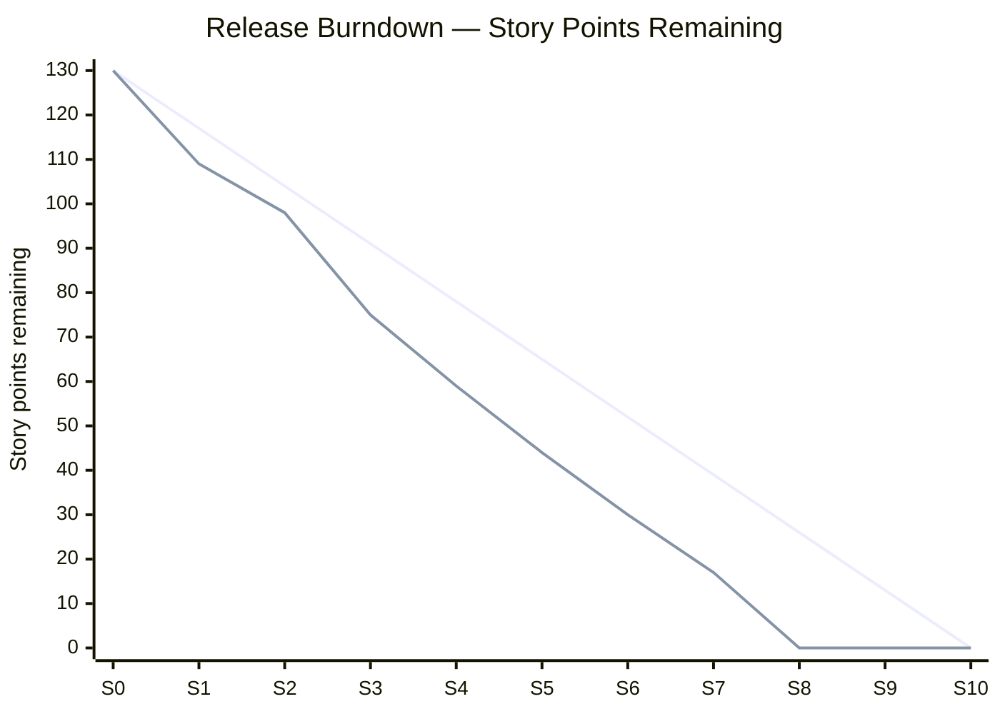

# ZUJ Incubator (حاضنة الزيتونة) — Project Management Plan & Requirements Traceability Matrix

*This document records how the project was planned and managed under Scrum: the sprint log, the release burndown, the risk register, and the full Requirements Traceability Matrix (RTM) linking Vision features → SRS requirements → test cases.*

---

# 1. Introduction

## 1.1 Purpose

To give the academic supervisor and the incubator office a single view of project governance: methodology, schedule, progress, risk handling, and requirement-to-test traceability.

## 1.2 References

- `docs/ZUJIncubatorVisionDocument.md` — Vision Document (Chapters 1 and 8: schedule and priority).
- `docs/ZUJIncubatorSRS.md` — functional/non-functional requirements (FR/NFR identifiers).
- `docs/ZUJIncubatorTestPlan.md` — test cases (TC identifiers).

---

# 2. Methodology

The project follows **Agile / Scrum** across a fixed **15-week** academic horizon, organised into **11 sprints** (Sprint 0 – Sprint 10). Core feature sprints (1–4) run two weeks; planning, real-time, content, sponsor, analytics, hardening, and delivery sprints run one week each. Each sprint ends with a Sprint Review (demo to the academic supervisor) and a Sprint Retrospective.

## 2.1 Team & Roles

| Role | Responsibility |
|---|---|
| Back-end lead | Convex schema, RBAC, state machine, audit log, webhooks. |
| Full-stack developer | End-to-end vertical feature slices (submission, review, dashboards). |
| Front-end developer | RTL UI, HeroUI components, uploads/previews, reels feed. |
| DevOps role (within the team) | Vercel + Convex pipeline, environment configuration. |
| Academic project supervisor | Mentoring, sprint sign-off, deliverable validation. |
| Product Owner (Incubator Office) | Backlog priority, UAT, production-release approval. |

## 2.2 Ceremonies & Artifacts

Sprint Planning, Daily Stand-up, Sprint Review, Sprint Retrospective. Artifacts: Product Backlog (the 28 features), Sprint Backlog, this Plan, the Risk Register (§5), and the RTM (§6).

---

# 3. Sprint Log

Story points are derived from the Vision Document's Appendix A *Effort* rating (High = 8, Medium = 5, Low = 3). Total backlog = **130 points** across 28 features.

| Sprint | Window | Phase | Features delivered | Points | Status |
|---|---|---|---|---|---|
| Sprint 0 | Week 1 | Analysis | Backlog, SRS finalisation (no production features) | 0 | ✅ Done |
| Sprint 1 | Weeks 2–3 | Foundation | F-25, F-26, F-28, F-01, F-24 | 21 | ✅ Done |
| Sprint 2 | Weeks 4–5 | Foundation | F-02, F-03, F-20 | 11 | ✅ Done |
| Sprint 3 | Weeks 6–7 | Core workflow | F-04, F-05, F-07, F-08 | 23 | ✅ Done |
| Sprint 4 | Weeks 8–9 | Core workflow | F-06, F-09, F-10 | 16 | ✅ Done |
| Sprint 5 | Week 10 | Real-time | F-11, F-12, F-23 | 15 | ✅ Done |
| Sprint 6 | Week 11 | Content | F-14, F-15, F-16, F-27 | 14 | ✅ Done |
| Sprint 7 | Week 12 | Sponsor track | F-17, F-18 | 13 | ✅ Done |
| Sprint 8 | Week 13 | Analytics | F-22, F-13, F-19, F-21 | 17 | ✅ Done |
| Sprint 9 | Week 14 | Hardening | Accessibility, RTL polish, performance, **security review** (server-side upload caps + university-email guard + backend test suite) | 0 | ✅ Done |
| Sprint 10 | Week 15 | Delivery | UAT, production deployment, documentation handover (Vision, SRS, SDD, Test Plan, Manuals, this Plan) | 0 | ✅ Done |

All 28 Must/Should/Could features were delivered by Sprint 8, leaving Sprints 9–10 entirely for hardening and delivery — satisfying Vision constraint TM-4.

---

# 4. Release Burndown

| Milestone | Ideal remaining | Actual remaining |
|---|---|---|
| After Sprint 0 | 130 | 130 |
| After Sprint 1 | 117 | 109 |
| After Sprint 2 | 104 | 98 |
| After Sprint 3 | 91 | 75 |
| After Sprint 4 | 78 | 59 |
| After Sprint 5 | 65 | 44 |
| After Sprint 6 | 52 | 30 |
| After Sprint 7 | 39 | 17 |
| After Sprint 8 | 26 | 0 |
| After Sprint 9 | 13 | 0 |
| After Sprint 10 | 0 | 0 |

*The first line is the ideal burndown; the second is the actual. Feature work tracked slightly ahead of the ideal line because the two-week core sprints (1–4) front-loaded the high-effort items, and all feature points were burned down by the end of Sprint 8 — by design, so Sprints 9–10 could be spent on hardening and delivery.*

---

# 5. Risk Register

Likelihood / Impact scale: L = Low, M = Medium, H = High.

| ID | Risk | Category | Likelihood | Impact | Mitigation | Status |
|---|---|---|---|---|---|---|
| R-01 | Clerk JWT issuer / webhook secret misconfigured between dev and prod | Integration | M | H | Documented env-var checklist (`.env.example`, install guide); `svix` signature verification fails fast and loudly | Mitigated |
| R-02 | A breaking change in Convex, Clerk, or Next.js | Dependency | L | H | Versions pinned in `package.json`; a breaking change triggers a dedicated update sprint | Open (monitored) |
| R-03 | Scope creep — 28 features in a fixed 15-week horizon | Schedule | H | H | MoSCoW prioritisation; vertical-slice sprints; all Must features scheduled ≤ Sprint 8 (TM-4) | Mitigated |
| R-04 | Unbounded file uploads exhaust Convex Storage / slow the reels feed | Technical | M | M | Size caps (10 MB PDF / 100 MB video) enforced **client-side and server-side** in the application mutations | **Closed** |
| R-05 | Non-university identities create application accounts by bypassing the registration form | Security | M | H | University-email allowlist enforced in the form **and** re-enforced in the Convex Clerk webhook | **Closed** |
| R-06 | RTL / Arabic layout regressions across breakpoints | Quality | M | M | RTL-first implementation; visual regression review in Sprint 9 at 1280/1024/768/375 px | Mitigated |
| R-07 | Clerk ↔ Convex user divergence (missed/duplicate webhook) | Integration | M | M | Idempotent upsert by `clerkId`; admin actions insert their own row if the webhook is skipped | Mitigated |
| R-08 | The first administrator cannot be bootstrapped | Operational | L | M | Documented manual admin seed in the install guide (DC-4) | Mitigated |
| R-09 | Personal-data handling vs Jordanian PDPL No. 24 of 2023 | Legal | L | H | Identity/data delegated to Clerk (SOC 2); no cross-border transfer without written institutional decision | Open (monitored) |
| R-10 | Insufficient automated test coverage of CRUD modules | Quality | M | M | Risk-prioritised `convex-test` suite covers the security-critical core; CRUD coverage flagged as future work | Open |
| R-11 | No end-to-end browser test automation | Quality | M | M | Manual UAT per role for Sprint 10; Playwright/Cypress recommended as post-handover work | Open |

---

# 6. Requirements Traceability Matrix (RTM)

Three-way trace: **Vision feature → SRS requirement(s) → test case(s)**. "Manual UAT" denotes a requirement currently verified by manual functional testing rather than an automated case (see the Test Plan §7 for the automation roadmap).

| Vision Feature | SRS Requirement(s) | Test Case(s) | Verification |
|---|---|---|---|
| F-01 Authentication & Identity | FR-AUTH-1 … FR-AUTH-8 | TC-09, TC-10, TC-11 | Automated + Manual UAT |
| F-02 Role-Based Access Control | FR-RBAC-1 … FR-RBAC-7, NFR-SEC-1…3 | TC-01, TC-02, TC-03, TC-04 | Automated |
| F-03 User Profile Management | FR-PROF-1 … FR-PROF-6 | — | Manual UAT |
| F-04 Multi-Track Application Submission | FR-APP-1 … FR-APP-3, FR-APP-8 | TC-01, TC-02, TC-08 | Automated + Manual UAT |
| F-05 Application Drafting & Editing | FR-APP-4 … FR-APP-7 | — | Manual UAT |
| F-06 Application Lifecycle State Machine | FR-REV-1 … FR-REV-3 | TC-05, TC-06 | Automated |
| F-07 PDF Upload & Preview | FR-FILE-1 … FR-FILE-5 | TC-07, TC-08 | Automated + Manual UAT |
| F-08 Video Pitch Upload & Preview | FR-FILE-1 … FR-FILE-5 | TC-07, TC-08 | Automated + Manual UAT |
| F-09 Supervisor Review, Rating, Notes | FR-REV-2, FR-REV-4, FR-REV-5, FR-REV-7, FR-REV-8 | TC-03, TC-06 | Automated + Manual UAT |
| F-10 Immutable Review Audit Log | FR-REV-4, FR-REV-6, FR-REV-9, NFR-REL-3 | TC-06 | Automated |
| F-11 Real-Time Reviewer Presence | FR-PRES-1 … FR-PRES-3 | — | Manual UAT |
| F-12 Typed Notification System | FR-NOTIF-1 … FR-NOTIF-5 | — | Manual UAT |
| F-13 Student Personal Notes | FR-NOTE-1 … FR-NOTE-2 | — | Manual UAT |
| F-14 Markdown Articles | FR-ART-1 … FR-ART-6 | — | Manual UAT |
| F-15 Banner Management | FR-BAN-1 … FR-BAN-5 | — | Manual UAT |
| F-16 Entrepreneurial Guide | FR-GUIDE-1 … FR-GUIDE-3 | — | Manual UAT |
| F-17 Sponsor Reels Feed | FR-SPON-1, FR-SPON-6 | — | Manual UAT |
| F-18 Sponsor Assignment & Matchmaking | FR-SPON-2 … FR-SPON-5 | — | Manual UAT |
| F-19 Supervisor Upgrade Request | FR-UPG-1 … FR-UPG-5 | — | Manual UAT |
| F-20 Colleges & Departments | FR-ORG-1 … FR-ORG-4 | — | Manual UAT |
| F-21 Social Links Management | FR-SOC-1 … FR-SOC-3 | — | Manual UAT |
| F-22 Administrative Dashboards | FR-ADMIN-1, FR-ADMIN-2, FR-ADMIN-6 | TC-04 | Automated + Manual UAT |
| F-23 System-Wide Activity Log | FR-ADMIN-3 … FR-ADMIN-5 | — | Manual UAT |
| F-24 Clerk Webhook Synchronisation | FR-AUTH-4 … FR-AUTH-6 | TC-10, TC-11 | Automated |
| F-25 RTL Arabic Interface & Theming | UI-1, UI-4, NFR-USE-1 | — | Manual UAT |
| F-26 Responsive Multi-Device Layout | UI-3, NFR-USE-1 | — | Manual UAT |
| F-27 Public Marketing & Onboarding | FR-PUB-1 | — | Manual UAT |
| F-28 Continuous Deployment Pipeline | FR-PUB-2 | — | Build pipeline verification |

**Coverage summary:** 11 automated test cases cover the security-critical features F-01, F-02, F-04, F-06, F-07, F-08, F-09, F-10, F-22, F-24. The remaining features are verified by manual UAT; extending automated coverage to them is the documented next step (Test Plan §7).

---

# 7. Communication & Reporting

- **Cadence:** daily stand-up; weekly (or bi-weekly) Sprint Review with the academic supervisor; retrospective each sprint.
- **Tracking:** the Product Backlog is the 28-feature list; sprint scope is fixed at Sprint Planning per §3.
- **Definition of Done:** code compiles (`tsc` clean), lints clean (changed files), automated tests pass, the relevant manual UAT scenario passes, and the change is committed to the development branch.

# 8. Deliverables Handover

| Deliverable | Artifact |
|---|---|
| Vision Document | `docs/ZUJIncubatorVisionDocument.md` |
| Software Requirements Specification | `docs/ZUJIncubatorSRS.md` |
| Software Design Document | `docs/ZUJIncubatorSDD.md` |
| Test Plan & Report | `docs/ZUJIncubatorTestPlan.md` |
| User Manuals (4 roles) | `docs/ZUJIncubatorUserManuals.md` |
| Project Management Plan & RTM | `docs/ZUJIncubatorProjectManagementPlan.md` |
| Source code & backend test suite | the repository (`convex/`, `src/`, `convex/incubator.test.ts`) |
