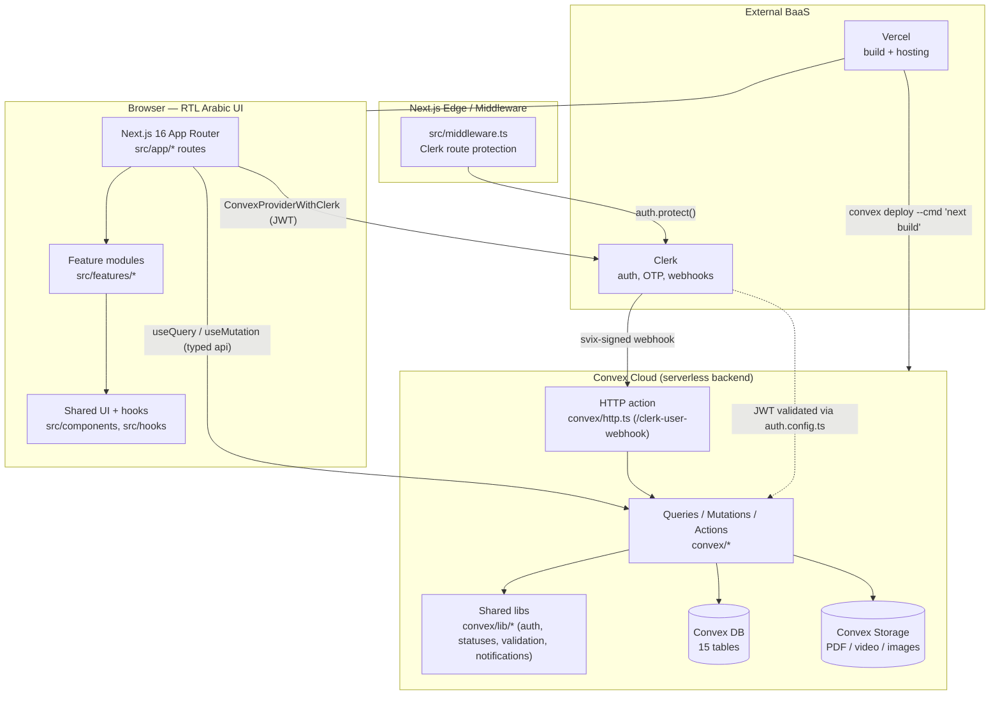
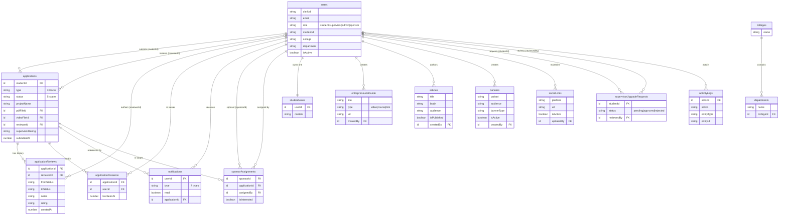
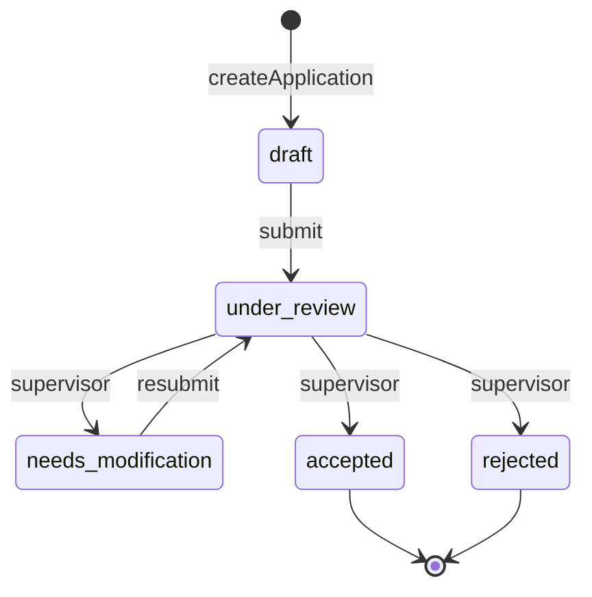
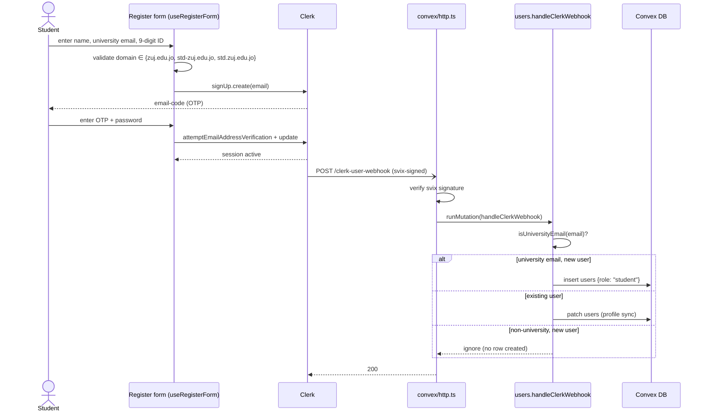
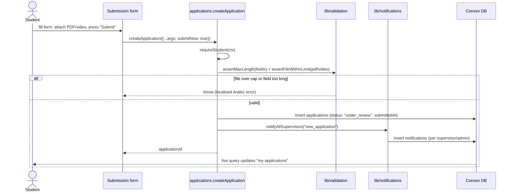
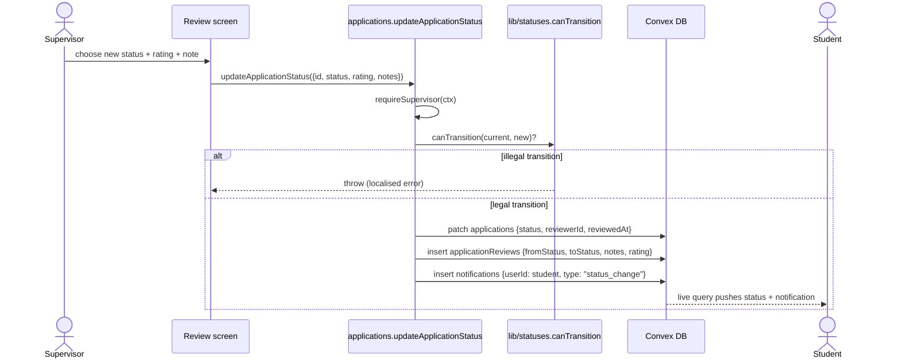
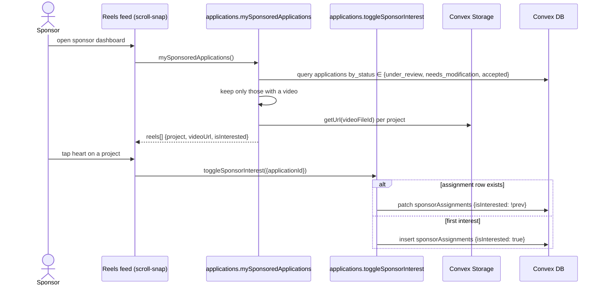

# ZUJ Incubator (حاضنة الزيتونة) — Software Design Document (SDD)

*This document describes **how** ZUJ Incubator is built internally. It complements the Vision Document (the "why") and the SRS (the "what"). Every component, table, and interaction described here corresponds to a concrete artifact in the repository.*

---

# 1. Introduction

## 1.1 Purpose

The SDD translates the requirements in `docs/ZUJIncubatorSRS.md` into an architectural and detailed design: the component structure, the data model and its relationships, the module decomposition, and the runtime behaviour of the principal use cases. It is intended for the development team and for the academic reviewer assessing the internal design.

## 1.2 Scope

The design covers the full stack: the Next.js 16 App Router front end (`src/`), the Convex serverless back end (`convex/`), the Clerk identity integration, Convex Storage for files, and the Vercel deployment pipeline.

## 1.3 References

1. `docs/ZUJIncubatorVisionDocument.md` — Vision Document.
2. `docs/ZUJIncubatorSRS.md` — Software Requirements Specification.
3. `convex/schema.ts` — the authoritative data model.
4. Convex documentation — https://docs.convex.dev

---

# 2. Architectural Design

## 2.1 Architectural Style

ZUJ Incubator follows a **client–serverless** architecture with a **single shared type system**. There is no hand-written API layer: the Next.js front end calls Convex functions directly through the generated, fully-typed `convex/_generated/api`, which eliminates contract drift between front end and back end. The back end is **reactive** — queries are live subscriptions, so any mutation that changes queried data pushes an update to every subscribed client.

Cross-cutting concerns are factored into shared modules:

- **Authorisation** — `convex/lib/auth.ts` (`requireUser`, `requireStudent`, `requireSupervisor`, `requireAdmin`).
- **Domain rules** — `convex/lib/statuses.ts` (the application state machine), `convex/lib/validation.ts` (field-length, file-size, and university-email guards).
- **Fan-out** — `convex/lib/notifications.ts` (notify-all helpers).
- **Read helpers** — `convex/lib/users.ts` (batch user lookups).

## 2.2 Component Diagram

## 2.3 Layered View

| Layer | Location | Responsibility |
|---|---|---|
| Presentation | `src/app/`, `src/components/` | RTL Arabic routes, layouts, shared HeroUI-based components, theming. |
| Feature logic | `src/features/*` | Per-domain components and React hooks (auth, applications, articles, banners, admin, …). |
| Client data access | `convex/react` + `convex/_generated/api` | `useQuery` / `useMutation` bindings; `preloadQuery` for server components. |
| Route protection | `src/middleware.ts` | Clerk middleware gating `/student`, `/supervisor`, `/admin`, `/sponsor`, `/login-redirect`. |
| API surface | `convex/*.ts`, `convex/**/  *.ts` | Public queries/mutations/actions and internal functions. |
| Domain / cross-cutting | `convex/lib/*` | Authorisation, the state machine, validation, notification fan-out. |
| Persistence | `convex/schema.ts` + Convex DB | 15 indexed tables. |
| Files | Convex Storage | PDF business plans, pitch videos, banner/article/avatar images. |
| Identity | Clerk + `convex/auth.config.ts` + `convex/http.ts` | JWT issuance/validation, OTP, lifecycle webhooks. |

## 2.4 Technology Stack

Next.js 16.2 (App Router, React 19), TypeScript 5.9 (strict), Convex 1.36, Clerk (`@clerk/nextjs` 6.39), HeroUI 3 + Tailwind CSS 4, `react-pdf` (PDF preview), `react-markdown` + `remark-gfm` (articles), `recharts` + `@tanstack/react-table` (admin), `react-dropzone` (uploads), `svix` (webhook verification), Vitest + `convex-test` (tests). Hosting on Vercel.

---

# 3. Data Design

## 3.1 Entity-Relationship Diagram

The schema (`convex/schema.ts`) defines fifteen tables. Convex adds `_id` and `_creationTime` to every row. Relationships are expressed as Convex document-id references.

## 3.2 Key Data-Design Decisions

- **Append-only tables.** `applicationReviews` and `activityLogs` are never updated or deleted by any function; they are the audit substrate. The "latest" reviewer fields on `applications` (`reviewerId`, `supervisorNotes`) may be overwritten, but the full history survives in `applicationReviews`.
- **Files as references.** PDFs, videos, and images are stored in Convex Storage and referenced by `Id<"_storage">`; they are never inlined into table rows.
- **Indexes follow access patterns.** Every list/lookup query reads through a declared index (e.g. `applications.by_student_status`, `notifications.by_user_read`, `banners.by_audience_active`) — never `.filter()` on an indexed field.
- **Presence is self-cleaning.** `applicationPresence` rows are heartbeats; readers ignore rows older than 30 s and the next `joinPresence` lazily evicts rows older than 60 s — no cron job.
- **Soft delete for users.** A Clerk `user.deleted` webhook sets `isActive = false` rather than deleting the row, preserving referential integrity for historical applications and reviews.

## 3.3 Storage Design

| Asset | Producer | Size cap (server-enforced) | Access control |
|---|---|---|---|
| PDF business plan | Student | 10 MB (`assertFileWithinLimit`) | `getFileUrl`: owner / staff / sponsor (non-draft) |
| Pitch video | Student | 100 MB (`assertFileWithinLimit`) | as above |
| Article cover, banner media, avatar | Staff / any user | — (image) | signed URL on read; superseded files deleted on replace |

---

# 4. Component (Module) Design

## 4.1 Backend Module Decomposition

| Module | Functions (selected) | Guard |
|---|---|---|
| `convex/users.ts` | `handleClerkWebhook` (internal), `getCurrentUser` | webhook / identity |
| `convex/users/shared.ts` | `currentUser`, `updateProfile`, `generateAvatarUploadUrl`, `getAvatarUrl` | `requireUser` |
| `convex/users/admin.ts` | `getAllUsers`, `getAdminStats`, `getStudentsWithStats`, `toggleUserActive`, `createUserByAdmin`, `insertSupervisor`/`insertSponsor` (internal) | `requireAdmin` / `requireSupervisor` |
| `convex/users/adminActions.ts` | `createSupervisor`, `createSponsor` (`"use node"` actions) | admin check |
| `convex/users/dev.ts` | `makeMeStudent/Supervisor/Admin` | dev-only (throws in production) |
| `convex/applications/student.ts` | `createApplication`, `updateApplication`, `submitApplication`, `deleteApplication`, `myApplications` | `requireStudent` |
| `convex/applications/supervisor.ts` | `updateApplicationStatus`, `bulkUpdateStatus`, `listApplications(WithStudent)`, `getReviewHistory` | `requireSupervisor` |
| `convex/applications/sponsor.ts` | `mySponsoredApplications`, `toggleSponsorInterest`, `assignSponsor`, `removeSponsorAssignment` | role check / `requireAdmin` |
| `convex/applications/shared.ts` | `getApplication`, `applicationStats` | per-role read filter |
| `convex/files.ts` | `generateUploadUrl`, `getFileUrl` | `requireUser` / per-request authorisation |
| `convex/notifications.ts` | `myNotifications`, `unreadCount`, `markAsRead`, `markAllAsRead` | `requireUser` |
| `convex/presence.ts` | `joinPresence`, `leavePresence`, `getPresence` | `requireUser` |
| `convex/articles.ts`, `convex/banners.ts`, `convex/entrepreneurialGuide.ts` | content CRUD | `requireSupervisor` to write |
| `convex/colleges.ts`, `convex/socialLinks.ts` | institutional metadata CRUD | `requireAdmin` to write |
| `convex/supervisorUpgradeRequests.ts` | `submitRequest`, `listRequests`, `reviewRequest` | student / `requireAdmin` |
| `convex/activityLogs.ts` | `log` (internal), `recentLogs` | `requireAdmin` to read |
| `convex/http.ts` | `POST /clerk-user-webhook` | svix signature |
| `convex/lib/*` | cross-cutting helpers (auth, statuses, validation, notifications, users) | — |

## 4.2 Frontend Module Decomposition

- `src/app/` — route segments per role: `(auth)/`, `student/`, `supervisor/`, `admin/(dashboard)/`, `sponsor/(dashboard)/`, plus `layout.tsx` (providers, RTL, Tajawal) and `ConvexClientProvider`.
- `src/features/<domain>/` — `components/`, `hooks/`, sometimes `utils/`/`types/`: `auth`, `applications`, `articles`, `banners`, `admin`, `entrepreneurialGuide`, `guide`, `landing`, `student`, `supervisor`.
- `src/components/` — shared UI primitives, `PdfViewer`, charts, `ThemeProvider`, tooltip.
- `src/hooks/`, `src/lib/` — shared hooks and config (e.g. application track config).

## 4.3 The Application State Machine

`convex/lib/statuses.ts` encodes the authoritative transition table; `updateApplicationStatus` and `bulkUpdateStatus` consult `canTransition()` before any write.

`accepted` and `rejected` are terminal. A student may delete an application only in `draft` or `rejected`; a student may edit only in `draft` or `needs_modification`.

---

# 5. Interface Design

## 5.1 Internal Interface — Convex Typed API

The single application contract is the generated `api` / `internal` object. Every function declares argument validators (`v.*`); the return type is inferred and shared with the client. No REST/GraphQL layer exists.

## 5.2 External Interfaces

- **Clerk → Convex (webhook):** `POST /clerk-user-webhook` with `svix-id`, `svix-timestamp`, `svix-signature` headers; body is a Clerk event (`user.created` / `user.updated` / `user.deleted`). Verified by `svix` before any DB write.
- **Client → Clerk:** `ConvexProviderWithClerk` attaches the Clerk JWT to every Convex request; Convex validates it against `convex/auth.config.ts`.
- **Vercel → Convex:** the `build` script runs `convex deploy --cmd 'next build'`.

## 5.3 User Interface

RTL Arabic, Tajawal typeface, HeroUI v3 + Tailwind v4, light/dark via `next-themes`. Routes are role-segregated and protected by `src/middleware.ts`.

---

# 6. Behavioural Design — Sequence Diagrams

## 6.1 Registration & Webhook Synchronisation

## 6.2 Application Submission → Supervisor Notification

## 6.3 Supervisor Review → State Transition → Audit Log → Student Notification

## 6.4 Sponsor Reels Feed & Interest Toggle

---

# 7. Design Rationale & Patterns

- **Single source of truth for types.** Sharing `convex/_generated` between front and back end removes a whole class of integration bugs and is the main reason no DTO/serialization layer exists.
- **Guard functions over middleware.** Authorisation is a small set of composable functions (`requireUser` → `requireStudent`/`requireSupervisor`/`requireAdmin`) called at the top of each handler — explicit, testable, and impossible to forget silently because handlers that read user data must call one.
- **Pure domain rule modules.** The state machine (`statuses.ts`) and validators (`validation.ts`) are pure and dependency-light, which is why they are the most heavily unit-tested modules.
- **Defence in depth.** Upload caps and the university-email rule are enforced on the client *and* re-enforced server-side, so bypassing the UI cannot bypass the rule.
- **Reactive by default.** Because Convex queries are subscriptions, presence, notifications, and status changes need no polling or socket code in the UI — a `useQuery` re-renders when the underlying rows change.
- **Lazy, self-healing presence.** Avoiding a scheduled cleanup job keeps the deployment simple and matches the academic-project operational constraints.

---

# Appendix — Design-to-Requirement Mapping

| Design element | Satisfies (SRS) |
|---|---|
| Component diagram §2.2, layered view §2.3 | Product perspective; CN-1…CN-8 |
| ERD §3.1, table notes §3.2 | §3.4 Logical Database Requirements (DB-1…DB-3) |
| Auth guard functions §4.1, §7 | FR-RBAC-1…7, NFR-SEC-1…3 |
| State machine §4.3 | FR-REV-1…3 |
| Sequence diagram §6.1 | FR-AUTH-2…6 |
| Sequence diagram §6.2 | FR-APP-1…5, FR-FILE-2, FR-NOTIF-5 |
| Sequence diagram §6.3 | FR-REV-2…6, FR-NOTIF-5 |
| Sequence diagram §6.4 | FR-SPON-1…2, FR-FILE-4 |
| Storage design §3.3 | FR-FILE-1…5 |
